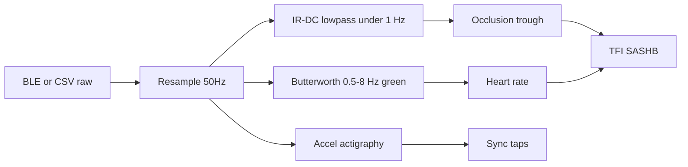

# Oralable Algorithm Architecture: Python ↔ iOS Swift

**Doc index:** [docs/README.md](./README.md) · **System hub:** [ORALABLE_SYSTEM_ARCHITECTURE.md](./ORALABLE_SYSTEM_ARCHITECTURE.md) (Core ML path, metrics) · **Firmware GATT:** [oralable_nrf/docs/README.md](../../oralable_nrf/docs/README.md) · **Figures:** [FIGURES.md](./FIGURES.md) · **App working diagrams:** [MOBILE_APP_FLOWS.md §2](../../oralable_swift/docs/MOBILE_APP_FLOWS.md#2-how-the-patient-app-works--phase-0)

This document describes the **algorithm split** between Python research and iOS production, what is **implemented today**, and what remains on the roadmap.

**Related literature (not product claims):** ear-hook PPG + audio chewing detection (Papapanagiotou et al. 2017, *IEEE JBHI*) is adjacent awake-mastication prior art — different from overnight **temporalis IR-DC / OMG**. Ambulatory SB commercial devices are mostly sEMG (Li et al. 2025). Distill: [data_room/LITERATURE_AND_PRIOR_ART.md](./data_room/LITERATURE_AND_PRIOR_ART.md).




*Figure FIG-CO-007 — 50 Hz PPG signal pipeline (placeholder).*


*Figure FIG-CO-006 — IR-DC occlusion trough (placeholder; cross-check clench detections).*


*Figure FIG-CO-020 — Core ML MAM inference flow (placeholder).*

---

## 1. Current state (June 2026)

### Python (`cursor_oralable`) — research reference

| Module | Purpose |
|--------|---------|
| `src/analysis/features.py` | Butterworth filters, beat detection, **TFI**, window biomarkers |
| `src/analysis/overnight_states.py` | Overnight quiet/tonic/phasic/rescue/recovery + bouts/KPIs |
| `scripts/generate_overnight_night_report.py` | Night pack — **hypnogram-first**; see [OVERNIGHT_NIGHT_REPORT.md](./OVERNIGHT_NIGHT_REPORT.md); iOS adapts via `StateHypnogramView` / `OvernightNightReportBuilder` |
| `src/validation/self_validate.py` | SASHB, occlusion tiers, swallow/speech FP, rescue gates |
| `src/utils/sync_align.py` | **3-tap** sync on accel Z (Protocol B validation) |
| `src/parser/log_parser.py` | TDM / hex parsing, 50 Hz resampling |
| `src/processing/resampler.py` | 50 Hz linear interpolation |
| `scripts/convert_temporalis_mam.py` | Keras → `BruxismMAM_Temporalis.mlpackage` |

### Swift (`OralableCore` + `oralable_swift`) — production

| Component | Status | Purpose |
|-----------|--------|---------|
| `BLEDataParser` | **Implemented** | Frame-counter-aware PPG/ACC/temp/battery/**5-byte status** |
| `AlgorithmSpec` | **Implemented** | Shared filter rates, thresholds |
| `TransferFunctionFilter` / `ButterworthFilter` | **Implemented** | HR bandpass, IR DC lowpass, Temporalis AC bandpass |
| `PPGProcessor`, `IRDCProcessor` | **Implemented** | Bandpass beats, IR DC trend / occlusion |
| `MAMInferenceManager` | **Implemented** | Core ML `BruxismMAM_Temporalis` @ 50 Hz × 6 ch — cohort plan [CORE_ML_TRAINING_COHORT.md](./CORE_ML_TRAINING_COHORT.md) |
| `UnifiedBiometricProcessor` | **Implemented** | HR, SpO₂, motion comp, **TFI**, **SASHB** |
| `OvernightStateClassifier` / `NightReportSampleLoader` | **Implemented** | Bout night report (Python `overnight_states` parity); Share clinical PDF |
| `ClinicalReportGenerator` | **Implemented** | Multi-page overnight PDF + event CSV |
| `NRFConnectBLELogger` | **Implemented** | nRF-style CSV export |
| `ProfessionalHandshakeExport` | **Implemented** | Hourly TFI + SASHB + Temporalis rollups |
| `algorithm_spec.yaml` (Python) | **Planned** | Single YAML loaded by both runtimes |
| `SyncTapDetector.swift` | **Partial** | Logic in Python; not standalone Swift module |
| Full Python↔Swift numeric parity tests | **Partial** | Golden-file diff not automated in CI |

**Summary:** Core filters, BLE parsing, Core ML inference, TFI/SASHB, and handshake export are **in production Swift**. Remaining work is **YAML spec parity**, **sync-tap Swift module**, and **automated golden tests** — not “Swift has no filters.”

---

## 2. Architecture: single source of truth (target)

```
┌─────────────────────────────────────────────────────────────────┐
│  ALGORITHM SPEC (YAML/JSON)                                      │
│  - Filter params (0.5–8 Hz, <1 Hz, order 4)                      │
│  - Window sizes (50 samples, 5s, 100 samples)                    │
│  - Sync tap params (2s window, 3σ, min 80ms between taps)        │
│  - SpO2 calibration coefficients                                │
└─────────────────────────────────────────────────────────────────┘
         │                                    │
         ▼                                    ▼
┌─────────────────────┐            ┌─────────────────────────────┐
│  Python (Research)   │            │  Swift (Production)          │
│  - features.py       │            │  - OralableCore/Algorithms   │
│  - visualize_test.py │            │  - Accelerate (vDSP) filters  │
│  - sync_align.py     │            │  - Core ML (if ML models)    │
│  - scipy.signal      │            │  - CircularBuffer(100)      │
└─────────────────────┘            └─────────────────────────────┘
```

---

## 3. Roadmap (not all shipped)

### Phase 1: Algorithm spec YAML (planned)

Create `src/config/algorithm_spec.yaml`:

```yaml
# Oralable MAM Algorithm Specification
# Single source of truth for Python and Swift

sampling:
  ppg_hz: 50.0
  accel_hz: 100.0

filters:
  ppg_bandpass:
    lowcut_hz: 0.5
    highcut_hz: 8.0
    order: 4
  ir_dc_lowpass:
    cutoff_hz: 0.8
    order: 4
  accel_median:
    window: 5

buffers:
  ppg_circular_size: 100   # 2s at 50 Hz
  hr_window_samples: 150  # 3s
  spo2_window_samples: 150

sync_taps:
  window_seconds: 2.0
  sigma_threshold: 3.0
  min_distance_ms: 80

beat_detection:
  min_distance_samples: 20   # ~0.4s, max 150 bpm
  prominence_factor: 0.5    # std * factor

spo2_calibration:
  # Empirical: SpO2 = a*R² + b*R + c
  a: -45.060
  b: 30.354
  c: 94.845
```

**Today:** parameters live in `OralableCore/Signal/AlgorithmSpec.swift` and Python `features.py` — keep in sync manually until YAML lands.

---

### Phase 2: Swift algorithm module (mostly done)

`OralableCore` already contains:

```
OralableCore/Sources/OralableCore/
  Algorithms/ButterworthFilter.swift
  Algorithms/PPGProcessor.swift
  Algorithms/IRDCProcessor.swift
  Filters/TransferFunctionFilter.swift
  Signal/AlgorithmSpec.swift
  Calculations/MAMInferenceManager.swift
```

**Remaining:** export filter coefficients from Python in CI; optional `SyncTapDetector.swift`.

---

### Phase 3: Core ML (shipped)

**Production model:** `BruxismMAM_Temporalis.mlpackage` — input `[1, 50, 6]`, four Temporalis classes. See [ORALABLE_SYSTEM_ARCHITECTURE.md](./ORALABLE_SYSTEM_ARCHITECTURE.md) §13.

Pipeline: `scripts/generate_mam_model.py` → `scripts/convert_temporalis_mam.py` → bundle in OralableCore Resources.

---

### Phase 4: Data Flow in iOS App

```
BLE (50 Hz PPG, ~100 Hz Accel)
    │
    ▼
┌─────────────────────────────────────┐
│  OralableCore.Algorithms             │
│  - Resample accel → 50 Hz (optional) │
│  - Butterworth bandpass (Green)      │
│  - Butterworth lowpass (IR)          │
│  - Median filter (Accel Z)           │
│  - Beat detection → HR, HRV          │
│  - IR DC trend → occlusion indicator │
│  - Sync tap detection (if needed)    │
└─────────────────────────────────────┘
    │
    ▼
UnifiedBiometricProcessor / DashboardViewModel
```

---

## 4. File layout (current)

### Python (`cursor_oralable`)

```
src/
  config/
    algorithm_spec.yaml      # Planned — not yet shared load
  analysis/
    features.py
  utils/
    sync_align.py
  processing/
    resampler.py
  parser/
    log_parser.py
```

### Swift (`OralableCore`)

```
OralableCore/Sources/OralableCore/
  Algorithms/              # Shipped
    ButterworthFilter.swift
    PPGProcessor.swift
    IRDCProcessor.swift
  Filters/TransferFunctionFilter.swift
  Signal/AlgorithmSpec.swift
  Calculations/MAMInferenceManager.swift
  Resources/BruxismMAM_Temporalis.mlpackage
```

### Shared export

```
cursor_oralable/scripts/convert_temporalis_mam.py  → mlpackage in OralableCore Resources
```

---

## 5. Validation Strategy

1. **Unit tests:** Python and Swift produce identical outputs for the same input (use exported test vectors).
2. **Golden files:** Run Python on `session_50hz.csv` → save `features_labeled.csv`, `features_windows_5s.csv`. Swift processes the same CSV (or equivalent) and diff results.
3. **Cross-verify:** Per `.cursorrules`, *"Every clench detection algorithm must be cross-verified against the DC-trough depth in the IR channel."*

---

## 6. Quick Start

1. **Create the spec:** Add `src/config/algorithm_spec.yaml` with the parameters above.
2. **Add a Python export script:** `scripts/export_filter_coeffs.py` to generate Swift-ready coefficients.
3. **Implement `ButterworthFilter.swift`** in OralableCore using vDSP or a biquad implementation.
4. **Replace placeholder logic** in `SignalProcessingPipeline` and `UnifiedBiometricProcessor` with calls to the new Algorithms module.
5. **Train and export** any ML model to Core ML when ready.

---

## 7. References

- [Peter Charlton PWA](https://peterhcharlton.github.io/) – Pulse waveform analysis
- [Zhang et al. 2023 PPG-Net](https://doi.org/10.1016/j.bspc.2023.104567) – Blood flow morphology
- [Apple Accelerate vDSP](https://developer.apple.com/documentation/accelerate/vdsp) – Signal processing on iOS
- [Core ML Tools](https://coremltools.readthedocs.io/) – Python → Core ML export
