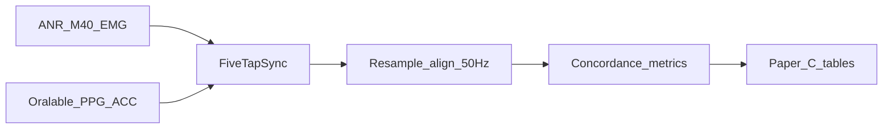

# ANR M40 Muscle Sense — temporalis sEMG concordance (research)

**As at:** 30 Aug 2026 · Pack **1.1.68** · data-room bookmark [data_room/clinical/ANR_M40_CONCORDANCE.md](./data_room/clinical/ANR_M40_CONCORDANCE.md)  
**Role:** Adjacent **surface EMG** comparator for temple OMG, shipped in the Research Kit. Descriptive Dual A (+ SpO₂∩EMG nest) sits in Paper A methods as a precursor; PSG-AV / Bruxoff diagnostic concordance waits for Paper C. Not a Phase 0 consumer product on its own.  
**Public docs:** [ANR Corporation — Documentation](https://www.anrcorp.com/documentation/) (M40 product sheet, iPhone/Android guides, BLE Design Guide)  
**iPhone app:** [anrcorp.com/iphoneapp](https://www.anrcorp.com/iphoneapp/) — graph / log / export / biofeedback (QC; not Dual A concordance)  
**BLE Design Guide (local):** `…/My Drive/notebook_lm/Sources/BLE_DesignGuide.pdf` (A001S1M40A-DG-23-1) — see [data_room bookmark](./data_room/clinical/ANR_M40_CONCORDANCE.md)  
**Data-room bookmark:** [data_room/clinical/ANR_M40_CONCORDANCE.md](./data_room/clinical/ANR_M40_CONCORDANCE.md) · kit [data_room/clinical/ORALABLE_RESEARCH_KIT.md](./data_room/clinical/ORALABLE_RESEARCH_KIT.md) · placement [data_room/clinical/TEMPORALIS_ANATOMY_AND_PLACEMENT.md](./data_room/clinical/TEMPORALIS_ANATOMY_AND_PLACEMENT.md)  
**Related:** [TEMPORALIS_COLLECTION_PROTOCOL.md](./TEMPORALIS_COLLECTION_PROTOCOL.md) · **construct map** [data_room/clinical/MEASUREMENT_CONSTRUCT_MAP.md](./data_room/clinical/MEASUREMENT_CONSTRUCT_MAP.md) · [GEMINI_TEMPLE_PPG_AVENUES.md](./data_room/bookmarks/GEMINI_TEMPLE_PPG_AVENUES.md) · [BRUXOFF_PSG_GOLD_STANDARD.md](./data_room/bookmarks/BRUXOFF_PSG_GOLD_STANDARD.md) · [PAPER_A_FEASIBILITY_PROTOCOL.md](./data_room/clinical/PAPER_A_FEASIBILITY_PROTOCOL.md)

**One-liner:** Place ANR M40 on **anterior temporalis** (electrodes **vertical**) next to Oralable. Time-align EMG bursts with IR-DC and Protocol A labels; nest Oralable SpO₂ with ANR EMG (AcuPebble-style burden context — not AHI). Mac dual-BLE remains the methods reference; iOS Dual Protocol A is TestFlight research until parity is proven.

---

## 1. Claim discipline

| Do | Do not |
|----|--------|
| Call ANR an **adjacent gold standard** (sEMG) for bout timing | Call ANR / Oralable a PSG-AV SB diagnosis |
| Expect IR-DC to **lag** EMG by ~**1–5 s** (hemodynamic) | Expect millisecond EMG–OMG lockstep |
| Start Pedro Day-1 on Oralable vitals; Dual A on Mac for Paper A precursor | Claim Dual A = PSG-AV SB diagnosis or require ANR for every Arm P window |
| Cite ANR public docs | Imply commercial partnership unless contracted |

SB diagnosis still rests on **PSG-AV**. Ambulatory EMG (ANR, Bruxoff, and similar) is for screening and research concordance only.

---

## 2. Hardware & BLE (M40)

### BLE validation reference (locked)

| Device | Product / GATT reference | nRF Connect |
|--------|--------------------------|-------------|
| **Oralable** | `oralable_nrf` GATT + project nRF Connect validation rule | **Primary** debug/validation artifact |
| **ANR M40** | ANR **BLE Design Guide** + [ANR iPhone app](https://www.anrcorp.com/iphoneapp/) | **Optional** GATT inspect only (same Central view as Mac bleak) — **not** ANR’s official product reference |

nRF Connect is not the ANR product reference path the way it is for Oralable.

Aligned with iOS [`ANRMuscleSenseDevice.swift`](../../oralable_swift/OralableApp/OralableApp/Devices/ANRMuscleSenseDevice.swift) and the ANR BLE Design Guide:

| Item | Value |
|------|--------|
| Company ID (adv) | `0x05DA` |
| Automation IO service | `1815` |
| Analog (EMG) | `2A58` — uint16 LE, **0–1023**, notify ~**100 ms** (~10 Hz) |
| Digital (device ID) | `2A56` — uint8, 1–24 |
| Battery | `180F` / `2A19` |
| Device info | `180A` |

**Placement:** ANR electrodes on **anterior temporalis** (same site class as GrindCare / Oralable temple clip). Photograph both sensors for the session folder.

---

## 3. Capture path (Mac first)



### Commands

```bash
cd /Users/johnacogan67/work/cursor_oralable

# ANR only (stream + log)
.venv/bin/python scripts/run_anr_emg_session.py

# Dual Protocol A (~6 min cues; Oralable + ANR)
.venv/bin/python scripts/run_dual_protocol_a_session.py

# Concordance after dual (or any paired logs)
.venv/bin/python scripts/align_anr_oralable_concordance.py \
  --oralable data/raw/TEMPORALIS_RAW_YYYYMMDD_HHMMSS.txt \
  --anr data/raw/ANR_EMG_YYYYMMDD_HHMMSS.txt
```

Outputs: `data/raw/ANR_EMG_*.txt`, dual Oralable `TEMPORALIS_RAW_*.txt`, plots under `plots/concordance/<session>/` (`overlay.png`, `metrics.json`, `NEST.md`, `aligned_50hz.csv`, **`session.edf`**).

**EDF+:** `align_anr_oralable_concordance.py` writes `session.edf` by default (`--no-edf` to skip). Default channels: **IR_DC** (LP &lt;1 Hz + local occlusion vs ~5 s baseline, ↑ = trough) · **EMG** · **SpO₂** (%dev from 100%) · **SASHB_cum**. Absolute IR-DC / SpO₂ in `aligned_50hz.csv`. Raw PPG omitted (`--edf-raw-ppg`). Research Dual A EDF — **not** PSG; **not** AHI/ODI. Convenience CLI: `scripts/export_dual_a_edf.py`.

### SpO₂ ∩ EMG nest (AcuPebble-style context)

`align_anr_oralable_concordance.py` also runs Mac `ClinicalBiometricSuite` SpO₂ / SASHB on the Oralable 50 Hz frame and nests it with ANR EMG bouts:

- Desat events: SpO₂ &lt; 90% for ≥10 s (descriptive rate / hour — **not** claimed ODI/AHI)
- `emg_bouts_with_desat` / fractions within ±5 s overlap
- SpO₂ QC line in `NEST.md` / `SUMMARY.md`: `spo2_qc` = `ok` | `warn` | `fail` (finite/in-band frac, AC RMS, mean &lt;92% or &gt;40% samples &lt;90% → warn; flat AC → fail). Handoff visibility — **not** finger SpO₂; Dual A muscle packs may archive with `warn`.
- 4-row overlay: **LP IR-DC** (Butterworth &lt;0.8 Hz) · EMG · SpO₂ · labels; dashed IR troughs after EMG bouts; always `emg_ir_lag_zoom.png`

**Claim discipline:** nest = Oralable oxygen-burden context + ANR timing. AcuPebble remains Pedro’s AHI/ODI reference. **Not** Bruxoff/GrindCare equivalence. **Not** PSG-AV diagnosis. Helpers: `src/analysis/emg_spo2_nest.py`.

**Measured eng pack (12 Aug 2026):** `20260812_085110` → `plots/concordance/20260812_085110/` (overlay, `emg_ir_lag_zoom.png`, `NEST.md`, `session.edf`). SpO₂ aligned mean ≈ 89.5%; SASHB ≈ 929 %·s; **`spo2_qc=warn`** (temple bias / coupling — AC present; not finger SpO₂). Median EMG→LP IR-DC lag ≈ 4.9 s; F1 IR↔EMG ≈ 0.61; F1 vs labels = 0 this pack (QC / placement). Preflight used `--emg-gate 70` (clench max 83); **no IR optical gate** on that run. Layout hypnogram: `plots/overnight_report/TEMPORALIS_20260812_085110_dualA/` (~6 min — not overnight *N*).

### Why these gates (config choices)

Goal right now: **ship usable Dual A muscle packs** (EMG ↔ LP IR-DC). SpO₂ is engineering oxygen context for nest/Paper A O2 — not a blocker for concordance.

| Choice | Default | Why |
|--------|---------|-----|
| Seat Oralable **before** ANR | Locked | ANR on top can shear or unload the PPG window. Good EMG does not prove optical coupling. |
| EMG hard gate | **≥70** raw (was 100) | Eng pack `20260812_085110` cleared at 70 (clench max 83). Dual A stack often never hits 100. Gate = “electrodes contact + clench visible,” not hero amplitude. |
| IR optical hard gate | Drop ≥ **8%** of rest median | Missing before; that pack had strong EMG but only moderate IR↔EMG (F1≈0.61) and early IR wander. Refuse Protocol A when clench does not move IR (unless `--force`). |
| SpO₂ mean | **Not** a hard gate | Temple curve + Dual A stack often give awake means ~89%. Hard-gating on mean would kill good muscle packs. |
| SpO₂ AC after IR | **WARN only** (~12 s) | Flags dead red/IR AC (`spo2_preflight_ac_ok=0`). Never blocks — IR trough already proved occlusion. |
| Post-hoc `spo2_qc` | `ok` / `warn` / `fail` | Paper A O2 handoff needs a good-signal line. `warn` = archive muscle pack anyway; `fail` = flat AC (junk SpO₂). Align never aborts on QC. |
| Overlay = **LP IR-DC** (&lt;0.8 Hz) + lag zoom | Always | Raw IR hides hemodynamic troughs. Dashed troughs + `emg_ir_lag_zoom.png` make EMG→IR lag readable without EDFbrowser. |

**Do not** tighten EMG back to 100 or hard-gate SpO₂ mean until oxygen calibration is a separate task. Finger SpO₂ curve change is deferred.

### Setup — seat Oralable alone first

Do this **before** stacking ANR. Not a full Oralable-only Protocol A — a short optical check with Oralable only on the temple.

1. Disconnect phone apps from Oralable and ANR.  
2. Place **only Oralable** on the anterior temporalis peak (PPG window flat on skin). No ANR yet.  
3. Hard clench once. Confirm an **IR-DC trough** (live vitals app, or wait for the script IR preflight later).  
4. If there is no trough: re-seat Oralable (pressure on the window, not hair/edge). Do **not** add ANR until the trough is clear.  
5. Then Kapton lock; place ANR Red Dots **long axis VERTICAL** on the same belly. Press the stack so ANR holds Oralable to skin — **do not slide** Oralable off the peak or cover the optical window.  
6. Optional: one more hard clench with the full stack — IR trough should still appear. Then start the Dual A script.

**Why:** ANR on top can shear or unload the PPG window. Strong EMG alone does not prove good IR-DC / SpO₂.

### Practical path — get a working Dual A pack

1. Complete **Setup — seat Oralable alone first** (above).  
2. Run defaults (no flags needed):

```bash
.venv/bin/python scripts/run_dual_protocol_a_session.py
```

3. Clear **EMG ≥70** and **IR drop ≥8%** (full stack on). If SpO₂ AC prints WARN, continue anyway for muscle Dual A.  
4. Do Protocol A cues (~6 min).  
5. Align and check nest:

```bash
.venv/bin/python scripts/align_anr_oralable_concordance.py \
  --oralable data/raw/TEMPORALIS_RAW_<ts>.txt \
  --anr data/raw/ANR_EMG_<ts>.txt \
  --pair data/raw/DUAL_PAIR_<ts>.txt
```

6. **Done for muscle Dual A when:** EMG and IR preflight passed, `overlay.png` / `emg_ir_lag_zoom.png` show EMG bouts with LP IR troughs, `NEST.md` has SpO₂ series. `spo2_qc=warn` is OK. Prefer smoking-gun IR/SpO₂ at 240–270 s that still moves (see `plots/temporalis_validation/`).  
7. **Re-seat / retry when:** EMG or IR preflight FAIL — start again from Oralable alone. Use `--force` only to debug; do not archive forced fails as methods packs.  
8. **Oxygen arm later:** chase `spo2_qc=ok` and finger reference — not required to finish Dual A concordance.

### Dual A procedure

1. Charge Oralable (no phone: flash green = charging, solid green = taper / hold); prep ANR per M40 guide; disconnect iPhone apps from both devices. FW **1.0.71+** collects only while the Mac BLE link is up — do not drop Oralable mid-session.  
2. **Setup — seat Oralable alone first** (see above): Oralable only → clench → IR-DC trough → then Kapton + ANR vertical without sliding the window.  
3. Run `run_dual_protocol_a_session.py` — placement reminder, then gates before Protocol A:  
   - **ANR EMG preflight** (~30 s: rest → hard clench → rest). Clench max must clear gate (default **≥70**).  
   - **Oralable IR optical preflight** (same windows). Rest-median IR in a sane band; clench drop ≥ **8%** of rest median (default `--ir-drop-gate 0.08`).  
   - **SpO₂ AC WARN** (~12 s quiet after IR). Non-blocking; stamps `spo2_preflight_ac_ok`. Dead AC → WARN only (does not refuse Protocol A).  
   Re-seat and retry on FAIL (`--force` / `--skip-emg-preflight` / `--skip-ir-preflight` to override). Pair file stamps `ir_preflight_*` / `spo2_preflight_*`.  
4. Follow Protocol A cues (5 taps at 01:00 on Oralable housing).  
5. QC: EMG rises on tonic/phasic; LP IR-DC troughs lag; sync taps visible on ACC and optionally EMG; SpO₂ series + `spo2_qc` line for nest (Paper A O2 uses QC / good-signal frac; muscle packs OK with `warn`).  
6. Run concordance script; archive session id + photos + `NEST.md` + lag zoom.

---

## 4. iOS follow-on (TestFlight research)

Mac Dual Protocol A remains the **primary** path for Paper A methods figures until iOS parity is proven on real Dual A packs.

**Slice 1 (in app, default OFF):** Developer Settings → **Dual Protocol A (research)** (`showDualProtocolA`). Sleep remains the normal path when the flag is off. Dashboard entry runs Mac-parity flow: ANR vertical placement reminder → EMG preflight (rest / hard clench / rest, gate ≥70) → Protocol A cues (~6 min) → Share `TEMPORALIS_RAW_*` + `ANR_EMG_*` + `DUAL_PAIR_*` + **`session.edf` (includes ANR EMG)**. Mac align remains methods reference for nest figures. Oralable-only EDF (no EMG): Developer Settings → Export Oralable-only session.edf. `DUAL_PAIR` may stamp `skin_temp_mean_c` / `on_skin_fraction` ([data_room/bookmarks/SENSOR_CORROBORATION.md](./data_room/bookmarks/SENSOR_CORROBORATION.md)).

| Step | Action | Status |
|------|--------|--------|
| 1 | Lab/TestFlight: enable **EMG Card** (`showEMGCard`); exercise ANR-only connect | Open |
| 2 | Dual Protocol A cue UI + preflight + Share pack (`showDualProtocolA`) | **Slice 1 shipped** (flag default **false**) |
| 3 | Prove TestFlight Dual A pack → Mac align produces `plots/concordance/<session>/` | Open |
| 4 | Harden dual central for multi-hour Dual A; overnight paired export | Later (slice 2) |
| 5 | Implement ANR `sendCommand` / config only if streaming needs it | Later |
| 6 | Keep App Store / Phase 0 vitals defaults: **`showEMGCard = false`**, **`showDualProtocolA = false`** | Locked |

Do not claim field Dual A *N* until kits ship and sessions exist. Do not block Phase 0 on ANR commands or Dual A overnight.

---

## 5. Paper ladder

| Paper | ANR role |
|-------|----------|
| **A** feasibility n≈5 | **Out of scope** (Oralable vitals / oxygen arm) |
| **B** phenotype | Optional EMG labels later |
| **C** concordance | Primary use of this pipeline |

---

*Research path only. The Oralable product is extraoral temporalis optical (OMG), not sEMG.*
