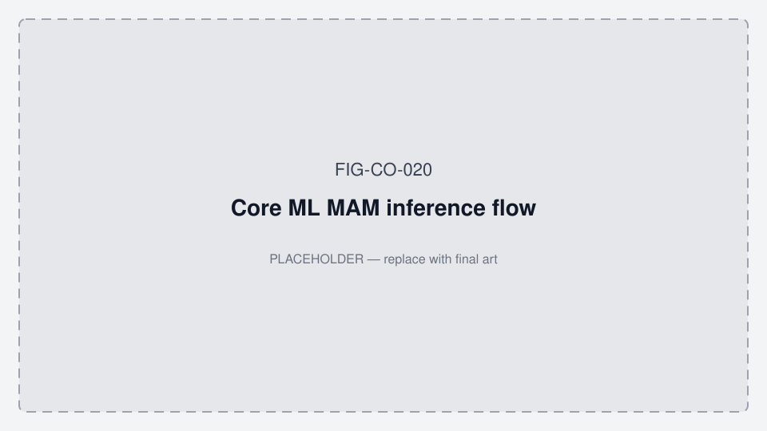

# Core ML training cohort — Temporalis MAM

**Status:** Canonical collection plan · July 2026  
**Audience:** Engineering, pilot ops, clinical partners  
**Related:** [TEMPORALIS_COLLECTION_PROTOCOL.md](./TEMPORALIS_COLLECTION_PROTOCOL.md) · [ALGORITHM_ARCHITECTURE.md](./ALGORITHM_ARCHITECTURE.md) · [OVERNIGHT_NIGHT_REPORT.md](./OVERNIGHT_NIGHT_REPORT.md) · [FIGURES.md](./FIGURES.md) · `scripts/generate_mam_model.py` · `scripts/run_protocol_a_session.py` · **App working diagrams:** [MOBILE_APP_FLOWS.md §2](../../oralable_swift/docs/MOBILE_APP_FLOWS.md#2-how-the-patient-app-works--phase-0)

Wellness Stage A: model classes are **device-inferred phenotypes** (quiet / tonic / phasic / rescue), not a medical bruxism diagnosis.



*Figure FIG-CO-020 — Core ML MAM inference flow (placeholder).*

---

## 1. What “valid Core ML” means here

| Gate | Requirement |
|------|-------------|
| **Train** | Fits labeled Protocol A windows |
| **Hold-out users** | Metrics hold on people **never seen in training** |
| **Placement** | Temple for current head (do not mix cheek without a separate model/labels) |
| **Stack** | Log FW + app + side (L/R) + strap notes with every file |

**Overnight (≥6 h)** nights feed **hypnogram / TFI / SASHB bands** ([OVERNIGHT_NIGHT_REPORT.md](./OVERNIGHT_NIGHT_REPORT.md)). They are **not** the primary Core ML label source. Labels come from **Protocol A** (~6 min structured locks).

---

## 2. Dataset tiers

### Tier 0 — Pipeline only (current-ish)

- Few Protocol A logs (often one user)
- Enough to export `BruxismMAM_Temporalis.mlpackage`
- **Not** generalizable

### Tier 1 — Usable research model (next target)

| Dimension | Target |
|-----------|--------|
| Users | **20–30** |
| Protocol A sessions / user | **3–5** (different days preferred) |
| Total Protocol A sessions | **~80–120** |
| Validation | **Leave-user-out** (never mix one person’s windows across train and val) |

### Tier 2 — Product-credible wellness head

| Dimension | Target |
|-----------|--------|
| Users | **50–80** |
| Protocol A sessions / user | **4–6** |
| Total Protocol A sessions | **~250–400** |
| Extra | **10–20** overnight (≥6 h) for band/hypnogram evaluation only |

### Tier 3 — Clinical / regulated (later Stage B)

- Hundreds of users, multi-site, sleep-lab anchors
- Out of scope for current App Store wellness path

---

## 3. Per-user session count

| Guidance | Value |
|----------|--------|
| Minimum useful | **3** Protocol A (separate days) |
| Better | **5** Protocol A |
| Same-day repeats | At most **2**, with **remount** between |
| Avoid | Dozens of sessions from one person (overfits IR-DC / bite style) |

Remount and day-to-day coupling matter more than grinding identical seating.

---

## 4. Who to recruit (stratified sampling, one model)

Train **one** Core ML head. Stratify **who you collect**, not separate models per demographic (until Tier 2+ shows clear failure modes).

### Must cover (Tier 1–2)

| Factor | Why | Target mix (Tier 2 ~60 users) |
|--------|-----|-------------------------------|
| **Sex** | Optical DC / face soft tissue | ~50 / 50 |
| **Age** | 18–34 / 35–54 / 55+ | ≥10 per band |
| **BMI / face habitus** | Contact + perfusion | ≥8–10 higher BMI |
| **Skin tone** | PPG IR coupling | ≥8 darker tones (simple light/medium/dark OK early) |
| **Self-reported jaw load** | Phenotype diversity | ≥15 with clench/grind or jaw pain history (wellness self-report, not diagnosis) |

### Optional later

- Beard / hair at temple  
- Known snoring / OSA *risk* self-report (medical carefulness)  
- Stick to **one temple side** for v1 (document L vs R)

---

## 5. Data types and effort split

| Type | Role | Effort share |
|------|------|--------------|
| **Protocol A** | Primary Core ML labels | **~80%** |
| **Protocol B** | Ed/Pedro pass/fail fidelity | QC / pilot gates |
| **Overnight ≥6 h** | Hypnogram + BP-style bands | **~20%** of collection (evaluate, don’t primary-train) |

Protocol A is **quiet-heavy**. Mitigate class imbalance:

- Multiple A sessions per user  
- Class weights / balanced sampling in `generate_mam_model.py`  
- Optional end-of-session boost: extra 10 s tonic + 20 s phasic on some runs  

---

## 6. Train / test hygiene (required)

1. Split by **user ID**, never by random windows.  
2. Freeze a **test panel** of **8–10 users** never used for training.  
3. Report leave-user-out accuracy / F1 per class (quiet, tonic, phasic, rescue).  
4. On retrain: new `mlpackage` + app build bump + note in [VERSION_ALIGNMENT.md](./data_room/VERSION_ALIGNMENT.md).  
5. File naming: include subject ID, date, placement, side — e.g. `TEMPORALIS_A_<subject>_<YYYYMMDD>_sN.txt`.

---

## 7. Pipeline (each Protocol A set)

```bash
.venv/bin/python scripts/run_protocol_a_session.py
.venv/bin/python scripts/process_temporalis_gold.py data/raw/<log>
.venv/bin/python scripts/run_temporalis_mam_pipeline.py --raw data/raw/<log>
# Aggregate multi-subject arrays before final train when Tier 1+ available
```

QC: IR-DC rest band and visible tonic HOI drop per [TEMPORALIS_COLLECTION_PROTOCOL.md](./TEMPORALIS_COLLECTION_PROTOCOL.md) § Protocol A.

---

## 8. Relationship to overnight bands

| Artifact | Primary data |
|----------|----------------|
| Core ML class probabilities | Protocol A (many users) |
| State hypnogram / KPIs | Overnight inferred states (`overnight_states`) |
| Low / Moderate / High bands | Overnight ≥6 h; cutoffs in [OVERNIGHT_NIGHT_REPORT.md](./OVERNIGHT_NIGHT_REPORT.md) |

Do not claim the Core ML head is “validated for overnight diagnosis.” Overnight uses the same phenotype language; labels and gates differ.

---

## 9. Immediate next step

**Tier 1:** ~**25 users × 4 Protocol A** (~100 labeled sets), leave-user-out, stratified by sex + age + habitus as available from Ed/Pedro expansion and volunteers.
