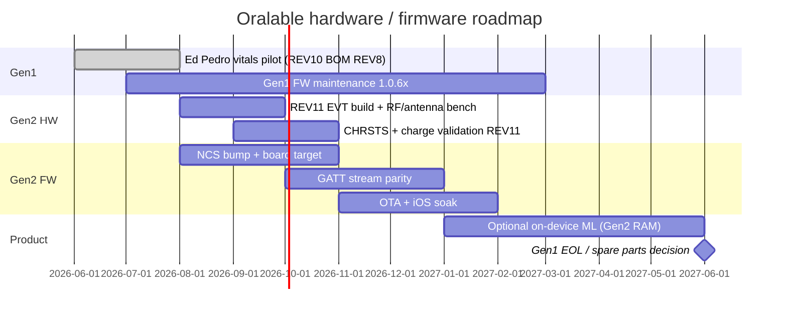

# Gen1 → Gen2 migration — capabilities, change map, roadmap, repo strategy

**Status:** Draft · July 2026  
**Sources:** `PCB00003-TGM-BOM-REV8` (Gen1) · `PCB00003-TGM-BOM-REV9` (Gen2) · REV10/REV11 pickplace · Kaga ES2832 / ES4L15 datasheets

Related: [COST_AND_TIMELINE.md](./data_room/COST_AND_TIMELINE.md) · [VITALS_PHASE_GEN1_GEN2.md](./VITALS_PHASE_GEN1_GEN2.md) · [ORALABLE_SYSTEM_ARCHITECTURE.md](./ORALABLE_SYSTEM_ARCHITECTURE.md) · `oralable_nrf/docs/HARDWARE_ROADMAP_nRF54L15.md` · [FIGURES.md](./FIGURES.md) · **App working diagrams:** [MOBILE_APP_FLOWS.md §2](../../oralable_swift/docs/MOBILE_APP_FLOWS.md#2-how-the-patient-app-works--phase-0)


**Strategy stack:** Stage A wellness wearable → Stage B medical (later) · new US patent embodiment · Ed/Pedro = patient app only.  
**Cost & timeline (planning):** [COST_AND_TIMELINE.md](./data_room/COST_AND_TIMELINE.md) — Phase 0 now–Sep 2026; Phase 1+ Q4’26–Q1’27; Gen2 parallel; Stage B H2’27–2028. Mid Stage A ~€200–250k; Stage A+Gen2 ~€350–450k; through Stage B ~€0.8–1.0M (ranges — not a budget).

---

## 1. Generation identity

| | **Gen1** | **Gen2** |
|--|----------|----------|
| **BOM** | `PCB00003-TGM-BOM-REV8` | `PCB00003-TGM-BOM-REV9` |
| **PCB production** | REV8 / **REV10** (Ed/Pedro pilot) | **REV11** |
| **Kaga U5** | **ES2832AA2** | **ES4L15BA1** |
| **Nordic SoC** | nRF52832-QFAA-G-R | **nRF54L15-CAAA-R** |
| **Battery** | CG-320B **15 mAh** pin LiPo | **LP260820 30 mAh** pouch |
| **Clip + case** | One BOM (LTC4124 RX + LTC6990 TX + USB-C) | Same architecture |

Gen1 and Gen2 are **not** a minor module swap on an identical PCB: **REV11 respins layout** (pickplace origin and component positions differ from REV10). Treat Gen2 as **pcb00003 family + new board revision**, not a drop-in BOM edit.

---

## 2. Capability comparison

### 2.1 Compute & connectivity

| Capability | Gen1 (ES2832AA2) | Gen2 (ES4L15BA1) | Product impact |
|------------|------------------|------------------|----------------|
| **Flash** | 512 KB | **1.5 MB NVM** | Larger signed OTA images; room for on-device models |
| **RAM** | 64 KB | **256 KB** | PPG/ACC double-buffering, mcumgr, optional ML window @ 50 Hz |
| **BLE stack** | nRF52 SoftDevice / legacy controller | **Bluetooth Core 6.0** (nRF Connect SDK) | Re-validate iOS pairing, MTU, supervision timeout |
| **TX power** | +4 dBm (configured in `prj.conf`) | Module ~9.1 mA @ max TX — re-tune | Cheek/temple RSSI profile may improve or shift |
| **Antenna** | Module + PCB layout (REV10) | **On-module certified antenna** | Different body detuning; keep-out zone on REV11 |
| **GPIO budget** | ~15 module pins (ES2832 map) | **15 exposed** (P0.03/04, P1.00–08, P2.01/02/04/05) | **Pinmux is a gating task** — I²C + 2× INT + chrsts + baten + ADC |
| **SWD / debug** | Standard nRF52 | Pin 14 SWDIO, 15 SWDCLK | J-Link workflow unchanged |

### 2.2 Sensors & analog (unchanged silicon, re-layout)

| Block | Gen1 | Gen2 | Notes |
|-------|------|------|-------|
| **PPG** | MAXM86161EFD+ @ 0x62 | Same | Driver + `ppg.c` portable; re-verify I²C pins, INT, cheek IR-DC band |
| **Accelerometer** | LIS2DTW12 @ 0x19 | Same | Driver portable; INT pin may move on REV11 |
| **Wireless charge** | LTC4124 + Würth 760308101216 ×2 | Same | Charge policy, LTC4124 **ISET strap** must be re-checked for **30 mAh** cell |
| **Case TX** | LTC6990 + USB-C | Same | Not WPC Qi |
| **NTC / temp** | NTCG104 on Gen1 BOM | Present on Gen2 BOM | Die temp + NTC path — confirm REV11 routing |
| **Battery gauge** | SAADC P0.28 / AIN4, ×11 divider | **Must be re-mapped** on nRF54 GPIO map | SOC curves differ for LP260820 |

### 2.3 Power & runtime

| | Gen1 | Gen2 |
|--|------|------|
| **Cell** | 15 mAh, 11.2 mA max charge (CG-320B) | **30 mAh** — ~2× energy if load similar |
| **Typical load** | PPG + ACC @ 50 Hz when worn; dim status LED on dock | Same policy initially; headroom for on-device ML |
| **Bulk cap / DCC** | 10 µH L2 (Gen1 BOM) | **4.7 µH** + Kaga **~100 µF** guidance | Gen2 needs explicit bulk cap on battery net |
| **Sleep / ship** | System OFF ~µA (nRF52) | ~0.7 µA System OFF (module spec) | Re-validate `baten` latch (P0.10 on Gen1 DTS) |

### 2.4 Software features enabled by Gen2 (not available on Gen1)

| Feature | Gen1 limit | Gen2 opportunity |
|---------|------------|------------------|
| On-device bruxism / vitals ML | RAM/Flash tight | 256 KB RAM + 1.5 MB Flash — align with `cursor_oralable` Core ML export |
| Richer OTA | ~220 KB slot0 on nRF52832 | Larger slots; less compression pressure |
| Auto placement / chrsts | Manual mode on Gen1 pilot | REV11 may fix wiring — **must be validated on hardware**, not assumed |
| Longer temple sessions | Battery + BLE drops at low SOC | 30 mAh + stronger RF may reduce mid-session disconnects |
| BLE 6.0 features | N/A | Evaluate only if iOS + clinical partners need them |

### 2.5 What Gen2 does **not** change

- **GATT contract** — TGM service `3A0FF000`, characteristics `004`/`006`/`009`, 50 Hz stream semantics (keep stable for iOS + Python pipeline).
- **PPG channel order** — R/G/IR on pcb00003 (`IR_DC_ADC_FORMAT.md`).
- **Analysis rate** — 50 Hz linear resample (`.cursorrules`).
- **Clinical metrics** — TFI, SASHB, occlusion logic in app/Python.

---

## 3. BOM / hardware change map (REV8 → REV9)

| Designator | Gen1 (REV8) | Gen2 (REV9) | Migration action |
|------------|-------------|-------------|------------------|
| **U5** | ES2832AA2 | **ES4L15BA1** | New Zephyr board + NCS nRF54 target |
| **BAT1** | CG-320B 15 mAh | **LP260820 30 mAh** | New fuel/charge tables; mechanical clip pocket |
| **XTL1 → X1** | ECS-.327-9-1210 (bottom) | ABS06 32.768 kHz (top) | LF clock layout per ES4L15 design guide |
| **L2** | 10 µH | **4.7 µH** | DCC per Kaga nRF54 module |
| **L3** | 15 nH RF | — | Removed (module integrated RF) |
| **C11, C12** | 12 pF (module-related) | — | Review ES4L15 reference — do not copy Gen1 blindly |
| **C7–C8, C13** | 1 µF ×3 | 1 µF ×2 | Module bypass per REV11 schematic |
| **R12** | — | 0 Ω | Strap / net tie — confirm in schematic |
| **U1–U4, U6, L1, L4, J2** | LTC4124, MAXM86161, LIS2DTW12, LTC6990, coils, USB-C | **Same MPNs** | Re-route to new module GPIO map |
| **CHRSTS** | Test point (REV10) | Test point (REV11) | Re-verify LTC4124 STAT → nRF pin on **first REV11 boards** |

**Pickplace note:** REV11 moves the power island (BAT1, U1, U5, X1) to a different board region vs REV10. Firmware DTS must follow **REV11 schematic net names**, not REV10 coordinates.

---

## 4. Firmware migration map (Gen1 → Gen2)

### 4.1 Repository layout (target)

```
oralable_nrf/
├── app/                    # Shared application (TGM, PPG, ACC, battery, charge)
├── boards/byteexplain/
│   ├── pcb00003/           # Gen1 — nrf52832 (existing)
│   └── pcb00003_gen2/      # Gen2 — nrf54l15 + REV11 pinmux (new)
├── drivers/sensor/         # maxm86161, lis2dtw12 — reuse
└── build_pcb00003/         # Gen1 build dir
    build_pcb00003_gen2/    # Gen2 build dir
```

### 4.2 By subsystem

| Area | Gen1 today | Gen2 work | Risk |
|------|------------|-----------|------|
| **Board / DTS** | `pcb00003.dts`, nRF52832 QFAA | New `compatible`, `nrf54l15` dtsi, **15-pin GPIO map** | **High** — wrong pin = dead sensors |
| **Pinmux** | I²C SDA P0.07, SCL P0.18; INT ACC P0.06, PPG P0.20; chrsts P0.05; baten P0.10; ADC P0.28 | **REV11 nets** — [PCB00003_GEN2_REV11_HARDWARE.md §5](./PCB00003_GEN2_REV11_HARDWARE.md#5-gpio-map--status) | **High** |
| **NCS / Zephyr** | Current west workspace (nRF52) | **Upgrade to NCS with nRF54L15 support** | **High** — may require workspace bump |
| **BLE / GATT** | `ble.c`, `tgm_service.c` | Port Kconfig (`CONFIG_BT_*` differs on nRF54); **keep UUIDs + byte layout** | Medium |
| **Conn params** | 32 s supervision (nRF52 max) | Re-check nRF54 limits | Medium |
| **MCUboot / OTA** | `sysbuild.conf`, ECDSA P256, 512 KB partitions | New partition table for 1.5 MB; re-sign; Device Manager test | Medium |
| **PPG / ACC** | `ppg.c`, `acc.c`, drivers | Re-test only | Low (if I²C/INT correct) |
| **Battery** | `battery.c`, ×11 divider, CG-320B curves | New LUT / thresholds for LP260820 | Medium |
| **Charge** | `charge_detector.c`, LTC4124 chrsts | Re-validate on REV11; may drop manual placement | Medium |
| **LED policy** | PPG-as-LED, vitals **1.0.70** | Unchanged logic | Low |
| **Kconfig** | `CONFIG_BT_CTLR_TX_PWR_PLUS_4` (nRF52) | Replace with nRF54 equivalent | Low |

### 4.3 iOS / OralableCore / Python

| Repo | Fork? | Gen2 action |
|------|-------|-------------|
| **oralable_swift** | No | Same GATT; optional firmware gate string for Gen2 builds; RF soak retest |
| **OralableCore** | No | Parser unchanged if `004`/`009` layout unchanged |
| **cursor_oralable** | No | Same 50 Hz pipeline; new validation logs from Gen2 bench |

### 4.4 Suggested firmware phases

| Phase | Goal | Exit gate |
|-------|------|-----------|
| **G2-P0** | NCS + `pcb00003_gen2` blink + SWD + RTT | J-Link flash REV11 |
| **G2-P1** | I²C bring-up: WHO_AM_I ACC + PPG ID | Sensor read in RTT |
| **G2-P2** | BLE advertise + GATT `006` version string | nRF Connect discovery |
| **G2-P3** | Stream PPG/ACC @ 50 Hz worn | Match Gen1 notify rate ±10% |
| **G2-P4** | Battery + charge + LED matrix | §3.3 scenario table in architecture doc |
| **G2-P5** | MCUboot OTA + iOS Device Manager | Signed swap on bench |
| **G2-P6** | Pilot parity (vitals temple) | Ed/Pedro-equivalent gates on Gen2 |

---

## 5. Roadmap (recommended sequencing)



**Parallel operation (6–12 months):** Ship and support **Gen1** for Ed/Pedro and any field units while **Gen2** runs on a branch with separate `build_pcb00003_gen2` artifacts. Firmware version strings should distinguish builds (e.g. `2.0.0-gen2-nrfconnect` vs `1.0.70`).

**Gen1 sunset criteria:** Gen2 passes G2-P4 + G2-P5; IR-DC cheek band matches Gen1 baseline; iOS reconnect/RSSI equal or better.

---

## 6. Should you fork the repository?

### Recommendation: **do not fork** — use **multi-board single repo**

| Approach | Verdict | Why |
|----------|---------|-----|
| **Single repo, two board targets** (`pcb00003` + `pcb00003_gen2`) | **Preferred** | Already matches `byteexplain` pattern (`pcb00003` + `a200451`); one GATT codebase; shared drivers |
| **Long-lived git branch** (`gen2/nrf54l15`) | **OK for bring-up** | Merge to `main` when G2-P3 passes; avoid permanent divergence |
| **Full repo fork** (`oralable_nrf_gen2`) | **Not advisable** | Duplicates mcuboot, TGM, charge_detector fixes; double CI; merge pain |
| **Fork iOS / OralableCore** | **No** | BLE contract unchanged |
| **Fork cursor_oralable** | **No** | Same log format |

### When a fork *might* make sense

- **Different NCS major** locked for years and west workspace cannot coexist (rare if build dirs are separate).
- **Separate team / IP boundary** (contract manufacturer owns Gen2 firmware only).
- **Regulatory submission** frozen on Gen1 binary while Gen2 experiments freely (use **release branches + tags**, not a fork, first).

### Practical git workflow (**implemented**)

Living board: **[GEN1_GEN2_TRACKING.md](./GEN1_GEN2_TRACKING.md)** · FW repo: **`oralable_nrf/docs/GEN2_GIT_WORKFLOW.md`**

1. **`known-good-battery-ble`** — Gen1 production (`1.0.x`), tags for pilot flashes.
2. **`feature/gen2-nrf54l15`** — Gen2 bring-up + `boards/byteexplain/pcb00003_gen2/` stub until G2-P3.
3. **Artifacts:** `artifacts/oralable_2.0.0_pcb00003_gen2_merged.hex` vs `1.0.70_pcb00003_*` (see `artifacts/README.md`).
4. **Protect Gen1:** `west build -b pcb00003` must keep passing on every merge until Gen1 EOL.
5. **Status:** `oralable_nrf/scripts/gen2_status.sh`

---

## 7. Risks & open items

| Risk | Mitigation |
|------|------------|
| GPIO exhaustion on ES4L15 | Pinmux spreadsheet before REV11 layout freeze; drop optional debug GPIO first |
| iOS BLE regression on nRF54 | Early nRF Connect + TestFlight soak; keep OralableCore parsing identical |
| OTA brick on new partitions | SWD recovery path; dual-slot MCUboot; never ship Gen2 OTA before G2-P5 |
| Charge current on 30 mAh | Strap LTC4124 to ≤15 mA until thermal validation |
| Antenna on cheek | A/B RSSI vs Gen1 at temple/cheek; module keep-out in encapsulation |
| NCS upgrade breaks nRF52 build | Pin NCS version in CI; two Docker/west manifests if needed |

**Open:** REV11 schematic nets are documented in [PCB00003_GEN2_REV11_HARDWARE.md](./PCB00003_GEN2_REV11_HARDWARE.md); **GPIO↔net assignment requires Altium netlist or first-board bench verify** before `pcb00003_gen2.dts` is locked.

---

## 8. References

| Document | Path |
|----------|------|
| Gen1 BOM REV8 | `PCB00003-TGM-PRODUCTION_DATA-REV8/PCB00003-TGM-BOM-REV8.xlsx` |
| Gen2 BOM REV9 | `PCB00003-TGM-PROD_DATA-REV11_260620/PCB00003-TGM-BOM-REV9.xlsx` |
| Gen1 pickplace | `PCB00003-TGM-PICKPLACE-REV10.csv` |
| Gen2 pickplace / schematic | `PCB00003-TGM-PICKPLACE-REV11.csv` · `PCB00003-TGM-SCHEM-REV10.PDF` |
| Gen2 hardware reference | [PCB00003_GEN2_REV11_HARDWARE.md](./PCB00003_GEN2_REV11_HARDWARE.md) |
| Gen1 DTS | `oralable_nrf/boards/byteexplain/pcb00003/pcb00003.dts` |
| nRF54 roadmap detail | `oralable_nrf/docs/HARDWARE_ROADMAP_nRF54L15.md` |
| Pilot workarounds | [VITALS_PHASE_GEN1_GEN2.md](./VITALS_PHASE_GEN1_GEN2.md) |
