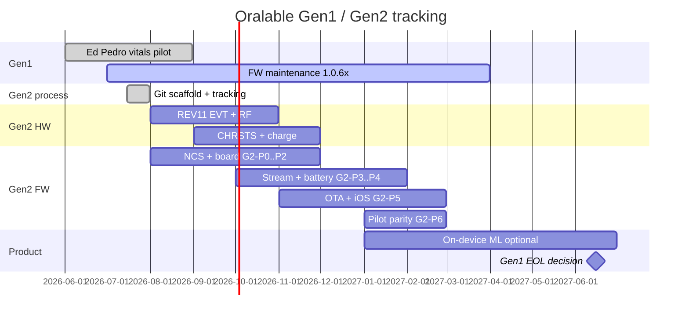

# Gen1 / Gen2 — living tracking board

**Owner:** John Cogan · **Updated:** 2026-07-26  
**Policy:** Single repo, multi-board — **do not fork**. See [GEN1_GEN2_MIGRATION.md](./GEN1_GEN2_MIGRATION.md) · [PCB00003_GEN2_REV11_HARDWARE.md](./PCB00003_GEN2_REV11_HARDWARE.md) · **[PRODUCT_ROADMAP.md](./PRODUCT_ROADMAP.md)** · **[VERSION_ALIGNMENT.md](./data_room/VERSION_ALIGNMENT.md)** · **[COST_AND_TIMELINE.md](./data_room/COST_AND_TIMELINE.md)**


**Strategy stack:** Stage A wellness wearable → Stage B medical (later) · new US patent embodiment · Ed/Pedro = patient app only.  
**Cost & timeline (planning):** [COST_AND_TIMELINE.md](./data_room/COST_AND_TIMELINE.md) — Phase 0 now–Sep 2026; Phase 1+ Q4’26–Q1’27; Gen2 parallel; Stage B H2’27–2028. Mid Stage A ~€200–250k; Stage A+Gen2 ~€350–450k; through Stage B ~€0.8–1.0M (ranges — not a budget).

---

## 1. Git map (active)

| Track | Repo | Branch / tag | Board | FW string | Status |
|-------|------|--------------|-------|-----------|--------|
| **Gen1 production** | `oralable_nrf` | working tree → tag `v1.0.70` | `pcb00003` | **`1.0.70`** (pilot ship hex) | **Active pilot** |
| **Gen1 prior** | `oralable_nrf` | tags `v1.0.66` | `pcb00003` | `1.0.66` | Rollback only |
| **Gen2 bring-up** | `oralable_nrf` | `feature/gen2-nrf54l15` | `pcb00003_gen2` | `2.0.0-gen2-nrfconnect` (target) | **Scaffold** |
| **Docs / research** | `cursor_oralable` | `main` | — | docs **1.3.15** / data_room **1.1.42** | Tracking live |
| **iOS / Core** | `oralable_swift` · `OralableCore` | current | — | App **4.3.3** · gate min **1.0.63** / recommend **1.0.70** | No Gen2 fork |

### Rules (non-negotiable)

1. **Never** break `west build -b pcb00003` on merges into Gen1 production branch until Gen1 EOL.
2. Gen2 work lands on **`feature/gen2-nrf54l15`** until **G2-P3** (GATT stream parity) passes, then merge to Gen1 production line with both boards building.
3. Artifacts must encode board + version:
   - Gen1: `artifacts/oralable_1.0.70_pcb00003_merged.hex`
   - Gen2: `artifacts/oralable_2.0.0_pcb00003_gen2_merged.hex`
4. Do **not** create `oralable_nrf_gen2` (or fork iOS / Core / Python).

### Tag conventions

| Tag | Meaning |
|-----|---------|
| `v1.0.66` | Gen1 prior ship (rollback hex) |
| `v1.0.70` | Gen1 **current** ship — STAT blink dock + 1.0.67/1.0.68 lineage |
| `v1.0.70-ed-pedro` | Gen1 flash frozen for Ed/Pedro kits |
| `v2.0.0-gen2-g2p0` | Gen2 phase gate tag (blink + SWD) |
| `v2.0.0-gen2-g2p3` | Gen2 stream parity — merge candidate |

---

## 2. Timeline (calendar)

| Window | Track | Milestone | Exit |
|--------|-------|-----------|------|
| **2026-06 → 2026-08** | Gen1 | Ed/Pedro vitals pilot (REV10 / BOM REV8) | Phase 0 success criteria |
| **2026-07 → 2027-03** | Gen1 | FW maintenance `1.0.6x` | Tags + data-room hex |
| **2026-07 → 2026-08** | Gen2 | Git scaffold + board stub + tracking | Branch exists; this doc live |
| **2026-08 → 2026-10** | Gen2 HW | REV11 EVT + RF/antenna bench | RSSI A/B vs Gen1 |
| **2026-08 → 2026-11** | Gen2 FW | NCS bump + `pcb00003_gen2` DTS (G2-P0…P2) | Advertise + `006` |
| **2026-09 → 2026-11** | Gen2 HW | CHRSTS + charge on REV11 | Byte0 or manual mode validated |
| **2026-10 → 2027-01** | Gen2 FW | GATT stream parity (G2-P3…P4) | 50 Hz ±/ACC |
| **2026-11 → 2027-02** | Gen2 FW | OTA + iOS soak (G2-P5) | Device Manager swap |
| **2027-01 → 2027-02** | Gen2 | Pilot parity (G2-P6) | Temple vitals gates |
| **2027-01 → 2027-06** | Gen2 | Optional on-device ML | Research gate |
| **2027-06** | Product | Gen1 EOL / spare-parts decision | Written decision |



---

## 3. Phase checklist (firmware)

Update status: `pending` → `in_progress` → `done` · put date in Notes.

| Phase | Goal | Exit gate | Status | Notes |
|-------|------|-----------|--------|-------|
| **G2-P0** | NCS + board blink + SWD + RTT | J-Link flash REV11; RTT hello | pending | Board stub scaffolded 2026-07-16 |
| **G2-P1** | I²C WHO_AM_I ACC + PPG | Sensor IDs in RTT | pending | Needs Altium netlist / bench pinmux |
| **G2-P2** | BLE advertise + GATT `006` | nRF Connect discovery | pending | Version `2.0.0-gen2-…` |
| **G2-P3** | Stream PPG/ACC @ 50 Hz | Rate ±10% vs Gen1 | pending | Merge-ready when done |
| **G2-P4** | Battery + charge + LED | Architecture §3.3 scenarios | pending | LP260820 LUT |
| **G2-P5** | MCUboot OTA | Device Manager signed swap | pending | New partitions |
| **G2-P6** | Pilot parity | Ed/Pedro-equivalent vitals | pending | Temple HR/SpO₂ |

### Hardware / pinmux gates (before G2-P1)

| # | Item | Status |
|---|------|--------|
| H1 | Altium netlist → lock GPIO table in REV11 hardware doc | pending |
| H2 | Confirm 100 µF bulk on REV11 | pending |
| H3 | LTC4124 ISET strap for 30 mAh | pending |
| H4 | First REV11 continuity: SDA/SCL/CHRSTS/SENS_EN/BATEN/BATVOL | pending |
| H5 | RF soak cheek/temple vs Gen1 | pending |

### Gen1 protection gates

| # | Item | Status |
|---|------|--------|
| G1-1 | `west build -b pcb00003` green on Gen1 branch | active |
| G1-2 | Pilot hex in `docs/data_room/firmware/` matches tag | active (**1.0.70** shipping) |
| G1-3 | Placement docs: Automatic OK on 1.0.70+ | active |
| G1-4 | STAT blink + prior BLE/Bugbot lineage in **1.0.70** | **ship packaged**; RTT gate + TestFlight soak |

---

## 3b. Scheduled backlog (do-now vs later)

### Do next (blocks Ed/Pedro handoff on 1.0.70)

| # | Owner | Item | Exit |
|---|-------|------|------|
| S1 | John | Flash both kits **1.0.70** | `006` reads `1.0.70` |
| S2 | John | nRF Connect/RTT: blink→charge_active; taper→solid; undock→off | [FIRMWARE_1.0.70_FLASH.md](./data_room/FIRMWARE_1.0.70_FLASH.md) |
| S3 | John | TestFlight **4.3.3** soak: Automatic + Device LED | App pairs with 1.0.70 |
| S4 | John | Tag `v1.0.70` / `v1.0.70-ed-pedro` after S2 | G1-2 frozen |

### Later (not blocking Ed/Pedro on 1.0.70 kits)

| # | When | Item | Notes |
|---|------|------|-------|
| L1 | After pairing UX | `CONFIG_MCUMGR_TRANSPORT_BT_PERM_RW_AUTHEN` | Nordic production DFU auth |
| L2 | Post-pilot | In-app Device Manager / McuManager | OTA still via Nordic Device Manager |
| L3 | Gen2 | G2-P0…P6 + H1–H5 | See §3 phase checklist |
| L4 | Optional | Refresh `docs/upload/*` frozen pack | Or keep deprecated |
| L5 | Optional | ACC INT via DT `gpio_dt_spec` (parity with PPG) | ACC still hardcoded ACTIVE_HIGH |

---

## 4. How to work day-to-day

### Gen1 fix (pilot / Ed & Pedro)

```bash
cd oralable_nrf
git checkout known-good-battery-ble
# … fix …
west build -b pcb00003 -d build_pcb00003 app --sysbuild
# tag after validation: git tag -a v1.0.70 -m "Gen1 STAT blink ship …"
```

### Gen2 bring-up

```bash
cd oralable_nrf
git checkout feature/gen2-nrf54l15
# … board / NCS / app port …
# When NCS supports nRF54L15 in this workspace:
west build -b pcb00003_gen2 -d build_pcb00003_gen2 app --sysbuild
```

### After G2-P3 — dual build on one branch

```bash
west build -b pcb00003 -d build_pcb00003 app --sysbuild
west build -b pcb00003_gen2 -d build_pcb00003_gen2 app --sysbuild
```

Helper: `oralable_nrf/scripts/gen2_status.sh`

---

## 5. Sunset criteria (Gen1)

All must be true before Gen1 EOL decision (target **2027-06**):

- [ ] G2-P4 and G2-P5 **done**
- [ ] IR-DC cheek band matches Gen1 baseline (`scripts/check_ir_dc_scaling.py`)
- [ ] iOS reconnect / RSSI ≥ Gen1 at temple
- [ ] Spare-parts / field Gen1 count documented
- [ ] Written EOL note in this file + architecture changelog

---

## 6. Changelog (process)

| Date | Change |
|------|--------|
| 2026-07-16 | `app/VERSION` → **1.0.67**; dropped misplaced `CONFIG_BT_DFU_SMP` (central client); iOS CCC timeouts + hang fixes; scheduled backlog §3b |
| 2026-07-16 | Nordic/Apple align documented: adv `.recycled`, iOS awaited CCC + status/battery readiness, explicit MCUmgr Kconfigs (SMP auth deferred) |
| 2026-07-22 | Pilot ship aligned to **1.0.70** + app **4.3.2**; STAT blink dock; prior 1.0.67/1.0.68 lineage folded in |
| 2026-07-24 | Milestone: app **4.3.3** (build 4) · Temporalis MAM Mac Protocol A retrain · night-report PDF path |
| 2026-07-26 | Docs align: hub **1.3.15** / data_room **1.1.42** · overnight bands + Core ML cohort · PRODUCT_ROADMAP §3 canonical timeline (Phase 0 gated; eng overnight shipped early) |
| 2026-07-16 | Tracking board created; `feature/gen2-nrf54l15` @ `c378a89` + `pcb00003_gen2` stub; no-fork policy locked |
