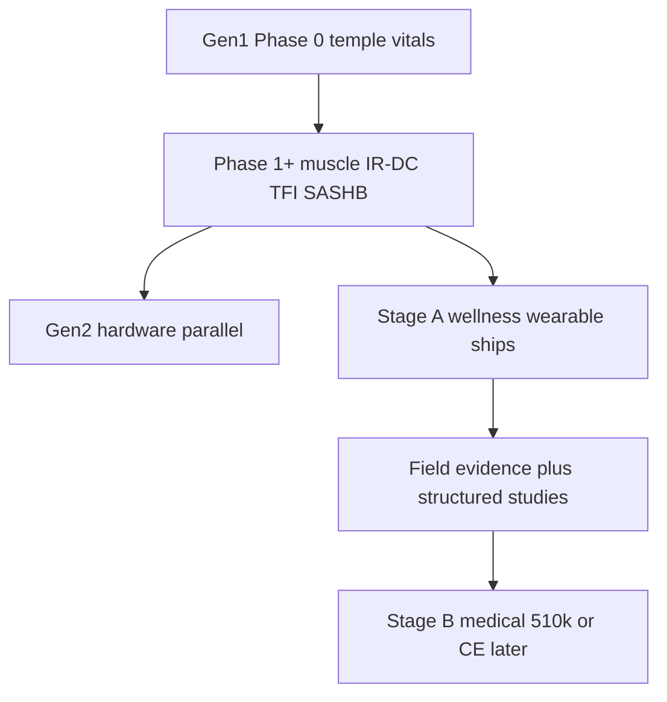
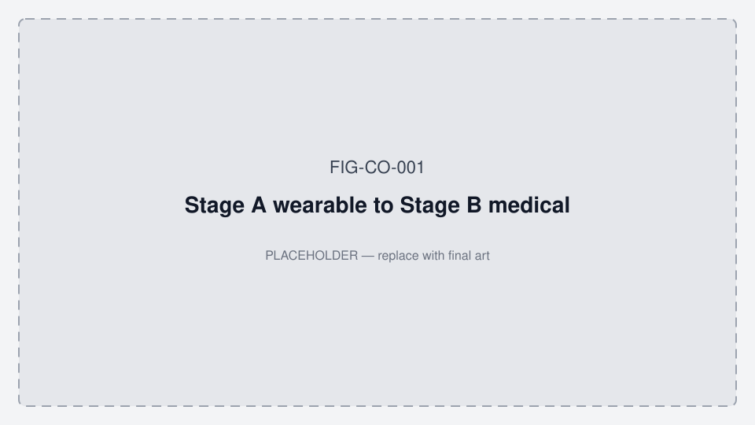
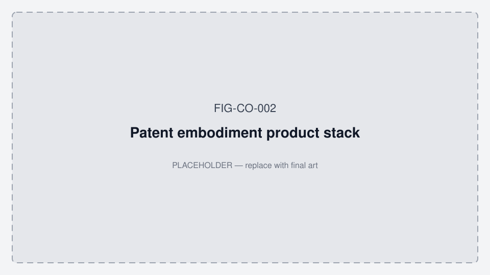
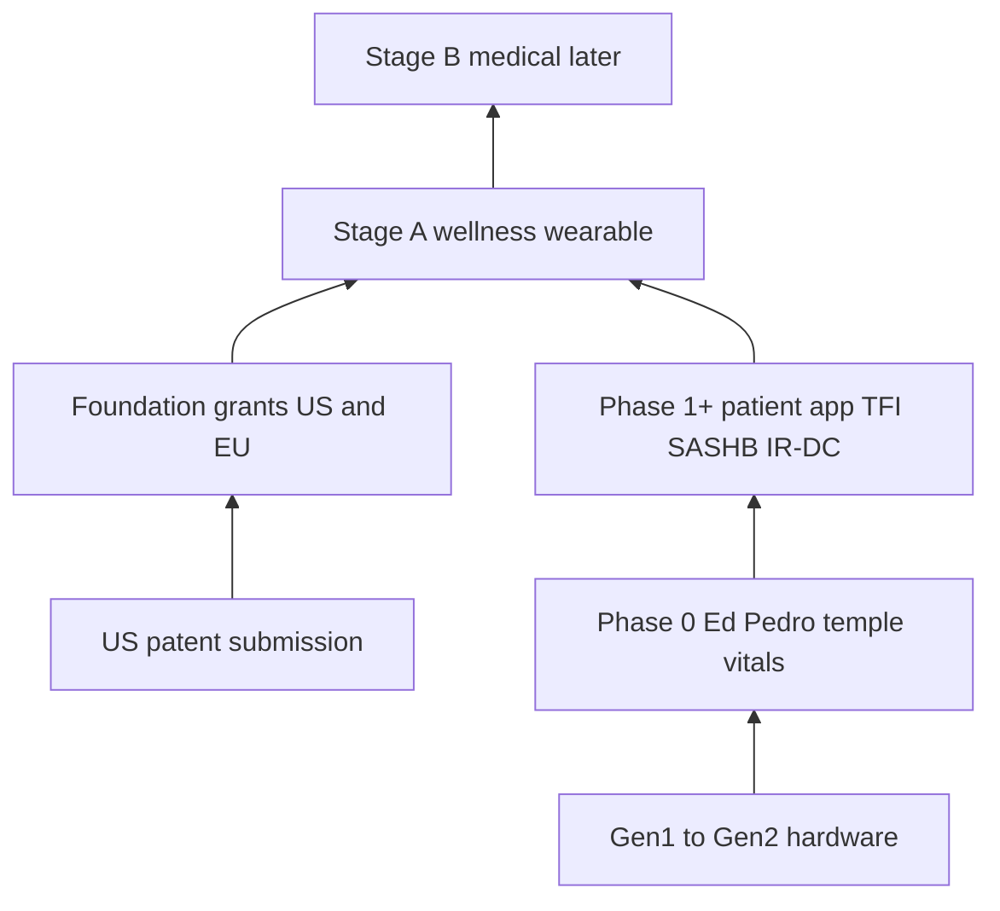

# North star — patent-backed wearable, then medical device

**Status:** Canonical product end-goal · July 2026  
**Audience:** Engineering, pilot, apps, GTM, counsel (Peacock / Strand Two — portfolio external to git)

**Related:** [PRODUCT_ROADMAP.md](./PRODUCT_ROADMAP.md) · [data_room/REGULATORY_TIMELINE.md](./data_room/REGULATORY_TIMELINE.md) · [ORALABLE_SYSTEM_ARCHITECTURE.md](./ORALABLE_SYSTEM_ARCHITECTURE.md) §14 · [data_room/APPS_AND_REVENUE_EVAL.md](./data_room/APPS_AND_REVENUE_EVAL.md) · [COST_AND_TIMELINE.md](./data_room/COST_AND_TIMELINE.md) · [data_room/IP_EVAL_AND_LANDSCAPE.md](./data_room/IP_EVAL_AND_LANDSCAPE.md) · [FIGURES.md](./FIGURES.md) · **App working diagrams:** [MOBILE_APP_FLOWS.md §2](../../oralable_swift/docs/MOBILE_APP_FLOWS.md#2-how-the-patient-app-works--phase-0)

**Strategy stack:** Stage A wellness wearable → Stage B medical (later) · new US patent embodiment · Ed/Pedro = patient app only.  
**Cost & timeline (planning):** [COST_AND_TIMELINE.md](./data_room/COST_AND_TIMELINE.md) — Phase 0 now–Sep 2026; Phase 1+ Q4’26–Q1’27; Gen2 parallel; Stage B H2’27–2028. Mid Stage A ~€200–250k; Stage A+Gen2 ~€350–450k; through Stage B ~€0.8–1.0M (ranges — not a budget).

---

## 1. End goal (two stages)

**Stage A — Wearable (now → near term):** Ship Oralable as a **consumer wellness wearable** that **implements** the invention in the **new US patent being submitted** (Temporalis OMG / IR-DC / TFI / SASHB) — working overnight product, not slides. Wellness App Store claims only. Ed/Pedro = patient app.

**Stage B — Medical device (later):** Use Stage A field evidence + structured studies to pursue a **cleared / CE medical device** pathway (US 510(k) monitoring indication target; EU MDR Class IIa exploration). Locked labeling, IFU, QMS — **not claimed today**.

| Stage | Product class | App posture | IP role | Revenue |
|-------|---------------|-------------|---------|---------|
| **A — Wearable** | General wellness wearable | Patient app; professional app deferred until Phase 1+ | Embody + support **new US filing**; foundation US/EU grants remain | Hardware + consumer IAP; Path B later |
| **B — Medical device** | Cleared / CE medical tier (future) | Patient + professional clinical workflows | Same patent family supports differentiated SaMD/device story | Higher ASP; slower; counsel + regulatory gate |

**Rule:** Do **not** jump to Stage B claims in App Store, website, or Ed/Pedro materials. Stage A must stay honest wellness while the patent embodiment matures.

*Figure FIG-CO-001 — Stage A wearable → Stage B medical pathway (placeholder).*

*Figure FIG-CO-002 — Patent embodiment product stack (placeholder).*

---

## 2. One-sentence stack

Everything we build — Gen1 Phase 0 → Phase 1+ → Gen2 → patient app → (later) professional app → clinical evidence — first **ships as a patent-implementing wearable**, then **graduates to a medical device** when evidence and regulatory gates allow — still practicing the claimed invention (temporalis / optical myography, hemodynamic IR-DC jaw load, overnight SpO₂ burden correlation), not only the older granted foundation patents.

---

## 3. IP layers (do not conflate)

| Layer | What it is | In-repo status |
|-------|------------|----------------|
| **Foundation patents** | WO **2022234145** / **EP 4 333 691 B1** (certificated Jul 2026) · **UP + IE/UK** instructed + US utility **18/289,827** (RCE) | [data_room/IP_PORTFOLIO_STATUS.md](./data_room/IP_PORTFOLIO_STATUS.md) · [data_room/IP_EVAL_AND_LANDSCAPE.md](./data_room/IP_EVAL_AND_LANDSCAPE.md) |
| **New US filing** | Track 1 provisional **64/033,978** filed **9 Apr 2026** (title: Apparatus and Method for Muscle Activity Monitoring) | Assign inventor → JAC if needed; convert within 12 months |
| **Pending US utility** | **18/289,827** — RCE + After Final response **filed 12 Jun 2026** | Continued examination (Peacock) |
| **Software / trade secrets** | Firmware GATT, OralableCore pipeline, Core ML Temporalis | In repos; FTO memo still a Ken **GAP** |

**Rule:** Public marketing may say “patents granted (US & EU)” for foundation IP. Do **not** publish provisional claim text, filing numbers, or “patent pending” on oralable.com until counsel signs off. Do **not** imply FDA/CE medical clearance during Stage A.

---

## 4. What “implementation” means (product ↔ claims)

Counsel owns exact claim language. Engineering implements **enabling embodiments** documented in architecture §14:

| Claim theme (provisional-aligned) | Product embodiment | When |
|-----------------------------------|--------------------|------|
| Optical myography at **temporalis** | Temple placement, overnight coupling | Phase 0 placement → Phase 1+ muscle UI |
| **Hemodynamic occlusion (IR-DC)** | IR-DC trough / occlusion %, ACC cross-check | Phase 1+ (**Stage A wearable**) |
| **Overnight jaw load** | Phasic / tonic / quiet / rescue; Core ML Temporalis | Phase 1+ |
| **State hypnogram (patient UX)** | In-app barcode + Clinical PDF (device-inferred states) | **Phase 0 shipping** — Dashboard / Share; ≥6&nbsp;h bands |
| **Blood oxygen burden correlation** | **SASHB** + SpO₂ vs rescue / clench timing | Phase 0 SpO₂ → Phase 1+ correlation exports |
| **TFI** | IR-DC slope + green AC slope → 0–100 | Phase 1+ patient app |
| Clinical / patent tables | Clinical report, handshake hourly bins | Phase 0 PDF pack; Phase 1+ muscle polish; professional app after share gate |
| **Stage B medical** | Same metrics under locked IFU / SaMD labeling | After regulatory submission path |

**Phase 0 role:** Prove temple SpO₂ / HR and honest device state — substrate for SASHB and overnight sessions. Patient app already surfaces the overnight **state hypnogram** (wellness copy only). Full IR-DC / TFI invention story is Phase 1+.

**Ed/Pedro:** Patient app only — Stage A wearable evidence. Professional app not required for this iteration.

---

## 5. How workstreams serve Stage A → Stage B

| Workstream | Stage A (wearable) | Stage B (medical, later) |
|------------|--------------------|---------------------------|
| Firmware / Gen1–Gen2 | Reliable overnight stream | Same stack; locked builds for clearance |
| Patient app | Wellness UX embodying patent metrics | IFU-aligned UI; claim-safe copy |
| Professional app | Off for Ed/Pedro; on after Phase 1+ share | Clinical viewer / CDS (label-dependent) |
| Regulatory | Wellness disclaimers only | 510(k) / MDR path — [REGULATORY_TIMELINE.md](./data_room/REGULATORY_TIMELINE.md) |

---

## 6. Success criteria

### Stage A — Wearable (engineering)

1. [ ] Repeatable temple overnight sessions on Gen1 (Phase 0 gates)  
2. [ ] IR-DC + TFI + SASHB in Python **and** Swift (parity)  
3. [x] Clinical / patent-table export from real logs (Clinical Temporalis PDF + Mac night pack)  
4. [x] Patient app surfaces overnight hypnogram + bands with **wellness-only** copy (`StateHypnogramView`)  
5. [ ] Claim wording consistent with latest US submission (counsel)  
6. [ ] Professional share path only after (3)–(4)

### Stage B — Medical device (later; counsel + regulatory)

7. [ ] Evidence package from Stage A field use + structured studies  
8. [ ] Predicate / indication locked; SaMD boundary decided  
9. [ ] US 510(k) (and/or EU MDR) submission ready — not App Store wellness tier  

---

## 7. External artifacts (not in git)

- Peacock Law portfolio (granted + new US submission)  
- Strand Two IP assignments  
- Provisional / US application drafts  
- Regulatory counsel file for Stage B  

When Stage A→B gate or filing status changes, update this file and bump `docs/VERSION`.

---

*Last updated: 2026-07-22*
