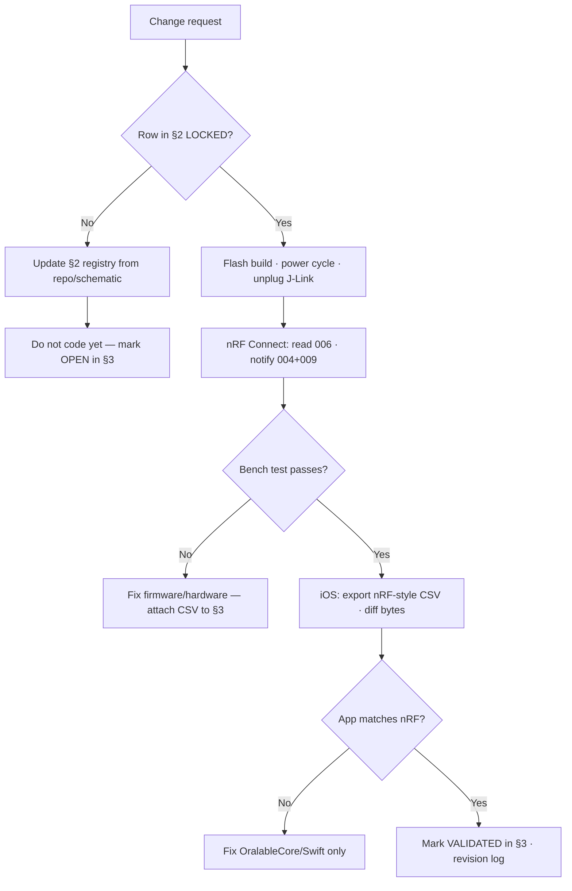

# Oralable System Architecture

**App working diagrams:** [MOBILE_APP_FLOWS.md §2](../../oralable_swift/docs/MOBILE_APP_FLOWS.md#2-how-the-patient-app-works--phase-0)

**Living document for engineering, clinical validation, and NotebookLM**

| Field | Value |
|-------|--------|
| Last updated | 2026-07-26 |
| Firmware baseline | pcb00003, nRF52832, TGM GATT `3A0FF000` — **Gen1 target 1.0.84** (IR-pulse worn · STAT blink · pad/desk recover) · see [VERSION_ALIGNMENT.md](./data_room/VERSION_ALIGNMENT.md) |
| iOS | App **4.3.3** (build **5**) · `FirmwareGate` min **1.0.63** · recommend **1.0.84** |
| Python sampling standard | 50 Hz (20 ms), PPG R/G/IR + ACC — **Phase 0:** temple vitals; **Phase 1+:** cheek/temple IR-DC |
| Primary repos | `oralable_nrf`, `oralable_swift`, `OralableCore`, `cursor_oralable` |
| Figures | [FIGURES.md](./FIGURES.md) · Mermaid hub [ORALABLE_SYSTEM_MAP_DIAGRAMS.md](./ORALABLE_SYSTEM_MAP_DIAGRAMS.md) |

**How to use this doc**

- Upload to NotebookLM with selected PDFs (clinical protocol, patent drafts) and CSV exports from nRF Connect.
- When behavior changes, update the **Revision log** at the end and bump **Last updated**.
- **Ground truth for BLE** is always an nRF Connect iOS CSV export, not this markdown file.
- **Strategy stack:** Stage A wellness wearable → Stage B medical (later) · new US patent embodiment · Ed/Pedro = patient app only.  
**Cost & timeline (planning):** [COST_AND_TIMELINE.md](./data_room/governance/COST_AND_TIMELINE.md) — Phase 0 now–Sep 2026; Phase 1+ Q4’26–Q1’27; Gen2 parallel; Stage B H2’27–2028. Mid Stage A ~€200–250k; Stage A+Gen2 ~€350–450k; through Stage B ~€0.8–1.0M (ranges — not a budget).

**Product truth** is locked in **§2 Truth registry**; **where we are** is tracked in **§3 Validation status matrix** — update both before shipping firmware or app changes.

---

## 1. Product truth lockdown process

**Rule:** Do not change firmware, iOS BLE parsing, or LED/charger logic until the relevant rows in §3 are **LOCKED** (documented) and the bench test in §3 passes on a fresh nRF Connect CSV.

This process exists because assumptions (wired dock, GPIO invert without measurement, solid-green from inflated ADC on the wireless dock) caused weeks of churn. Lock facts from **repos + schematic/DTS + nRF logs + BOM**, not from chat memory.

### 1.1 Layers (order matters)

| Layer | What is “truth” | Authoritative source | Lock before… |
|-------|-----------------|----------------------|--------------|
| **L0 Product** | Wear site, use case, charging type (Oralable magnetic case), regulatory intent | This doc §2 + product brief | Any UX or clinical claim |
| **L1 Hardware** | Pins, parts, GPIO polarity, ADC divider | `pcb00003.dts`, schematic, BOM | Firmware `chrsts`/battery/LED |
| **L2 BLE contract** | UUIDs, payload sizes, endianness, notify order | `tgm_service.c`, nRF Connect CSV | iOS connect flow changes |
| **L3 Firmware policy** | Worn, charger detect, LED semantics, streaming gates | `main.c`, `charge_detector.c`, nRF CSV | App worn/stream assumptions |
| **L4 Algorithms** | 50 Hz, filters, TFI/SASHB, Core ML I/O | `cursor_oralable` + OralableCore | Dashboard / patent tables |
| **L5 Clinical** | Protocol phases, pass criteria, gold CSVs | `TEMPORALIS_COLLECTION_PROTOCOL.md` (Protocol B), `CLINICAL_VALIDATION.md` | Investor/clinical reports |

### 1.2 Lockdown workflow (every firmware or BLE change)



### 1.3 What counts as “locked”

| Criterion | Required |
|-----------|----------|
| Written in §2 with file path or schematic ref | Yes |
| Contradicts no nRF Connect CSV on file | Yes |
| `CHRSTS_INVERT` / polarity changed | Only after byte0 toggles on/off **Oralable case** in CSV |
| LED policy changed | Only after charger + SOC matrix in §3.3 passes |
| iOS BLE change | Only after nRF Connect pass on same firmware build |

### 1.4 Artifacts to attach when validating

| Artifact | Filename pattern | Used for |
|----------|------------------|----------|
| nRF Connect CSV | `nrf_log_YYYYMMDD_NN.csv` | BLE bytes, mV, status byte0 |
| iOS nRF-style export | `oralable_nrf_YYYYMMDD.csv` | Diff vs nRF Connect |
| Clinical segment | `Oralable_YYYYMMDD_*.txt` | TFI/SASHB/occlusion |
| Flash record | `merged.hex` + `3A0FF006` string | Reproducibility |

Repo rule: `oralable_nrf/.cursor/rules/nrf-connect-validation.mdc`

---

## 2. Truth registry (locked product & hardware facts)

**Status key for registry rows:** LOCKED = agreed and sourced; OPEN = needs hardware/doc confirmation.

| ID | Truth | Value (pcb00003) | Source | Registry |
|----|--------|------------------|--------|----------|
| P-01 | Product form (target) | Clip on temporalis / masseter region (overnight) | Product | LOCKED |
| P-01a | **Phase 0 (now)** | **Temple** HR & SpO₂; no muscle-fit calibration; Gen1 BOM REV8 / REV10 / ES2832AA2 / FW **1.0.84** | [PRODUCT_ROADMAP.md](./PRODUCT_ROADMAP.md) | LOCKED |
| P-01b | **Phase 1+** | IR-DC / TFI / SASHB / Protocol B on **same Gen1 hardware** | PRODUCT_ROADMAP | LOCKED |
| P-02 | Charging | **Oralable magnetic case** — clip **LTC4124** RX + case **LTC6990** TX on **same PCB00003 BOM**; **not WPC Qi**; not wired contact dock | BOM REV8 + pickplace | LOCKED |
| P-03 | Overnight use | Sleep bruxism + vitals + hypoxic burden (Phase 1+ product target; Phase 0 = vitals first) | Product/clinical | LOCKED |
| H-01 | MCU (Gen1) | Kaga **ES2832AA2** → nRF52832-QFAA-G-R | **BOM REV8** U5 · PCB **REV10** | LOCKED |
| H-01b | MCU (Gen2) | Kaga **ES4L15BA1** → nRF54L15 | **BOM REV9**, PCB **REV11** | LOCKED |
| H-02 | PPG | MAXM86161 @ 0x62, R/G/IR | DTS + driver | LOCKED |
| H-03 | ACC | LIS2DTW12 @ 0x19 | DTS | LOCKED |
| H-04 | Battery (Gen1) | CG-320B ~15 mAh | BOM REV8 | LOCKED |
| H-04b | Battery (Gen2) | LP260820 ~30 mAh | BOM REV9 | LOCKED |
| H-05 | Battery ADC | P0.28 / AIN4, divider ×11 | `pcb00003.dts` | LOCKED |
| H-06 | Boost latch | `baten` P0.10 must stay HIGH | DTS + `main.c` | LOCKED |
| H-07 | Charge GPIO | `chrsts` P0.05, active-low in DTS | `pcb00003.dts` | LOCKED |
| H-08 | chrsts → PMIC | **LTC4124** charge-status → nRF P0.05 (test point CHRSTS) | BOM U1 + schematic | LOCKED |
| H-10 | Wireless RX (clip) | **LTC4124** + **L1** Würth 760308101216 coil | BOM REV8 | LOCKED |
| H-11 | Case TX (dock) | **LTC6990** + **L4** coil + **J2** USB-C — same PCB00003 assembly | BOM REV8 + pickplace | LOCKED |
| H-09 | Status LEDs | PPG green/red channels (no separate LED) | Firmware | LOCKED |
| B-01 | TGM service UUID | `3A0FF000-98C4-46B2-94AF-1AEE0FD4C48E` | `tgm_service.h` | LOCKED |
| B-02 | Battery char | `3A0FF004` int32 mV LE | nRF CSV + parser | LOCKED |
| B-03 | Status char | `3A0FF009` 5 bytes (see §9) | FW ≥ 1.0.47 | LOCKED |
| B-04 | Stream rate | 50 Hz PPG/ACC when worn policy allows | Firmware | LOCKED |
| A-01 | Resample | All analysis @ 50 Hz linear | `.cursorrules` | LOCKED |
| A-02 | PPG order | Red, Green, IR on pcb00003 | `IR_DC_ADC_FORMAT.md` | LOCKED |
| A-03 | Core ML input | `[1,50,6]` @ 50 Hz | `MAMInferenceManager` | LOCKED |

When **H-08** wiring is re-verified on bench, update byte0 semantics in §9 and re-run §3.3 bench test.

---

## 3. Validation status matrix (where we are)

**Update this table after every bench session.** Status legend:

| Status | Meaning |
|--------|---------|
| **VALIDATED** | Latest targeted nRF/iOS CSV or clinical script passes |
| **PARTIAL** | Works in some conditions; known failure mode |
| **OPEN** | Not tested on current firmware |
| **BROKEN** | Fails acceptance test on latest build |
| **BLOCKED** | Depends on unresolved registry row (e.g. H-08) |

**Current firmware reference for this matrix:** Gen1 target **1.0.84** ([VERSION_ALIGNMENT.md](./data_room/VERSION_ALIGNMENT.md); [FIRMWARE_1.0.84_FLASH.md](./data_room/firmware/FIRMWARE_1.0.84_FLASH.md)). Historical 1.0.70 / 1.0.82 rows stay below.

### 3.1 Platform & BLE contract

| Area | Expected behavior | Status | Evidence / notes | Owner |
|------|-------------------|--------|------------------|-------|
| GATT discovery | TGM `3A0FF000` + SMP present | VALIDATED | nRF Connect | — |
| Read `006` firmware | UTF-8 version string | VALIDATED | All recent logs | — |
| Battery `004` decode | int32 mV LE | VALIDATED | `550C` → 3157 mV | — |
| Status `009` 5-byte layout | Bytes 0–4 per §9 | VALIDATED | FW ≥ 1.0.47 | — |
| iOS mirrors nRF bytes | Same hex on 004/009 | PARTIAL | Awaited staggered CCC (bat→status→PPG→ACC→temp); ready = PPG+ACC+status+battery | iOS |
| Supervision timeout | Stable link ≥10 s after CCC | PARTIAL | Pref 32 s FW; deferred app conn-param update | FW+iOS |
| Adv after disconnect | Reappear in scan after recycle | PARTIAL | `.recycled` + `k_work` (NCS ≥ 3.0) — in **1.0.70** | FW |
| OTA via Device Manager | SMP mcumgr flash | PARTIAL | Explicit MCUmgr Kconfigs; auth optional (commented) | FW |

### 3.2 Charger, battery, LEDs (Oralable case — critical path)

| Area | Expected behavior | Status | Evidence / notes | Owner |
|------|-------------------|--------|------------------|-------|
| **chrsts byte0** | `00` off case → `01` on **Oralable case** while STAT active | **PARTIAL** | Pre-1.0.70: stable-level debounce failed on blink. **1.0.70:** STAT activity → on_dock; validate on Oralable case | FW |
| mV rise on case | Voltage increases on case vs off | PARTIAL | Seen in logs 35/36; used as backup inference | FW |
| LED: off case, low SOC | Flash green (bench idle) | PARTIAL | FW 1.0.63+ vitals policy | FW |
| LED: on **Oralable case** | Flash red while charging; solid on STAT taper | PARTIAL | **1.0.70** STAT activity; dim @ 1.0.65+ | FW |
| LED: app mirror | Device LED row on vitals card | VALIDATED | OralableCore `statusLED()` @ app **4.3.3+** | iOS |
| charge_active | Byte4 = STAT blink (charging) | PARTIAL | **1.0.70**; mode 1 may OR mV rise | FW |
| Battery: implausible ADC | Do **not** publish invented mV | PARTIAL | Discard (not clamp) — in **1.0.70** tree | FW |
| LED: after BLE disconnect (off body) | PPG LEDs recover (no blackout) | PARTIAL | `ppg_stop_streaming` + re-arm @ 1.0.48+ | FW |
| Sensors: worn + BLE disconnect | Keep PPG/ACC FIFO drain; notifies off | PARTIAL | In **1.0.70** (`tgm_service_on_disconnect`) | FW |
| Connect probe (dim green) | Disabled in vitals build | VALIDATED | `CONFIG_TGM_CONNECT_PROBE_DURATION_S=0` @ 1.0.63 | FW |
| PPG INT polarity | Falling edge (ACTIVE_LOW OD) | PARTIAL | DT `int-gpios` via `gpio_pin_configure_dt` — in **1.0.70** | FW |
| Solid green semantics | Bench full SOC only (off pad) | PARTIAL | Requires Vmax guard | FW |
| Worn byte1 | `01` on cheek after temp latch | PARTIAL | Die temp + sustain; suppressed on charger | FW |

### 3.3 Scenario truth table (expected vs validated)

Bench script: notify **`004` + `009` only** · off case 60 s → on **Oralable case** 60 s → off case 60 s · power cycle between runs if LEDs misbehave.

| # | Scenario | Worn | On case | Byte0 | Byte1 | mV trend | LED | Matrix status |
|---|----------|------|---------|-------|-------|----------|-----|---------------|
| S1 | Bench, off case, idle | 0 | 0 | 0 | 0 | stable | flash/solid **green** by SOC | PARTIAL (1.0.63) |
| S2 | Bench, on **Oralable case** | 0 | 1 | **1** | 0 | **rise** | flash/solid **red** | PARTIAL (manual mode 1) |
| S3 | On cheek, off case | 1 | 0 | 0 | **1** | stable | sensing LEDs, no status flash | PARTIAL |
| S4 | BLE connect, off body | 0 | * | * | 0 | — | probe **disabled** @ 1.0.63+ | VALIDATED |
| S5 | BLE connected, streams | * | 0 | * | 1 | — | PPG/ACC @ 50 Hz | PARTIAL |
| S6 | Disconnect, off body | 0 | 0 | 0 | 0 | — | LEDs recover, sensors suspended | PARTIAL |
| S7 | Disconnect, **worn** | 1 | 0 | 0 | **1** | — | Notifies off; PPG/ACC keep draining (**1.0.70**) | PARTIAL |

**Pass gate for charger work:** S2 must be VALIDATED on two consecutive CSV exports before further `CHRSTS_INVERT` or LED hacks.

### 3.4 Algorithms & app metrics

| Area | Expected behavior | Status | Evidence / notes | Owner |
|------|-------------------|--------|------------------|-------|
| 50 Hz pipeline | Python ↔ Swift filter parity | PARTIAL | `AlgorithmSpec` target | Research |
| TFI session metric | `calculate_tfi` / `computeTFIPercent` | PARTIAL | Needs worn gold sessions | Research |
| SASHB | %·s below 90% SpO₂ | PARTIAL | Red/IR calibration empirical | Research |
| Core ML Temporalis | 4-class window inference | PARTIAL | Stub or trained mlpackage in bundle | Research |
| Dashboard TFI/SASHB | Live + session rollups | PARTIAL | UI present; data quality tied to worn stream | iOS |
| Clinical PDF / handshake | Hourly TFI, SASHB, rescue | PARTIAL | `ProfessionalHandshakeExport` | iOS |
| Gold validation protocol | 6 phases, sync T=0 | PARTIAL | `CLINICAL_VALIDATION.md` | Clinical |
| IR-DC occlusion tiers | Cheek clench vs swallow | PARTIAL | `check_ir_dc_scaling.py` | Research |

### 3.5 How to update this matrix

1. Run bench scenario → save CSV as `data/validation_logs/nrf_log_YYYYMMDD_NN.csv` (or team folder).
2. Set row **Status** and **Evidence** (log id + firmware `006`).
3. If a **Truth registry** row changes, update §2 first, then §3.
4. Add one line to **Revision log** (§18).

---

## 4. Product summary

Oralable is a **clip + magnetic-case** monitor on the **PCB00003** family. **Phase 0 (now)** focuses on **temple** heart rate and SpO₂ with honest device state on **Gen1** kits. **Phase 1+** adds jaw-load / bruxism phenotypes (IR-DC, TFI, SASHB) on the **same Gen1 hardware**, then Gen2.

It combines:

- **PPG** (Red, Green, IR) on MAXM86161 — Phase 0 vitals; Phase 1+ hemodynamic occlusion during clench/grind
- **Accelerometer** (LIS2DTW12) — jaw actigraphy, sync taps, motion
- **Die temperature** — worn hint (firmware); Phase 0 uses **manual placement** on Gen1
- **Wireless charging (Oralable case)** — matched **LTC4124** (clip) / **LTC6990** (case) link on pcb00003; **not WPC Qi**; firmware uses GPIO `chrsts` (LTC4124 STAT blink/taper @ **1.0.70**, not mechanical dock contacts)

**Primary clinical target:** sleep bruxism and related overnight jaw load, correlated with **SpO₂ burden** and **rescue** physiology (Phase 1+ evidence path after Phase 0 vitals gates).

**Device identity:** Oralable MAM, board **pcb00003** — **Gen1:** ES2832AA2 (nRF52832, **BOM REV8**, PCB **REV10**, FW **1.0.84**) · **Gen2:** ES4L15BA1 (nRF54L15, **BOM REV9**, PCB **REV11**, FW **2.0.x**). Canonical map: [PRODUCT_ROADMAP.md](./PRODUCT_ROADMAP.md) · [VERSION_ALIGNMENT.md](./data_room/VERSION_ALIGNMENT.md).

---

## 5. Repository map

| Repo | Role |
|------|------|
| `oralable_nrf` | Zephyr/NCS firmware: BLE GATT, sensors, worn/charger logic, OTA (MCUboot + mcumgr) |
| `OralableCore` | Shared Swift package: BLE parsing, algorithms, Core ML inference, handshake export |
| `oralable_swift` | iOS app UI, `DeviceManager`, `UnifiedBiometricProcessor`, dashboards — [MOBILE_APP_FLOWS.md §2](../../oralable_swift/docs/MOBILE_APP_FLOWS.md#2-how-the-patient-app-works--phase-0) |
| `cursor_oralable` | Python research: log parsing, 50 Hz pipeline, validation, **Core ML training/export** |

**Build / flash (firmware):**

```bash
cd oralable_nrf
west build -b pcb00003 -d build_pcb00003 app --sysbuild
./scripts/flash_and_rtt.sh
```

---

## 6. End-to-end architecture

```
┌─────────────────────────────────────────────────────────────────────────────┐
│  HARDWARE (pcb00003)                                                         │
│  MAXM86161 PPG (R/G/IR) │ LIS2DTW12 ACC │ CG-320B LiPo │ LTC4124 wireless RX (L1) │
│  chrsts P0.05 (on charger) │ Battery ADC P0.28 │ BATEN P0.10 (boost latch)   │
└───────────────────────────────┬─────────────────────────────────────────────┘
                                │ BLE 5.x
┌───────────────────────────────▼─────────────────────────────────────────────┐
│  FIRMWARE (oralable_nrf)                                                       │
│  TGM service 3A0FF000 │ SMP OTA │ 50 Hz PPG/ACC when worn │ status 3A0FF009   │
│  Worn gate: die temp + off-dock sustain │ Connect probe: 10 s dim green PPG  │
└───────────────────────────────┬─────────────────────────────────────────────┘
                                │ GATT notify (little-endian)
┌───────────────────────────────▼─────────────────────────────────────────────┐
│  VALIDATION LAYER — nRF Connect (gold standard)                              │
│  CSV: Timestamp, Source, Level, Line │ decode hex on 004/006/009            │
└───────────────────────────────┬─────────────────────────────────────────────┘
                                │ Same bytes + order (mirrored)
┌───────────────────────────────▼─────────────────────────────────────────────┐
│  iOS APP (oralable_swift + OralableCore)                                     │
│  Connect → discover → read 005/006 → staggered CCC → stream @ 50 Hz          │
│  UnifiedBiometricProcessor │ MAMInferenceManager (Core ML) │ Session history   │
└───────────────────────────────┬─────────────────────────────────────────────┘
                                │ Optional: export CSV, PDF, handshake JSON
┌───────────────────────────────▼─────────────────────────────────────────────┐
│  RESEARCH (cursor_oralable)                                                  │
│  Parse logs → 50 Hz → filters → features → train/convert Core ML → validate  │
└─────────────────────────────────────────────────────────────────────────────┘
```

---

## 7. Hardware pin map (detail)

| Signal | Pin / node | Notes |
|--------|------------|--------|
| PPG I²C | MAXM86161 @ 0x62 | Status LEDs use same chip (green/red channels) |
| ACC I²C | LIS2DTW12 @ 0x19 | Jaw vibration / actigraphy |
| Battery ADC | P0.28 / AIN4 | Divider ×11; CG-320B 15 mAh |
| `chrsts` | P0.05 | Active-low in DTS; **wireless charge active** into nRF |
| `baten` | P0.10 | Must stay HIGH — boost latch |
| Charging | **Oralable magnetic case** (LTC4124 RX + LTC6990 TX, same BOM) | Not WPC Qi; not a wired contact dock |

**LED semantics (off-body, not worn):**

| State | LED (PPG channels) |
|-------|-------------------|
| On **Oralable case**, charging | Flash **red** (vitals policy @ 1.0.63+; avoid solid from inflated ADC alone) |
| Off pad (bench), battery ≤80% | Flash **green** |
| Off pad (bench), true full (Vmax) | Solid **green** |
| Worn (on body) | Status LEDs off; red/IR for sensing |

---

## 8. Firmware architecture (`oralable_nrf`)

### 8.1 Stack

- **MCU:** nRF52832, NCS/Zephyr, MCUboot signed images
- **BLE:** Custom TGM GATT + Nordic SMP for OTA
- **Sampling:** PPG + ACC at 50 Hz when `worn=1` (after connect probe window when off-body)

### 8.2 GATT service `3A0FF000-98C4-46B2-94AF-1AEE0FD4C48E`

| Char UUID suffix | Name | Direction | Payload |
|------------------|------|-----------|---------|
| `001` | PPG data | Notify | Frame counter + N×(Red, IR, Green) uint32 |
| `002` | Accelerometer | Notify | Frame counter + N×(X,Y,Z) int16 |
| `003` | Temperature | Notify | Frame counter + die temp (centi-°C) |
| `004` | Battery | Notify/Read | **int32 millivolts** (LE) |
| `005` | Device ID | Read | uint64 |
| `006` | Firmware version | Read | UTF-8 string (e.g. `1.0.51-nrfconnect`) |
| `007` | PPG reg read | Write/Notify | Register peek |
| `008` | PPG reg write | Write/Notify | Register poke (LED PA) |
| `009` | **Status** | Read/Notify | **5 bytes** (see below) |
| `00A` | Firmware log | Notify | UTF-8 diagnostic lines |
| `00B` | FW config | Write | TLV bench tuning |
| `00C` | FW config state | Read/Notify | Applied config |

**Status `3A0FF009` (5 bytes):**

| Byte | Field | Meaning |
|------|--------|---------|
| 0 | `on_dock` | 1 = on Oralable case (`chrsts` / LTC4124 STAT activity @ **1.0.70**) |
| 1 | `worn` | 1 = on-body (die temp + policy) |
| 2 | `device_state` | 0 off charger / 1 on charger / 2 worn |
| 3 | `battery_pct` | 0–100 |
| 4 | `charge_active` | 1 = cell voltage rising while on charger |

### 8.3 Worn and streaming policy

- **Worn latch:** die temp > 25.5°C (centi-°C), off-dock sustain ~120 s, suppressed on charger; vitals phase uses **manual placement** mode 3 on Gen1 pilot units
- **Connect probe:** Disabled in vitals builds (`CONFIG_TGM_CONNECT_PROBE_DURATION_S=0`). Older FW: ~10 s dim green after connect
- **Off-body:** PPG/ACC hardware stopped after probe; status/battery still available
- **On-body + BLE connected:** PPG/ACC at 50 Hz after CCC enable
- **On-body + BLE disconnect (1.0.70):** clear notify flags but **keep** PPG/ACC streaming (FIFO drain); only suspend when off-body
- **Battery ADC:** reject implausible raw/scaled samples — do not clamp and publish invented millivolts
- **PPG INT:** MAXM86161 open-drain IRQ is **ACTIVE_LOW** — configure from DT `int-gpios` so `GPIO_INT_EDGE_TO_ACTIVE` is falling
- **Advertising (NCS ≥ 3.0):** restart connectable advertising from connection **`.recycled`** via `k_work` — not from `disconnected` (Nordic Academy Lesson 2). Soft ensure only if adv is off (no force-restart watchdog).

### 8.4 Key source files

| Area | Path |
|------|------|
| Main / charger / LEDs | `app/src/main.c` |
| GATT / BLE | `app/src/tgm_service.c`, `app/src/ble.c` |
| Battery | `app/src/battery.c` |
| Board DTS | `boards/byteexplain/pcb00003/pcb00003.dts` |

---

## 9. nRF Connect as the BLE gold standard

**Principle:** What the nRF52832 exposes over BLE is defined by **nRF Connect logs**, not by app assumptions or markdown docs.

### 9.1 Validation workflow

1. Flash firmware to device.
2. nRF Connect (iOS): connect to `Oralable`.
3. Discover services: **TGM `3A0FF000`** + **SMP** (Device Manager uses SMP for OTA).
4. Read `3A0FF006` (firmware version).
5. Enable notifications on chosen characteristics; export CSV.
6. Disconnect → confirm Oralable reappears in scan after host **recycles** the connection object (not necessarily inside the disconnect callback).

**CSV format:** `Timestamp,Source,Level,Line`

### 9.2 Decode cheatsheet

| Log line | Decode |
|----------|--------|
| `3A0FF004` → `B80C 0000` | int32 LE mV → `0x00000CB8` = 3256 mV |
| `3A0FF006` → `312E 302E 3531` | ASCII → `1.0.51` |
| `3A0FF009` → `01 00 01 0B 00` | on_charger=1, worn=0, state=1, bat=11%, charge_active=0 |

### 9.3 Acceptance test (charger vs off case)

Enable notify on **`004` + `009` only**:

| Transition | `004` mV | Byte0 `009` |
|------------|----------|-------------|
| Off **Oralable case** | baseline | `00` |
| On **Oralable case** ~60 s | tends to **rise** | `01` |
| Off case again | tends to **drop** | `00` |

If voltage rises on the case but byte0 stays `00` on **1.0.70**, confirm Oralable case (not MagSafe/Qi) and STAT edges in RTT — HW polarity only if STAT is flat inactive.

### 9.4 nRF Device Manager

- **Role:** OTA firmware updates via SMP/mcumgr (not GATT browsing).
- **Does not replace** nRF Connect for characteristic-level validation.

---

## 10. iOS app — mirroring nRF Connect

**Rule:** The Oralable iOS app must read/notify the **same UUIDs**, receive the **same bytes**, and decode with the **same endianness** as nRF Connect.

### 10.1 Connect sequence (`DeviceConnectionCoordinator`)

Aligned with Nordic Academy / Apple CoreBluetooth: **one CCC write at a time**, await `didUpdateNotificationState` before the next.

1. Discover services / characteristics (full TGM tree).
2. Read `3A0FF005` (device ID).
3. Read `3A0FF006` (firmware) → `FirmwareGate` blocks &lt; **1.0.63** (recommend **1.0.84**).
4. Apply manual placement (`00B` 0x09) before streaming CCCs.
5. Enable battery notify (`004`) — **await CCC confirm**.
6. **Staggered CCC** (`enableNRFAlignedStreamingNotifications`), each step awaited:
   - Status `009`
   - Firmware log `00A` (optional flag)
   - PPG `001`
   - ACC `002`
   - Temperature `003`
7. Optional: deferred firmware conn-param update (~8 s after notify setup — avoid fighting CCC storm).

**Connection ready** when PPG + ACC + **status + battery** CCC confirms are set (`NotificationReadiness.allRequired`).

**Connect options:** `CBConnectPeripheralOptionNotifyOnDisconnectionKey` so iOS wakes on link drop for reconnect.

### 10.2 Parsing (`OralableCore`)

- `BLEDataParser.swift` — PPG, ACC, temp, battery, **5-byte status**
- `BLEConstants.swift` — UUIDs aligned with firmware
- `NRFConnectBLELogger` — exports **same CSV format** as nRF Connect for diffing

**Developer menu:** Settings → Developer → Export nRF-style CSV; dump firmware diagnostics (`00B` opcode snapshot).

### 10.3 What iOS adds (product layer)

| Feature | Notes |
|---------|--------|
| `FirmwareGate` | Blocks old firmware |
| `AutomaticRecordingSession` | Session lifecycle across disconnects |
| `UnifiedBiometricProcessor` | HR, SpO₂, TFI, motion compensation |
| `MAMInferenceManager` | Core ML Temporalis classifier |
| No off-body IR inference | Uses firmware `worn` from `009` |

### 10.4 Key Swift paths

| Component | Path |
|-----------|------|
| Connect flow | `oralable_swift/.../DeviceConnectionCoordinator.swift` |
| BLE central | `oralable_swift/.../BLECentralManager.swift` |
| BLE device | `oralable_swift/.../OralableDevice.swift` |
| Live biometrics | `oralable_swift/.../UnifiedBiometricProcessor.swift` |
| Dashboard UI | `oralable_swift/.../DashboardView.swift` |
| Clinical PDF | `oralable_swift/.../ClinicalReportGenerator.swift` |

---

## 11. Data collected at 50 Hz

After sync alignment (3-tap accel anchor in research logs), all analysis uses **50 Hz** linearly interpolated streams.

| Channel | Source | Processing (Python + Swift) |
|---------|--------|-----------------------------|
| Green AC | PPG | Butterworth bandpass 0.5–8 Hz → HR, beats |
| Red / IR | PPG | SpO₂ (ratio-of-ratios + empirical calibration) |
| IR DC | PPG lowpass &lt;1 Hz | **Muscle occlusion** / clench depth |
| Accel X/Y/Z | IMU | Actigraphy, phasic jitter, sync taps |
| Die temp | nRF sensor | Worn (firmware), optional plots |

**Default PPG channel order on pcb00003:** Red, Green, IR (firmware LED sequence).

**IR-DC coupling (cheek):** validate with `scripts/check_ir_dc_scaling.py` on new logs; expect meaningful occlusion on clench vs validation protocol.

---

## 12. Research pipeline (`cursor_oralable`)

### 12.1 Typical flow

```bash
# 1. Parse nRF Connect / device log → aligned 50 Hz CSV
python scripts/run_temporalis_mam_pipeline.py --log path/to/log.txt

# 2. Self-validation (SpO₂, SASHB, occlusion, rescue)
python -m src.validation.self_validate

# 3. Clinical summary for IEEE / patent tables
python scripts/generate_clinical_report.py --csv path/to/gold.csv

# 4. Train Keras model + export Core ML
python scripts/generate_mam_model.py
python scripts/convert_temporalis_mam.py --keras path/to/model.h5
```

### 12.2 Core Python modules

| Module | Purpose |
|--------|---------|
| `src/parser/log_parser.py` | HEX/TDM from nRF exports → DataFrame |
| `src/processing/resampler.py` | 50 Hz interpolation |
| `src/utils/sync_align.py` | 3-tap sync on accel Z |
| `src/analysis/features.py` | Filters, beats, **TFI**, **SASHB**, window biomarkers |
| `src/validation/self_validate.py` | SpO₂, SASHB, rescue, false-positive checks |
| `scripts/convert_temporalis_mam.py` | Keras → `BruxismMAM_Temporalis.mlpackage` |

### 12.3 Filter standards (locked)

- **HR PPG:** Butterworth bandpass 0.5–8.0 Hz @ 50 Hz
- **IR DC / occlusion:** Low-pass &lt;1 Hz
- **SpO₂:** Red + IR AC/DC; empirical curve in `self_validate.py`
- **Sync taps:** 3 high-G events on accel Z within 2 s window

Shared parameters target: `OralableCore` `AlgorithmSpec` / `TransferFunctionFilter` (Swift parity with Python).

---

## 13. Core ML — from Python to iPhone

### 13.1 Model: `BruxismMAM_Temporalis`

| Property | Value |
|----------|--------|
| Input shape | `[1, 50, 6]` — 1 second @ 50 Hz, 6 channels |
| Output | Softmax over 4 classes |
| Deployment | iOS 16+, CPU + Neural Engine |
| Bundle path | `OralableCore/Sources/OralableCore/Resources/BruxismMAM_Temporalis.mlpackage` |

**Input channel order (must match training and inference):**

| Index | Channel |
|-------|---------|
| 0 | Green AC (bandpass 0.5–4 Hz) |
| 1 | IR DC (lowpass 0.8 Hz) |
| 2 | Red AC (bandpass 0.5–4 Hz) |
| 3 | Accel X (g) |
| 4 | Accel Y (g) |
| 5 | Accel Z (g) |

### 13.2 Classes (`TemporalisState`)

| Class | Clinical meaning (overnight) |
|-------|------------------------------|
| **Quiet** | Baseline muscle / perfusion |
| **Phasic** | Rhythmic grinding (RMMA-like) |
| **Tonic** | Sustained clench |
| **Rescue** | Airway-related jaw event (validated vs desaturation windows) |

### 13.3 Creation paths

1. **Production path:** `scripts/generate_mam_model.py` trains on labeled windows → Keras `.h5` → `convert_temporalis_mam.py` → mlpackage.
2. **Stub path:** `convert_temporalis_mam.py` without `--keras` builds a small MIL placeholder for app integration tests.

### 13.4 Runtime (`MAMInferenceManager.swift`)

- Loads `BruxismMAM_Temporalis` from package bundle
- `CoreMLTemporalisClassifier` runs 1 s windows in real time during worn sessions
- Probabilities feed UI and hourly rollups

---

## 14. Clinical metrics

These metrics are implemented in Python (`features.py`, `self_validate.py`, `generate_clinical_report.py`) and surfaced in iOS (`UnifiedBiometricProcessor`, `DashboardView`, `ClinicalReportGenerator`, `ProfessionalHandshakeExport`).

They support claims around **hemodynamic occlusion**, **overnight jaw load**, and **correlation with blood oxygen burden** — align wording with the **latest provisional / new US patent submission** ([IP_NORTH_STAR.md](./IP_NORTH_STAR.md)). Temple Phase 0 builds the SpO₂/overnight substrate; Phase 1+ implements TFI / SASHB / IR-DC as the primary product embodiment.

### 14.1 Temporalis Fatigue Index

**Definition:** Session-level index 0–100 combining:

1. **IR-DC baseline slope** — falling DC under sustained clench (hemodynamic drift)
2. **Green AC amplitude slope** — narrowing pulsatile perfusion

**Python:** `calculate_tfi()` in `src/analysis/features.py`  
**Swift:** `UnifiedBiometricProcessor.computeTFIPercent()` (regression parity)

**UI:** `TFIFatigueGaugeView` on dashboard; hourly rollups in session history.

### 14.2 SASHB

**Definition:** Cumulative area when SpO₂ &lt; 90% over time — **%·s** (percent-seconds of hypoxic exposure).

**Python:** `ClinicalBiometricSuite` / `self_validate.py`  
**Swift:** Computed in `UnifiedBiometricProcessor` from Red/IR pipeline

**UI:** SASHB card on dashboard; shaded regions in clinical plots.

### 14.3 Temporalis state fractions

Per hour (or session):

| Metric | Description |
|--------|-------------|
| `quiet`, `phasic`, `tonic`, `rescue` | Average Core ML class probabilities |
| `rescueEventCount` | Count of rescue-dominant windows |

### 14.4 “Smoking gun” correlation

**Pearson correlation** between hourly **SASHB** and hourly **rescue fraction** — temporal coupling of hypoxic burden and jaw rescue events.

**Swift:** `ClinicalReportGenerator` — PDF/text export for clinicians.

### 14.5 IR-DC occlusion depth

Per validation segment (tonic clench, phasic grind, apnea gasp):

- Occlusion % = (baseline IR-DC − trough) / baseline
- Cross-verified with accelerometer jitter for phasic grinding

### 14.6 Professional handshake export

`ProfessionalHandshakeExport` (JSON) — hourly bins for **Oralable for Professionals**:

- `tfiPercent`, `sashbHypoxicBurden`, Temporalis averages, `rescueEventCount`
- Share via CloudKit / secure code for dentist review

---

## 15. Visualization in the Oralable Swift app

| UI surface | Metrics shown |
|------------|----------------|
| **Dashboard** | HR, SpO₂, battery, connection, TFI gauge, SASHB, accel sparklines |
| **Apple Health summary strip** | TFI + SASHB when clinical mode enabled |
| **Session history** | Per-night rollups, trends |
| **Share / Clinical PDF** | Overnight night report: bout KPIs, bout hypnogram, hourly stack + SASHB, smoking-gun IR-DC/SpO₂ dual rail, event table + CSV |
| **Professional share** | Handshake JSON + display code |
| **Developer** | nRF-style BLE CSV export for side-by-side with nRF Connect |

**Overnight evaluation floor:** **≥ 6 h** worn (goal **8 h**) for an evaluable sleep session; Protocol A/B locks are minutes only.

**Measurement / graphing direction** ([OVERNIGHT_NIGHT_REPORT.md](./OVERNIGHT_NIGHT_REPORT.md)):

- **Bands** (blood-pressure style): Low / Moderate / High on TFI, SASHB per wear-hour, rescue per hour, tonic min per hour — not a single sleep-quality score first.
- **Primary graphic (very useful measure):** **state hypnogram** (quiet / tonic / phasic / rescue / recovery). Eng exemplar: [FIG-CO-025](./figures/FIG-CO-025-state-hypnogram-exemplar.png) ← `plots/overnight_report/TEMPORALIS_20260724/02_state_hypnogram.png`. **In-app:** `StateHypnogramView` + `OvernightMorningCardView` (Share preview + Dashboard). Hourly stack and smoking-gun dual rail remain PDF-secondary; 3D cluster is appendix.
- Mac pack: `scripts/generate_overnight_night_report.py` · states in `src/analysis/overnight_states.py`. iOS: `NightReportSampleLoader` + Share clinical PDF.

---

## 16. Validation protocol (bench)

Reference: `cursor_oralable/docs/CLINICAL_VALIDATION.md`, `TEMPORALIS_COLLECTION_PROTOCOL.md`

| Phase | Action | Pass criteria |
|-------|--------|---------------|
| Sync | 3-tap accel | Anchor T=0 |
| Tonic clench | Sustained bite | IR-DC occlusion measured |
| Phasic grind | RMMA motion | Accel jitter RMS elevated |
| Swallow | Swallow only | **0** false clench alerts |
| Simulated apnea | Breath hold + gasp clench | Rescue detected; occlusion in cheek tier |
| Speech | Talk | **0** false positives |

Export plots: `data/plots/ed_presentation/` after running validation scripts. Named embeds: [FIGURES.md](./FIGURES.md) (FIG-CO-009 / FIG-CO-010).

---

## 17. NotebookLM ingestion guide

### Engineering notebook (upload these)

| Include | Why |
|---------|-----|
| `docs/ORALABLE_SYSTEM_ARCHITECTURE.md` | Hub: truth lockdown, §3 status matrix, end-to-end stack |
| `docs/IR_DC_ADC_FORMAT.md` | Raw ADC ranges, R_G_IR order (not duplicated in hub) |
| `docs/CLINICAL_VALIDATION.md` | Run results + Protocol B pass/fail |
| `docs/TEMPORALIS_COLLECTION_PROTOCOL.md` | Protocol A vs B (read “do not mix” table first) |
| `oralable_nrf/docs/DEVELOPMENT.md` | Tandem workflow + smoke checklist |
| `oralable_swift/docs/MOBILE_APP_FLOWS.md` | App navigation / UX + **§2 working diagrams** (session, BLE→UI, auto-record) |
| `docs/ALGORITHM_ARCHITECTURE.md` | Optional — roadmap + parity status (overlap with hub §11–13) |
| Recent **nRF Connect CSV** exports | Runtime BLE truth |

### Do not upload with the engineering set

| Skip | Why |
|------|-----|
| `docs/archive/upload_2026-06/ORALABLE_COMBINED.md` | **Deprecated** duplicate of hub + old 1.0.36 snapshot; PDF export only |
| Former redirect stubs (`PROTOCOL_CONFIRMATION`, `ORALABLE_7_*`, `SELF_VALIDATION_*`, `ED_PRESENTATION_*`, `CLAUDE_IOS_REFACTOR` at docs root) | Removed 30 Aug 2026 — use [CLINICAL_VALIDATION.md](./CLINICAL_VALIDATION.md) · [internal/CLAUDE_IOS_REFACTOR_INSTRUCTIONS.md](./internal/CLAUDE_IOS_REFACTOR_INSTRUCTIONS.md) |

### Separate investor notebook

- [ORALABLE_MARKET_LANDSCAPE.md](./data_room/bookmarks/ORALABLE_MARKET_LANDSCAPE.md)
- `data_room/governance/ORALABLE_FTS_36MO.md`, `REGULATORY_TIMELINE.md`, `GTM_ONE_PAGE.md`
- Provisional patent PDF

**Suggested NotebookLM prompts:**

- “Decode this nRF Connect status line and explain on_charger vs battery mV.”
- “Trace how TFI is computed from IR-DC and green AC in Python and Swift.”
- “What must match between nRF Connect and the iOS app on connect?”
- “Map Temporalis Core ML classes to overnight chart metrics.”
- “Protocol A vs Protocol B — which sync tap count and T=0 anchor?”

---

## 18. Known gaps (summary — see §3 for live status)

| Area | Status | Notes |
|------|--------|-------|
| `chrsts` vs case reality | **PARTIAL** | §3.2 — **1.0.70** STAT blink; Automatic OK after RTT gate |
| Solid green on pad | OPEN | Target 1.0.52; see §3.2 |
| LED after BLE | PARTIAL | §3.2 S6 (off body) / S7 (worn keep streams @ 1.0.70) |
| Android app | Roadmap | iOS + OralableCore first |
| Unified overnight report UI | **PARTIAL** | §15 — Share PDF + Mac pack + **in-app hypnogram / morning card** (`StateHypnogramView`, flag `showOvernightHypnogram`); polish / Figma still open |
| 510(k) path | Regulatory | Monitoring claim separate from wellness |

*For detailed per-area status, use §3 Validation status matrix.*

---

## 19. Revision log

| Date | Author | Changes |
|------|--------|---------|
| 2026-07-26 | Docs align | Docs **1.3.15** / data_room **1.1.42** · PRODUCT_ROADMAP §3 canonical timeline · overnight PARTIAL (PDF done) · Core ML cohort doc |
| 2026-07-24 | Milestone | App **4.3.3** (build 4) · Temporalis MAM Mac Protocol A retrain · night-report PDF path |
| 2026-07-22 | Version align | Pilot ship **1.0.70** + iOS **4.3.2**; STAT blink dock; [VERSION_ALIGNMENT.md](./data_room/VERSION_ALIGNMENT.md) |
| 2026-07-16 | Cost/timeline | [COST_AND_TIMELINE.md](./data_room/governance/COST_AND_TIMELINE.md) propagated across docs; Stage A→B cash ranges |
| 2026-07-16 | IP north star | [IP_NORTH_STAR.md](./IP_NORTH_STAR.md): Stage A wearable → Stage B medical; new US patent embodiment |
| 2026-07-16 | Product roadmap | [PRODUCT_ROADMAP.md](./PRODUCT_ROADMAP.md): Phase 0/1+/Gen2 feature map + BOM; §2 P-01a/P-01b, H-04b; §4 Phase 0 temple lead |
| 2026-07-16 | 1.0.67 code cut | `app/VERSION` **1.0.67**; drop `CONFIG_BT_DFU_SMP`; iOS CCC timeouts + hang fixes; [tracking §3b](./GEN1_GEN2_TRACKING.md) S1–S4 / L1–L5 |
| 2026-07-16 | Nordic/Apple align | Adv `.recycled`; iOS awaited CCC + status/battery readiness; explicit MCUmgr Kconfigs; docs §8.3/§9/§10 |
| 2026-07-16 | Docs sync | Pilot ship **1.0.66**; §3.2/§8.3 Bugbot behaviors (PPG DT IRQ, worn-disconnect streams, battery discard) as **1.0.67**; LED bench colours corrected |
| 2026-07-16 | Gen1/Gen2 tracking | Multi-board git track live: `feature/gen2-nrf54l15`, [GEN1_GEN2_TRACKING.md](./GEN1_GEN2_TRACKING.md), board stub `pcb00003_gen2` |
| 2026-07-14 | Vitals Phase 0 | FW **1.0.65** energy LEDs + charge detect fix; app Device LED mirror; flash guide in data_room |
| 2026-07-14 | Vitals Phase 0 | FW 1.0.63 LED matrix (charger=red, bench=green), probe off, Gen1/Gen2 doc, Ed/Pedro vitals test plan |
| 2026-06-07 | Doc pack 1.3.0 | Cross-links: landscape, data_room index, PILOT FW note |
| 2026-06-07 | System doc | NotebookLM guide: drop COMBINED; engineering vs investor bundles |
| 2026-06-07 | System doc | Added §1 product truth lockdown process, §2 truth registry, §3 validation status matrix + scenario table |
| 2026-06-07 | System doc | Initial living architecture: 4 repos, nRF gold standard, iOS mirror, Core ML path, TFI/SASHB/rescue metrics; charging noted historically as “Qi” — **superseded:** Oralable magnetic case LTC4124/LTC6990, not WPC Qi |

---

*Oralable — Gen1 temple vitals (Phase 0) → muscle/bruxism phenotypes (Phase 1+) → Gen2 hardware; overnight hemodynamic monitoring path.*
