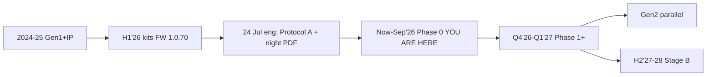
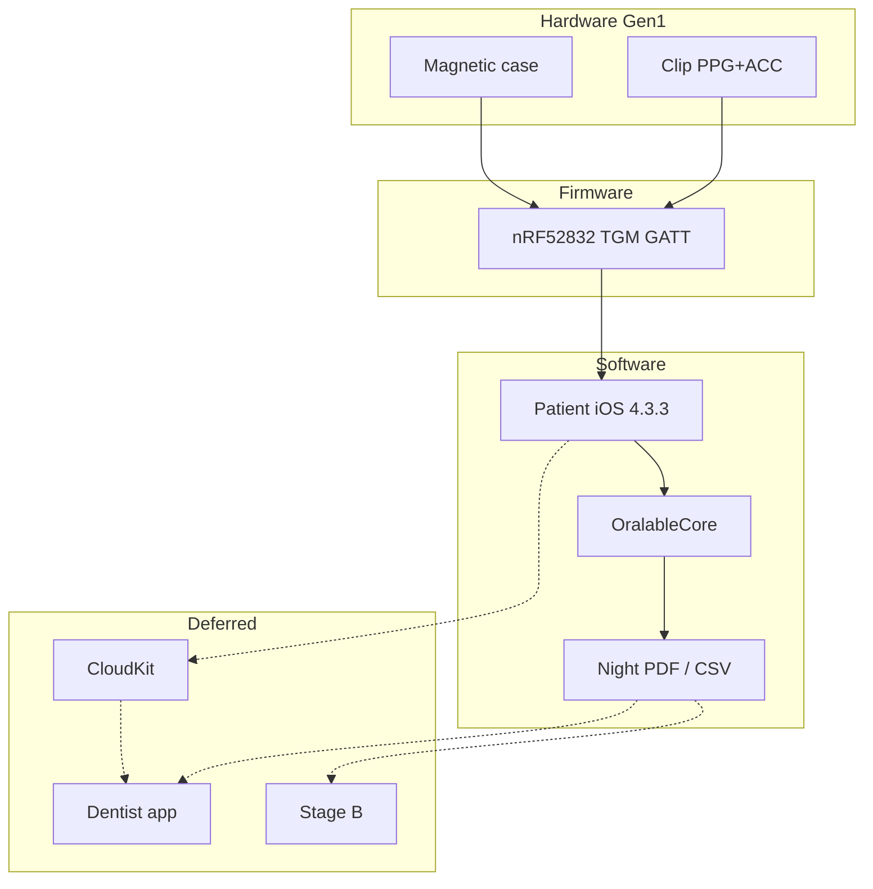
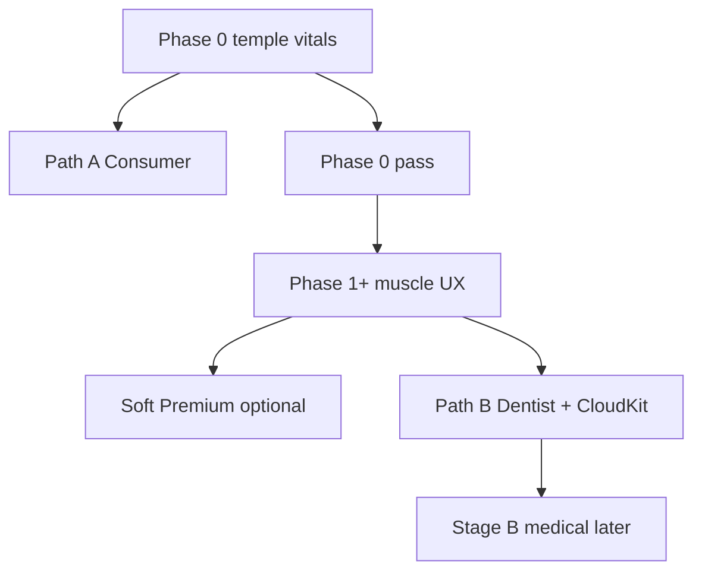
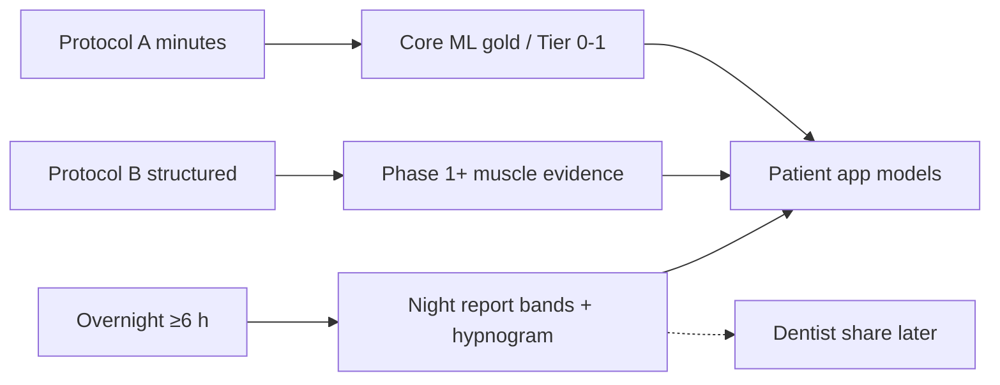
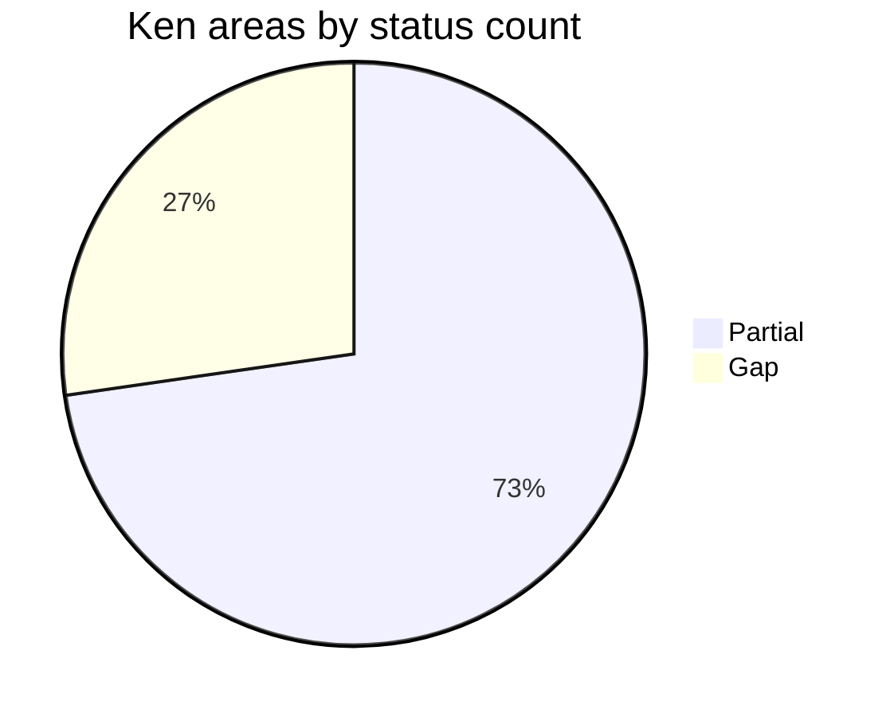
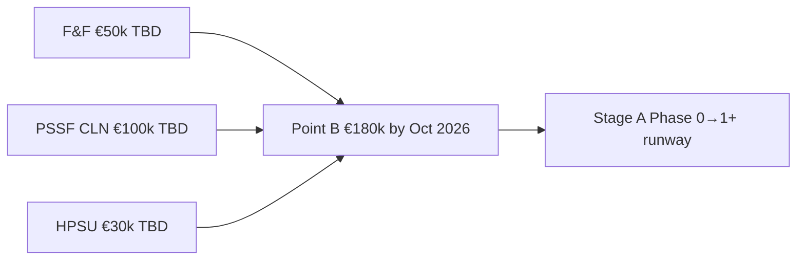
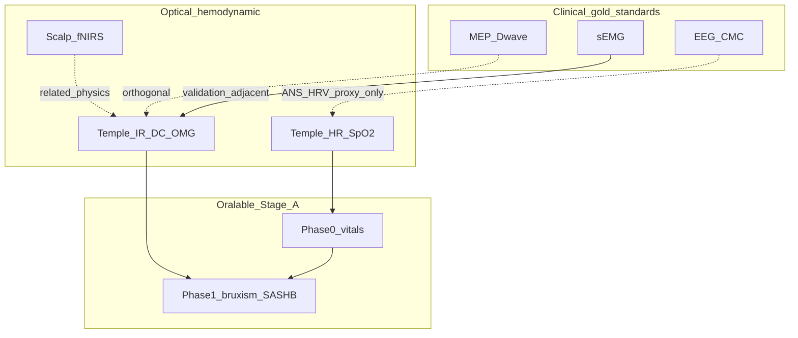
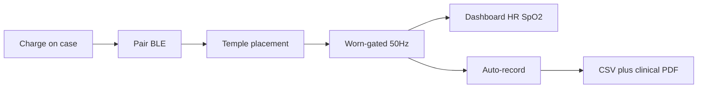
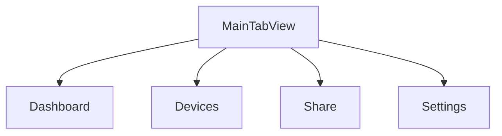

# Oralable system map — Mermaid diagrams (pitch / Notion)

**App working diagrams:** [MOBILE_APP_FLOWS.md §2](../../oralable_swift/docs/MOBILE_APP_FLOWS.md#2-how-the-patient-app-works--phase-0)

**As at:** 27 Jul 2026 · Pair with interactive canvas + [ORALABLE_SYSTEM_MAP.csv](./ORALABLE_SYSTEM_MAP.csv)  
**Timeline truth:** [PRODUCT_ROADMAP.md §3](./PRODUCT_ROADMAP.md#3-timeline-calendar--canonical) · avenues [§2b](./PRODUCT_ROADMAP.md#2b-technology-avenues)  
**Raster / photo placeholders:** [FIGURES.md](./FIGURES.md) (do not convert these Mermaid blocks to PNG)

Paste any block into GitHub, Notion, or a Mermaid-capable slide tool.

---

## 1. Development timeline

---

## 2. System stack — live vs deferred

---

## 3. GTM phase gates

---

## 4. Evidence protocols

---

## 5. Ken diligence readiness (conceptual)

---

## 6. Point B funding stack

---

## 7. Modality ladder (where Oralable sits)

Source: [GEMINI_TEMPLE_PPG_AVENUES.md](./data_room/GEMINI_TEMPLE_PPG_AVENUES.md) · landscape §4b.

---

## 8. Patient app working model (Phase 0)

Canonical detail + more diagrams: [oralable_swift/docs/MOBILE_APP_FLOWS.md §2](../../oralable_swift/docs/MOBILE_APP_FLOWS.md#2-how-the-patient-app-works--phase-0) · placeholders [FIGURES.md](./FIGURES.md) (`FIG-IOS-006`…`008`).

