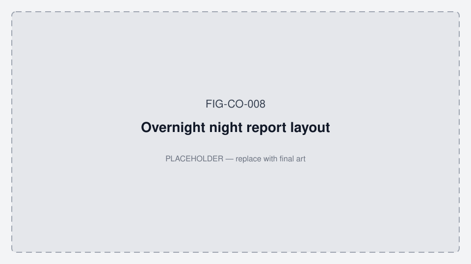
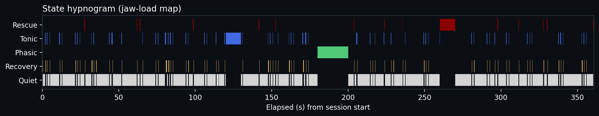
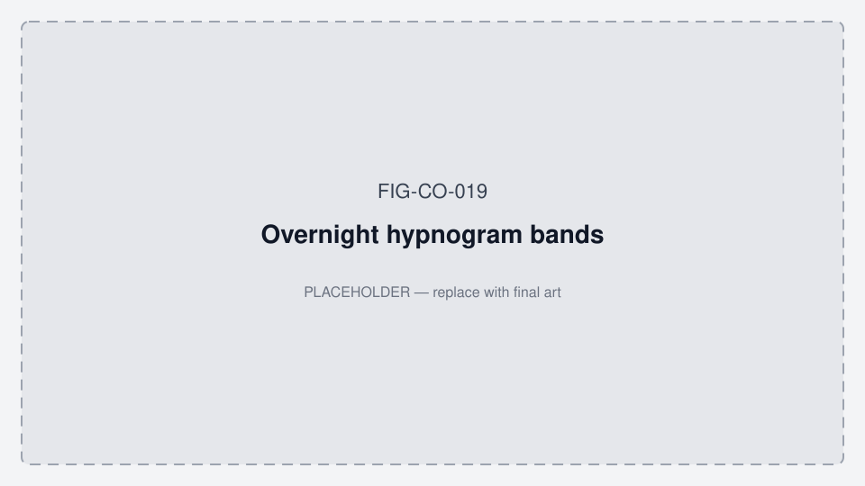
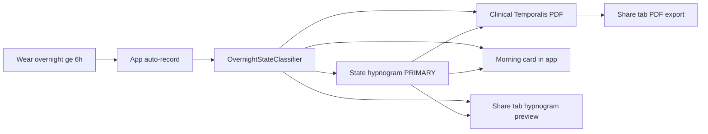

# Overnight night report — graphing, bands, and evaluation

**Status:** Canonical product direction · July 2026  
**Audience:** Engineering, pilot ops, patient/dentist UX  
**Related:** [TEMPORALIS_COLLECTION_PROTOCOL.md](./TEMPORALIS_COLLECTION_PROTOCOL.md) · [ALGORITHM_ARCHITECTURE.md](./ALGORITHM_ARCHITECTURE.md) · [oralable_swift/docs/MOBILE_APP_FLOWS.md](../../oralable_swift/docs/MOBILE_APP_FLOWS.md) · [data_room/PILOT_PROTOCOL_ED_PEDRO.md](./data_room/PILOT_PROTOCOL_ED_PEDRO.md) · [FIGURES.md](./FIGURES.md) · **App working diagrams:** [MOBILE_APP_FLOWS.md §2](../../oralable_swift/docs/MOBILE_APP_FLOWS.md#2-how-the-patient-app-works--phase-0)

Wellness wording only — **not** a diagnosis of bruxism, apnea, or disease.

*Figure FIG-CO-008 — Overnight night report layout (placeholder).*

### Gold exemplar — state hypnogram (very useful measure)

**Most useful overnight graphic:** the **state hypnogram** (`02_state_hypnogram.png`) — quiet / tonic / phasic / rescue / recovery across the night. Lead partner reviews, morning UX, and clinical PDF page-1 with this panel ahead of hourly stack or dual-rail.

**In-app (required):** Patient app ships a **SwiftUI adaptation** of this measure (`StateHypnogramView` + `OvernightMorningCardView`) — Share-tab preview + Dashboard morning card — via `OvernightStateClassifier` / `OvernightNightReportBuilder`. Not a PNG screenshot. Flag: `showOvernightHypnogram` (on in vitals phase; off in App Store Minimal). Full multi-page pack remains Share → Clinical Temporalis PDF.

**Reference night (24 Jul 2026 eng pack):**  
[`plots/overnight_report/TEMPORALIS_20260724/02_state_hypnogram.png`](../plots/overnight_report/TEMPORALIS_20260724/02_state_hypnogram.png) · figure ID **FIG-CO-025**.

*Figure FIG-CO-025 — State hypnogram from TEMPORALIS_20260724 — **primary / very useful overnight measure** (eng exemplar; in-app adapts this).*

*Figure FIG-CO-019 — Overnight band chips layout stub (placeholder; pair with FIG-CO-025).*

App path: [MOBILE_APP_FLOWS.md §2](../../oralable_swift/docs/MOBILE_APP_FLOWS.md#2-how-the-patient-app-works--phase-0) · FIG-IOS-003 (adapts FIG-CO-025).

---

## 1. Measurement model (blood-pressure style, not sleep-score first)

Present **named axes with Low / Moderate / High (or Elevated)** bands — like blood pressure — rather than a single opaque “sleep quality” score.

| Axis | Metric | Patient label |
|------|--------|---------------|
| **Jaw load** | Session **TFI** (0–100) | Jaw load |
| **Oxygen burden** | **SASHB** rate = total SASHB (%·s) ÷ wear hours | Oxygen burden |
| **Rescue pattern** | Rescue events ÷ wear hours | Rescue pattern |
| **Activity mix** | Tonic minutes ÷ wear hours (phasic as secondary) | Jaw activity mix |

**Optional later:** a transparent 0–100 “Night load index” as a *secondary* summary only, with drivers shown underneath.

**Cohort percentiles:** defer until many ≥6 h nights exist; until then prefer **personal baseline** (vs last 7 nights).

---

## 2. Provisional band cutoffs (pilot — recalibrate after Ed/Pedro overnights)

Apply only to **evaluable nights** (≥ **6 h** worn; goal **8 h**). Shorter sessions → **Insufficient data** (no band).

Rates use `wear_h = wear_seconds / 3600`.

| Axis | Low | Moderate | High / Elevated |
|------|-----|----------|-----------------|
| **Jaw load (TFI)** | TFI below 35 | 35–65 | above 65 |
| **Oxygen burden (SASHB / h)** | below 50 %·s / h | 50–200 %·s / h | above 200 %·s / h |
| **Rescue pattern (events / h)** | below 1 / h | 1–3 / h | above 3 / h |
| **Activity mix (tonic min / h)** | below 2 min / h | 2–8 min / h | above 8 min / h |

**Notes**

- Cutoffs are **provisional engineering defaults** for UI/PDF copy; refine from pilot ≥6 h distributions.
- SASHB band uses **rate per wear hour** so 6 h and 8 h nights are comparable.
- Rescue “High” means frequent *device-inferred* rescue-class events — not a medical apnea index.
- Phasic bout count can annotate Activity mix (e.g. “phasic-heavy”) without its own mandatory band until more data.

---

## 3. Graphing hierarchy (what to lead with)

| Priority | Panel | Role |
|----------|-------|------|
| **1 — Primary (very useful)** | **State hypnogram** (quiet / tonic / phasic / rescue / recovery) | Best at-a-glance overnight map for users and dentists — PSG-style jaw-load barcode. **Exemplar:** FIG-CO-025 / `TEMPORALIS_20260724/02_state_hypnogram.png` |
| **2 — Supporting** | Hourly stacked burden + SASHB line | Clustering by hour of night |
| **3 — Dentist detail** | Smoking-gun dual rail (IR-DC + SpO₂) | Mechanism / coupling review |
| **4 — Dentist table** | Event bout CSV / table | Chairside list |
| **Appendix** | Events-only 3D cluster | Mechanism / IP storytelling — not the morning view |

**Product rule:** Morning card and page-1 of the clinical PDF lead with **bands + state hypnogram**. Dual-rail and 3D are secondary. Treat the hypnogram as the **default “is this night useful?”** view.

### Implementations

| Surface | Location |
|---------|----------|
| Mac pack | `scripts/generate_overnight_night_report.py` → `plots/overnight_report/<session>/` (`02_state_hypnogram.png` **primary / very useful**) |
| Eng exemplar | `plots/overnight_report/TEMPORALIS_20260724/02_state_hypnogram.png` → [FIG-CO-025](./figures/FIG-CO-025-state-hypnogram-exemplar.png) |
| States | `src/analysis/overnight_states.py` |
| iOS PDF | `ClinicalReportGenerator` + `OvernightStateClassifier` + `NightReportSampleLoader` |
| **iOS in-app** | `StateHypnogramView` + `OvernightMorningCardView` + `OvernightNightReportBuilder` (Share preview + Dashboard) |
| Share path | Share → hypnogram preview + Clinical Temporalis Report (+ event CSV) |

---

## 4. UX copy (Stage A)

- Use: Low / Moderate / High (or Elevated for oxygen burden).  
- Avoid: diagnose, bruxism disorder, AHI, “you have apnea.”  
- Footer: device-inferred wellness states — not a medical diagnosis.  
- Empty/short night: “Need ≥6 hours worn for overnight bands.”

---

## 5. Calibration path

1. Collect Ed/Pedro (≥6 h) nights with Share PDF + Mac night pack.  
2. Plot distributions of TFI, SASHB/h, rescue/h, tonic min/h.  
3. Adjust band edges in this doc + code constants together.  
4. Only then consider cohort percentiles (“among Oralable users”).
