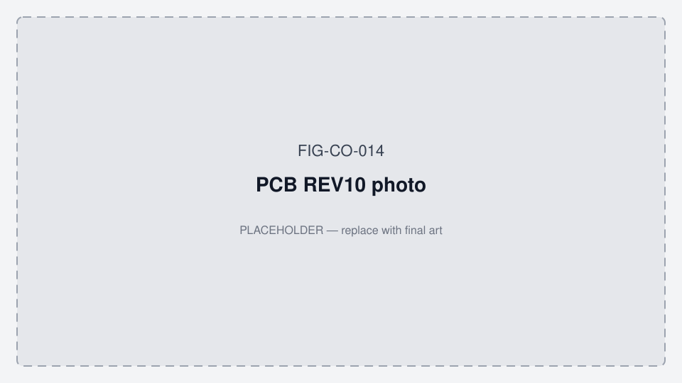

# PCB00003 Gen2 — REV11 hardware reference (BOM REV9)

**App working diagrams:** [MOBILE_APP_FLOWS.md §2](../../oralable_swift/docs/MOBILE_APP_FLOWS.md#2-how-the-patient-app-works--phase-0)

**Project:** TGM-REV11 · **Schematic:** REV10 (2026-05-01, ES4L15BA1) · **BOM:** REV9 · **MCU:** Kaga **ES4L15BA1** (nRF54L15)

Source bundle: `PCB00003-TGM-PROD_DATA-REV11_260620/`

| File | Role |
|------|------|
| `PCB00003-TGM-BOM-REV9.xlsx` | Gen2 BOM |
| `PCB00003-TGM-SCHEM-REV10.PDF` | Net names, revision history, tuning |
| `PCB00003-TGM-PICKPLACE-REV11.csv` | Component placement |
| `PCB00003-TGM-PCB-REV11.PDF` | Fab / layer stack |
| `PCB00003-TGM-ASSEMBLY-REV11.PDF` | Assembly drawing |

Migration context: [GEN1_GEN2_MIGRATION.md](./GEN1_GEN2_MIGRATION.md) · **Figures:** [FIGURES.md](./FIGURES.md)

*Figure FIG-CO-014 — PCB photo placeholder (promote REV10 / REV11 fab photos when available).*

---

## 1. Revision notes (from schematic coversheet)

| Schematic rev | Date | Change |
|---------------|------|--------|
| 7 | 2024-10-14 | ES2832AA2 pinout optimized for routing |
| 8 | 2024-11-01 | Sensor + charger combined in one project |
| 9 | 2025-04-11 | Battery voltage monitor fix; production test points; LBD resistor option |
| **10** | **2026-05-01** | **Updated to ES4L15BA1** |

**Naming:** PCB/assembly = **REV11**; schematic PDF filename = **REV10** (latest schematic revision inside).

---

## 2. Gen1 vs Gen2 — layout delta (REV10 pickplace → REV11)

REV11 **respins the clip power island** — do not assume Gen1 coordinates or Gen1 `pcb00003.dts` pins apply.

| Item | Gen1 REV10 | Gen2 REV11 |
|------|------------|------------|
| **U5** | ES2832AA2 @ (+4.3, +1.4) mm | ES4L15BA1 @ (**−9.2**, +0.7) mm |
| **BAT1** | CG-320B @ (+14.0, −1.9) | **LP260820** @ (**−8.8**, +2.6) |
| **U1 LTC4124** | (+19.1, +1.7) | (**−8.3**, −1.4) |
| **L1 coil (clip)** | (+16.1, +1.8) | (**−5.5**, −2.5) |
| **X crystal** | XTL1 bottom @ (+7.9, +2.1) | **X1** top @ (**−7.3**, +3.1) |
| **U2 MAXM86161** | ~(+4.8, +2.0) | (+10.8, 0) |
| **Case TX (L4, U6, J2)** | ~47–65 mm | ~47–65 mm (**unchanged region**) |

Clip electronics and battery move to the **negative-X** region on REV11; **charger half** of the flex/rigid board stays in the same ~50–65 mm band.

---

## 3. Confirmed net names (schematic)

These nets connect **U5 (ES4L15BA1)** to sensors, power, and charger logic:

| Net | Function | Gen1 `pcb00003.dts` (nRF52832) |
|-----|----------|----------------------------------|
| **SDA** | I²C data (MAXM86161 + LIS2DTW12) | TWIM SDA **P0.07** |
| **SCL** | I²C clock | TWIM SCL **P0.18** |
| **INT_ACC** | LIS2DTW12 **INT1** (pin 12) | GPIO **P0.06** |
| **INT_OPT** | MAXM86161 **GPIO** (pin 13) | GPIO **P0.20** — **ACTIVE_LOW** open-drain + pull-up (Gen1 DTS `int-gpios`; remap pin on Gen2) |
| **SENS_EN** | MAXM86161 **LDO_EN** (pin 3) + net to module | FW uses **P0.08** hardcoded in `main.c` — move to DTS on Gen2 |
| **CHRSTS** | LTC4124 charge-status (pin 2) | **P0.05** (active-low) |
| **BATEN** | Boost / rail latch (SSM6L36 + divider) | **P0.10** (must stay HIGH) |
| **BATVOL** | Battery sense to SAADC | **P0.28** / AIN4, ×11 divider |
| **nRESET** | Module reset | UICR GPIO-as-nRESET (Gen1) |

**Production test points (bottom):** `SDA`, `SCL`, `SENS_EN`, `CHRSTS`, `3V3`, `VCC`

**Debug:** Tag-Connect **J1** (`TC2030-CTX-NL`) — SWDIO, SWCLK, nRESET, GND

---

## 4. ES4L15BA1 module constraints (from Kaga datasheet)

| Item | Requirement |
|------|-------------|
| **Antenna** | Short **pin 11 (OUT_ANT)** ↔ **pin 12 (OUT_MOD)** for internal antenna |
| **32 kHz** | **X1** on **P1.00 (XL1)** + **P1.01 (XL2)** — ABS06 32.768 kHz on REV11 |
| **DCC** | **L2 = 4.7 µH** (REV9 BOM; Gen1 used 10 µH) |
| **Bulk cap** | ~**100 µF** on battery net (Kaga guidance) — verify on REV11 schematic |
| **SWD** | Module pin **14** SWDIO, **15** SWDCLK |
| **Exposed GPIO** | **15** lines: P0.03, P0.04, P1.00–P1.08, P2.01, P2.02, P2.04, P2.05 |

**Not available for application:** pins **11–12** (RF), **3–4** (crystal), **1–2** (GND/DECD), **13–15** (GND/SWD partially).

---

## 5. GPIO map — status

**Schematic PDF text extraction does not yield a reliable pin↔net table.** The ES4L15 symbol lists SoC lines (e.g. P2.01 @ module pin 10, P0.03 @ pin 8, P1.04/AIN0 @ pin 20) but Altium net ties must be confirmed from:

1. Altium **netlist export** from `PCB00003-TGM-SCHEM-REV10`, or  
2. **Continuity / scope** on first REV11 boards using test points `SDA`, `SCL`, `CHRSTS`, `SENS_EN`.

### Bring-up probe order (first REV11 unit)

| Step | Action | Pass |
|------|--------|------|
| 1 | J-Link via **J1**; read nRF54 device ID | ☐ |
| 2 | Scope **SDA/SCL** — I²C activity when firmware probes sensors | ☐ |
| 3 | Read MAXM86161 / LIS2DTW12 WHO_AM_I over I²C | ☐ |
| 4 | Toggle **SENS_EN** — MAXM86161 LDO responds | ☐ |
| 5 | Seat on case — **CHRSTS** toggles; compare to Gen1 LTC4124 behavior | ☐ |
| 6 | **BATVOL** vs DMM on LP260820 | ☐ |
| 7 | **BATEN** high at boot; rail stays up | ☐ |

Once nets are confirmed, record the definitive map in `oralable_nrf/boards/byteexplain/pcb00003_gen2/pcb00003_gen2.dts`.

### Likely nRF54 candidates (hypothesis — verify)

| Net | Likely GPIO | Module pin | Rationale |
|-----|-------------|------------|-----------|
| SDA | **P0.03** | 8 | Listed on ES4L15 symbol next to I²C cluster |
| SCL | **P2.02** | 23 | P2.x bus alternate |
| INT_ACC | **P2.01** | 10 | Interrupt-capable; near INT_ACC label on sheet |
| INT_OPT | **P2.04** | 9 | Interrupt-capable |
| BATVOL | **P1.04 / AIN0** | 20 | Analog input for divider |
| CHRSTS | **P1.07** or **P2.05** | 16 or 24 | Digital input; Gen1 used P0.05 |
| BATEN | **P2.05** or **P1.08** | 24 or 21 | Latch output |
| SENS_EN | **P1.06** or **P2.02** | 17 or 23 | MAX86161 LDO enable |

**Do not ship Gen2 firmware until this table is bench-verified.**

---

## 6. Power & charging (REV11)

| Block | Part | Notes |
|-------|------|-------|
| Cell | **LP260820** 30 mAh | Gen1 CG-320B was 15 mAh |
| Charger IC | **LTC4124** | Same as Gen1 |
| LBD threshold | **R12** 0 Ω default | **R13** OMIT → strap **2.7 V** LBD (move R12 to R13 position) |
| Clip coil | **L1** 760308101216 | Clip RX |
| Case coil | **L4** + **U6 LTC6990** + **J2 USB-C** | Case TX; tank **~591.7 kHz** (case) / **~763.8 kHz** (clip) per schematic notes |
| 3V3 reg | **TPS79733** | Sensor rail |
| BATEN switch | **SSM6L36** + **BSS816NW** | Same topology as Gen1 |

**Charge current:** Re-strap LTC4124 **ISET** for **30 mAh** cell (do not assume Gen1 10 mA strap).

---

## 7. Firmware hooks (Gen1 → Gen2)

| Code | Gen1 assumption | Gen2 action |
|------|-----------------|-------------|
| `pcb00003.dts` | nRF52832 QFAA | New **`pcb00003_gen2.dts`** with `nrf54l15` |
| `SENS_ENABLE_PIN 8` in `main.c` | Hardcoded nRF52 P0.08 | **Remove** — use DTS `sens-en-gpios` |
| `baten-gpios` P0.10 | Boost latch | Remap to REV11 net **BATEN** |
| `chrsts-gpios` P0.05 | LTC4124 STAT | Remap to **CHRSTS** |
| SAADC channel | AIN4 / P0.28 | Remap to **BATVOL** (likely P1.04 AIN0) |
| `maxm86161` / `lis2dtw12` `int-gpios` | P0.20 / P0.06 | Remap to **INT_OPT** / **INT_ACC**; keep **ACTIVE_LOW|PULL_UP** on OPT (open-drain) |
| I²C pinctrl | P0.07 / P0.18 | Remap to **SDA** / **SCL** nets |
| `prj.conf` | `CONFIG_BT_CTLR_TX_PWR_PLUS_4` (nRF52) | nRF54 BLE Kconfig |
| Partitions / MCUboot | 512 KB slots | nRF54 **1.5 MB** layout |

---

## 8. iOS / tooling

- **GATT UUIDs unchanged** — OralableCore + app need RF soak only unless MTU/conn params differ on nRF54.
- **Firmware version string** — use distinct prefix (e.g. `2.0.0-gen2-…`) so TestFlight gate can reject wrong binary on Gen1 clips.
- **Flashing:** SWD on **J1** until MCUboot OTA proven on Gen2.

---

## 9. Open items

| # | Item | Owner |
|---|------|-------|
| 1 | Export Altium netlist → lock §5 GPIO table | HW |
| 2 | Confirm **100 µF** bulk cap populated on REV11 | HW |
| 3 | REV11 RF soak (cheek/temple) vs Gen1 RSSI | FW + HW |
| 4 | LTC4124 ISET + LP260820 charge profile (~2 h target) | HW |
| 5 | Create `pcb00003_gen2` Zephyr board + first blink | FW |
