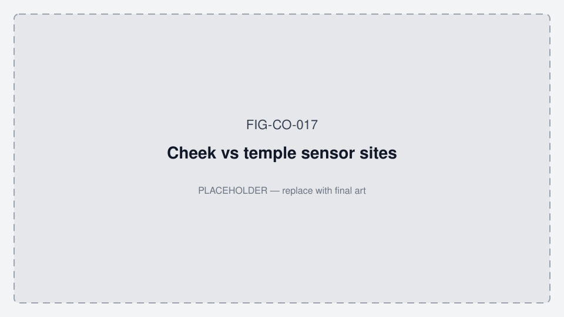

# Oralable product roadmap — phases, hardware, BOM

**Status:** Canonical · July 2026  
**Audience:** Engineering, pilot ops, website, investor data room  
**Website mirror:** `oralable_swift/OralableApp/docs/about.html` (+ `WEBSITE.md`)

**North star:** [IP_NORTH_STAR.md](./IP_NORTH_STAR.md) — **first a patent-implementing wellness wearable**, **later a medical device**. Embody the **new US patent being submitted** (Temporalis OMG / IR-DC / TFI / SASHB). Foundation granted US & EU patents are the base layer.

Related: [VITALS_PHASE_GEN1_GEN2.md](./VITALS_PHASE_GEN1_GEN2.md) · [GEN1_GEN2_MIGRATION.md](./GEN1_GEN2_MIGRATION.md) · [GEN1_GEN2_TRACKING.md](./GEN1_GEN2_TRACKING.md) · [data_room/ED_PEDRO_QUICK_START.md](./data_room/ED_PEDRO_QUICK_START.md) · [data_room/REGULATORY_TIMELINE.md](./data_room/REGULATORY_TIMELINE.md) · [COST_AND_TIMELINE.md](./data_room/COST_AND_TIMELINE.md) · [data_room/GEMINI_TEMPLE_PPG_AVENUES.md](./data_room/GEMINI_TEMPLE_PPG_AVENUES.md) · [FIGURES.md](./FIGURES.md) · [ORALABLE_SYSTEM_MAP_DIAGRAMS.md](./ORALABLE_SYSTEM_MAP_DIAGRAMS.md) · **App working diagrams:** [MOBILE_APP_FLOWS.md §2](../../oralable_swift/docs/MOBILE_APP_FLOWS.md#2-how-the-patient-app-works--phase-0)

**Strategy stack:** Stage A wellness wearable → Stage B medical (later) · new US patent embodiment · Ed/Pedro = patient app only.  
**Cost & timeline (planning):** [COST_AND_TIMELINE.md](./data_room/COST_AND_TIMELINE.md) — Phase 0 now–Sep 2026; Phase 1+ Q4’26–Q1’27; Gen2 parallel; Stage B H2’27–2028. Mid Stage A ~€200–250k; Stage A+Gen2 ~€350–450k; through Stage B ~€0.8–1.0M (ranges — not a budget).

*Figure FIG-CO-017 — Cheek vs temple sensor sites (placeholder; pilot = temple).*

### Patient app (Phase 0) — working diagram

Full set: [MOBILE_APP_FLOWS.md §2](../../oralable_swift/docs/MOBILE_APP_FLOWS.md#2-how-the-patient-app-works--phase-0).

---

## 0. End goal → how phases feed it

| Goal | Role of this roadmap |
|------|----------------------|
| **Stage A — Wearable** | Ship wellness product that **practices** the new US filing |
| **Stage B — Medical device** | Later clearance path using Stage A evidence ([REGULATORY_TIMELINE.md](./data_room/REGULATORY_TIMELINE.md)) |
| Phase 0 | Temple overnight vitals substrate (SpO₂ for SASHB; coupling for IR-DC) |
| Phase 1+ | **Primary Stage A embodiment** — IR-DC, TFI, SASHB in patient app + exports |
| Gen2 | Better nights / sensors → stronger Stage A evidence → Stage B readiness |
| Professional app | Optional; **after** Phase 1+; not Ed/Pedro; clinical role grows in Stage B |

---
**Version stamps:** [data_room/VERSION_ALIGNMENT.md](./data_room/VERSION_ALIGNMENT.md) — Gen1 FW **1.0.70** · iOS **4.3.3**.

## 1. Hardware ↔ BOM map (do not invent)

| Generation | BOM | PCB | Module (U5) | SoC | Battery | Firmware | Status |
|------------|-----|-----|-------------|-----|---------|----------|--------|
| **Gen1** | `PCB00003-TGM-BOM-REV8` | **REV10** pilot (REV8 prod data) | Kaga **ES2832AA2** | nRF52832 | CG-320B ~15 mAh | **1.0.70** ship (min 1.0.63) | **Ship-ready / kits gated** (charge-to-temple) |
| **Gen2** | `PCB00003-TGM-BOM-REV9` | **REV11** | Kaga **ES4L15BA1** | nRF54L15 | LP260820 ~30 mAh *(sample EMS: **LP270829 35 mAh** approved May 2026 — [GEN2_COGS](./data_room/GEN2_COGS_KAGA_QUOTE.md))* | **2.0.x** target | **Not shipping** (scaffold) |

**Rules**

- Gen1 / Gen2 are **hardware** generations (module + BOM). They are **not** software phase names.
- **Phase 0 / Phase 1+** are **software** feature phases. They run on **Gen1** today (same BOM REV8 / REV10) and carry forward to Gen2.
- Charging: **Oralable magnetic case** (clip **LTC4124** RX + case **LTC6990** TX + USB-C) — **not WPC Qi**. Do not tell users to use a phone Qi pad.
- Board family: **PCB00003** clip + case (one BOM per rev). Firmware board target Gen1: `pcb00003`; Gen2: `pcb00003_gen2`.

---

## 2. Software phases (features)

### Phase 0 — Vitals (now – Sep 2026)

**Hardware:** Gen1 · BOM REV8 · PCB REV10 · ES2832AA2 · FW **1.0.70** · App **4.3.3**

| In scope | Out of scope (until Phase 1+) |
|----------|-------------------------------|
| Temple / temporalis placement | Cheek / masseter muscle-fit as primary UX |
| Heart rate (green PPG) + quality gating | Clench / grind event detection |
| SpO₂ (red / IR) + quality gating | Protocol B / muscle calibration wizards |
| Honest device state (charger / bench / worn) | Auto-worn from die temp alone |
| Battery / charge cards; Device LED mirror (STAT) | EMG-style muscle UI |
| Automatic dock (STAT blink) + manual override | IR-DC occlusion product gates |
| Beacon / Ed–Pedro vitals pilot | **Patient app only** — professional app deferred |

**Pass gates:** [data_room/VITALS_PILOT_TEST_PLAN.md](./data_room/VITALS_PILOT_TEST_PLAN.md)

### Phase 1+ — Muscle / bruxism (Q4 2026 – Q1 2027 · Gen1 software)

**Hardware unchanged:** Gen1 · BOM REV8 · PCB REV10 · ES2832AA2 (same kits; app/FW unlock features)

| Features | Notes |
|----------|--------|
| IR-DC occlusion / hemodynamic load for clench & grind phenotypes | Live in patient UX |
| Temporalis Fatigue Index (**TFI**) session & hourly rollups | Live gauges + history |
| Hypoxic burden (**SASHB**) with overnight SpO₂ | Live + overnight bands |
| Protocol B / muscle calibration | When Phase 0 gates pass |
| Actigraphy / jaw vibration (LIS2DTW12) | Productized with muscle UX |
| Oralable for Professionals | After Phase 1+ share gate — **not** Ed/Pedro kit scope |
| In-app overnight morning card | **Shipping** — `StateHypnogramView` + band chips (Dashboard + Share preview; adapts FIG-CO-025); PDF for full pack |

**Already shipped as engineering (Jul 2026) — not the same as Phase 1+ pilot complete:**

- Mac night pack + iOS Share clinical PDF + **in-app state hypnogram** (**very useful primary** — [FIG-CO-025](./figures/FIG-CO-025-state-hypnogram-exemplar.png) / `TEMPORALIS_20260724`; Dashboard morning card + Share preview; dual-rail in PDF)
- Provisional BP-style overnight bands ([OVERNIGHT_NIGHT_REPORT.md](./OVERNIGHT_NIGHT_REPORT.md))
- Protocol A capture + Core ML Tier 0 retrain; Tier 1 cohort plan ([CORE_ML_TRAINING_COHORT.md](./CORE_ML_TRAINING_COHORT.md))

**Deferred Phase 1+ pilot body:** [data_room/PILOT_PROTOCOL_ED_PEDRO.md](./data_room/PILOT_PROTOCOL_ED_PEDRO.md) · [TEMPORALIS_COLLECTION_PROTOCOL.md](./TEMPORALIS_COLLECTION_PROTOCOL.md)

### Gen2 hardware era (2026–2027)

**Hardware:** Gen2 · BOM REV9 · PCB REV11 · ES4L15BA1 · FW **2.0.x**

| Targets vs Gen1 |
|-----------------|
| More RAM/Flash (on-device ML headroom later) |
| ~30 mAh longer temple sessions |
| Same GATT / 50 Hz TGM stream (iOS continues) |
| Re-validated `chrsts` → automatic on-dock when HW allows |
| Calibrated SOC on case; dedicated status LED; skin thermistor worn-detect |
| Richer OTA; temple HR/SpO₂ parity with Gen1 Phase 0 gates |

Checklist: [GEN1_GEN2_TRACKING.md](./GEN1_GEN2_TRACKING.md) G2-P0…P6

### 2027+ clinical pathways & Stage B medical

Primary on **Gen2** (BOM REV9 / REV11). Gen1 sunset after IR-DC, RF, and iOS soak parity.

- **Stage A (now):** wellness wearable only — no FDA/CE medical claims.  
- **Stage B (later):** medical-device pathway exploration / 510(k)–MDR — [REGULATORY_TIMELINE.md](./data_room/REGULATORY_TIMELINE.md).  
- **IP:** Align embodiments with the **new US patent submission** ([IP_NORTH_STAR.md](./IP_NORTH_STAR.md)). Foundation granted US & EU remain; no public filing details without counsel.

### 2b. Technology avenues

**Where Oralable sits:** not MEP/ESG/EEG; not an sEMG product. Temple **optical hemodynamic** sensing (IR-DC optical myography + arterial PPG + ACC) — **adjacent** to EMG gold standard (ANR validation path), **orthogonal** to rings and to intraoperative neural monitoring. Hemodynamic lag (~1–5 s) is accepted for ambulatory/overnight use; it is not a millisecond nerve-conduction substitute. Distill: [GEMINI_TEMPLE_PPG_AVENUES.md](./data_room/GEMINI_TEMPLE_PPG_AVENUES.md) · landscape §4b.

**Form factor rule:** **Night temple clip first** (Gen1 Phase 0 → Phase 1+). Day glasses/frames share the sensor thesis but are an **avenue only** — do not slip Ed/Pedro or §3 dates.

| Avenue | Physics / sensors | Product posture | When |
|--------|-------------------|-----------------|------|
| Temple vitals HR/SpO₂ | Green/R/IR PPG | **Phase 0 (now)** | Now – Sep 2026 |
| Optical myography / IR-DC bruxism + ACC | IR-DC + jaw vib | **Phase 1+ Stage A** | Q4 2026 – Q1 2027 |
| Overnight SpO₂ burden (SASHB) + hypnogram | SpO₂ + overnight states | Eng PDF done → Phase 1+ UX | Parallel |
| Daytime clench / stress (chew vs clench filter) | Same sensors, day UX | **Avenue** — not Ed/Pedro | Post Phase 1+ explore |
| Migraine prodrome / vascular amplitude | Temporal artery PPG + temp | Research / Stage B explore | Far |
| Sleep apnea **screening claims** | SpO₂ + HR + ACC | Stage A = pattern context only; diagnostic claim = Stage B | Far |
| Haptic / audio biofeedback therapy | Actuator **not** on Gen1 BOM | Hardware avenue (Gen2+ / accessory) | Far |
| Bilateral carotid / PTT BP / GCA / TBI / seizure | Needs 2nd site, ECG, clinical gold | **Out of Stage A scope** | Deferred / not roadmap |

---

## 3. Timeline (calendar) — canonical

**This table is the development timeline of record.** Sync [COST_AND_TIMELINE.md](./data_room/COST_AND_TIMELINE.md), [VERSION_ALIGNMENT.md](./data_room/VERSION_ALIGNMENT.md), [MOBILE_APP_FLOWS.md](../../oralable_swift/docs/MOBILE_APP_FLOWS.md), and FTS to it.

| Window | Track | Status (26 Jul 2026) | Milestone |
|--------|-------|----------------------|-----------|
| 2024–2025 | Gen1 + IP | Done | Platform build; foundation patents granted (US & EU); beta |
| H1 2026 | Gen1 | Done | REV10 / BOM REV8 kits; FW 1.0.6x lineage → **1.0.70** |
| **24 Jul 2026** | **Eng milestone** | **Shipped** | Protocol A Mac capture; Core ML Temporalis retrain (Tier 0); Mac + iOS night-report PDF (hypnogram-first); provisional overnight bands |
| **27 Jul 2026** | **Docs** | **Shipped** | Gemini temple-PPG avenues mapped (§2b); docs hub **1.3.16** / data_room **1.1.47** |
| **Now – Sep 2026** | **Stage A · Phase 0** | **You are here** | Ed/Pedro temple vitals — stack ready, **kits gated** (charge-to-temple); patient app only |
| **Q4 2026 – Q1 2027** | **Stage A · Phase 1+** | Planned | Muscle embodiment in patient UX; Protocol B; ≥6 h overnight evaluation; Core ML Tier 1 cohort; US patent file |
| **Q4 2026 – H2 2027** | Gen2 HW/FW | Scaffold | REV11 + FW **2.0.x** bring-up (parallel) |
| 2026–2027 | IP | Active | New US patent submission / prosecution (counsel-led) |
| **H2 2027 – 2028** | **Stage B** | Deferred | Medical device path (510(k) / CE) — not claimed in Stage A |

**Stack now:** FW **1.0.70** · app **4.3.3** · Gen1 REV10 · [VERSION_ALIGNMENT.md](./data_room/VERSION_ALIGNMENT.md)

Living engineering calendar: [GEN1_GEN2_TRACKING.md §2](./GEN1_GEN2_TRACKING.md#2-timeline-calendar) · **Cost ranges:** [COST_AND_TIMELINE.md](./data_room/COST_AND_TIMELINE.md)

---

## 4. Doc & website sync checklist

When any row in §1, §2, or §2b changes:

1. This file + [VITALS_PHASE_GEN1_GEN2.md](./VITALS_PHASE_GEN1_GEN2.md) + [COST_AND_TIMELINE.md](./data_room/COST_AND_TIMELINE.md)
2. [data_room/ED_PEDRO_QUICK_START.md](./data_room/ED_PEDRO_QUICK_START.md) (if pilot ship)
3. Website: `oralable_swift/OralableApp/docs/{about,specifications,support,user-guide}.html` + `WEBSITE.md` (no euro budgets on public pages)
4. Firmware smoke: `oralable_nrf/docs/DEVELOPMENT.md` (case ≠ Qi; Phase 0 = temple)
5. Avenues / modality: [GEMINI_TEMPLE_PPG_AVENUES.md](./data_room/GEMINI_TEMPLE_PPG_AVENUES.md) · `oralable_nrf/docs/ORALABLE_MARKET_LANDSCAPE.md` §4b
6. Bump `docs/VERSION` / `docs/data_room/VERSION` as appropriate

---

*Last updated: 2026-07-27*
