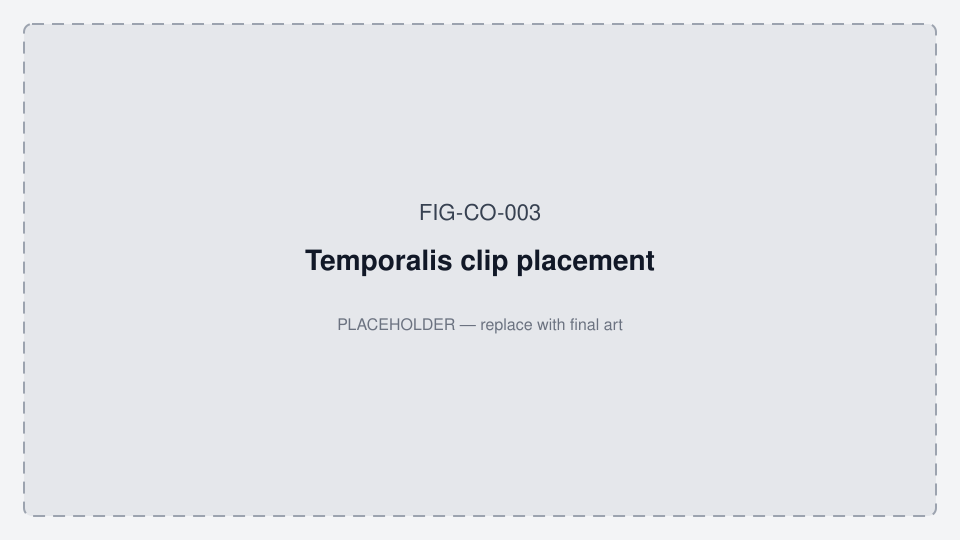
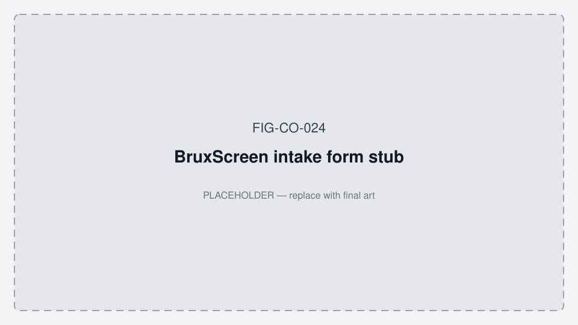
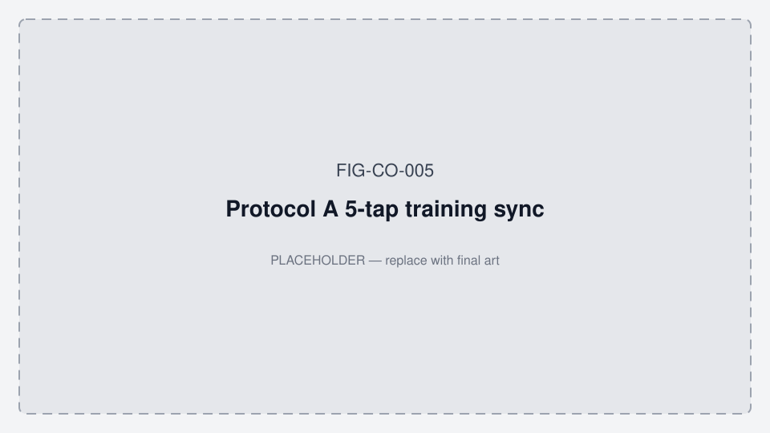
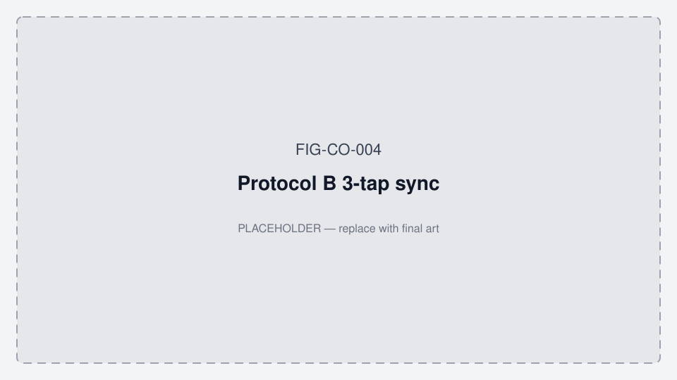

# Temporalis collection & validation protocols (REV10)

> **Phase scope:** These protocols are **Phase 1+ / research** (muscle IR-DC, Protocol A/B).  
> **Current pilot (Phase 0):** temple HR/SpO₂ only — [PRODUCT_ROADMAP.md](./PRODUCT_ROADMAP.md) · [COST_AND_TIMELINE.md](./data_room/COST_AND_TIMELINE.md) · [data_room/ED_PEDRO_QUICK_START.md](./data_room/ED_PEDRO_QUICK_START.md). Do not require Protocol B for Phase 0 kit ship.

**Related:** [docs/README.md](./README.md) · [IR_DC_ADC_FORMAT.md](./IR_DC_ADC_FORMAT.md) · [CLINICAL_VALIDATION.md](./CLINICAL_VALIDATION.md) · [ORALABLE_SYSTEM_ARCHITECTURE.md](./ORALABLE_SYSTEM_ARCHITECTURE.md) · [FIGURES.md](./FIGURES.md) · [ANR_M40_CONCORDANCE.md](./ANR_M40_CONCORDANCE.md) · **construct map** [data_room/MEASUREMENT_CONSTRUCT_MAP.md](./data_room/MEASUREMENT_CONSTRUCT_MAP.md) · Firmware **1.0.84** (sense only on BLE; gate min 1.0.63) · **App working diagrams:** [MOBILE_APP_FLOWS.md §2](../../oralable_swift/docs/MOBILE_APP_FLOWS.md#2-how-the-patient-app-works--phase-0)

**Hardware:** Gen1 · BOM REV8 · PCB REV10 · Kaga ES2832AA2  
**Target site (Phase 1+):** Temporalis anterior (temple / cheek clip)

**Sampling:** 50 Hz PPG + accelerometer (BLE logger or app). **FW 1.0.84** (since 1.0.80+): sensors run only while a central is connected. A BLE drop stops Oralable PPG/ACC (no FIFO catch-up). Keep Mac or iOS linked for the whole Protocol A / Dual A run. Clip status LED is off while linked; red/IR is PPG. Charge with no phone: flash green = charging, solid green = taper / hold (not always 4.2 V).



*Figure FIG-CO-003 — Temporalis clip placement (placeholder).*


*Figure FIG-CO-017 — Cheek vs temple sensor sites (placeholder; pilot = temple).*

---

## Do not mix these two protocols

| | **Protocol A — Training labels** | **Protocol B — Ed/Pedro validation** |
|---|----------------------------------|--------------------------------------|
| **Purpose** | Core ML / CNN-LSTM **labeled** dataset | Clinical **pass/fail** gates (Ed Owens, Pedro) |
| **Time anchor** | **Recording start** (wall-clock offsets in table) | **T=0 = 1st 3-tap sync** on accelerometer Z |
| **Sync taps** | **Five** rhythmic taps at 01:00 | **Three** taps in phase 0 (0–5 s from T=0) |
| **Duration** | ~6 min lock sequence (+ setup) | ~4.5 min from T=0 |
| **Used by** | `label_enum`, training pipelines | `self_validate.py`, `CLINICAL_VALIDATION.md` |
| **Occlusion check** | ~15% HOI drop (training QC, voltage-scaled) | Cheek raw tiers + swallow/speech FP gates |

Uploading both to NotebookLM without this table causes conflicting answers about sync count and T=0.

---

## Shared: physical setup

1. **Locate target:** Fingers on temple; clench to find peak bulge (**anterior temporalis** — vertical elevating fibers; same site class as GrindCare sEMG in literature; Oralable uses **optical** IR-DC, not electrodes). See [data_room/TEMPORALIS_ANATOMY_AND_PLACEMENT.md](./data_room/TEMPORALIS_ANATOMY_AND_PLACEMENT.md).
2. **Mounting:** Sensor window over peak bulge (headband or cheek clip per hardware). Dual A: ANR Red Dots **long axis VERTICAL** (‖ anterior fibers) over / pressing the same belly.
3. **Tension:** Firm but comfortable (target 5–15 mmHg strap equivalent).

**Optional clinical intake (Ed/Pedro / Paper B):** patient completes **BruxScreen-Q** (and dentist **BruxScreen-C** when available) — Lobbezoo et al. 2024. See [LITERATURE_AND_PRIOR_ART.md](./data_room/LITERATURE_AND_PRIOR_ART.md). Do not treat questionnaire alone as instrumented SB diagnosis.



*Figure FIG-CO-024 — BruxScreen intake form stub (literature tool — not Oralable UI).*

**IR-DC units:** Protocol A uses **voltage** targets for headband QC. Protocol B and production cheek logs use **raw ADC** (10M–70M, see [IR_DC_ADC_FORMAT.md](./IR_DC_ADC_FORMAT.md)). Do not compare 1.5 V baseline to 33M raw without conversion.

---

## Protocol A — 10-minute lock sequence (training labels)

**Objective:** Create labeled training set for Core ML MAM Net.

**Cohort sizing / demographics:** [CORE_ML_TRAINING_COHORT.md](./CORE_ML_TRAINING_COHORT.md) — Tier 1 ≈ 20–30 users × 3–5 Protocol A; leave-user-out; stratify by sex, age, habitus, skin tone. Overnight nights are for hypnogram/bands, not primary Core ML labels.

**Anchor:** offsets below are **elapsed time from recording start** (not from sync taps).

| Time offset | Action | Clinical target |
|-------------|--------|-----------------|
| 00:00 – 01:00 | Rest (quiet) | IR-DC baseline voltage (target **1.5 V–2.5 V** during rest). |
| 01:00 – 01:10 | Sync-taps | **Five** firm, rhythmic taps on housing. |
| 01:10 – 02:00 | Rest | Signal settle after movement. |



*Figure FIG-CO-005 — Protocol A 5-tap training sync (placeholder).*

| 02:00 – 02:10 | Max tonic clench | 10 s HOI anchor. |
| 02:10 – 03:00 | Rest | HOI recovery. |
| 03:00 – 03:20 | Phasic grinding | 20 s rhythmic jaw motion. |
| 03:20 – 04:00 | Rest | Accel jitter baseline. |
| 04:00 – 04:20 | Simulated apnea | 20 s breath hold (SpO₂ dip). |
| 04:20 – 04:30 | Tonic rescue | 10 s clench at end of breath-hold. |
| 04:30 – 06:00 | Final recovery | 90 s stillness. |

### Post-collection QC (Protocol A)

- Baseline audit: IR-DC **< 2.8 V** strap ceiling; rest target **1.5–2.5 V** during first minute.
- HOI crash: visible **~15%** drop during tonic clench (training QC, not Ed/Pedro pass gate).
- Output file: `TEMPORALIS_RAW_01.csv`.

```bash
# Mac guided session (preferred): timed cues + worn-mode write + BLE log
.venv/bin/python scripts/run_protocol_a_session.py
# Legacy logger (no cues):
python -m src.utils.ble_logger --out data/raw/TEMPORALIS_RAW_01.txt
```

Then: `scripts/process_temporalis_gold.py <log>` and/or `scripts/run_temporalis_mam_pipeline.py --raw <log>` for Core ML. Aggregate **many subjects** before claiming a general model — see [CORE_ML_TRAINING_COHORT.md](./CORE_ML_TRAINING_COHORT.md).

**Labeling:** Table offsets (e.g. 02:00 tonic) define `label_enum` segment boundaries. Accuracy within **1–2 s** required.

**Milestone log (24 Jul 2026):** `data/raw/TEMPORALIS_RAW_20260724_084345.txt` → OralableCore `BruxismMAM_Temporalis.mlpackage` · app **4.3.3**.

---

## Dual A — Oralable + ANR temporalis (Paper C precursor)

**Objective:** Time-align **ANR M40 surface EMG** (anterior temporalis) with Oralable Protocol A IR-DC / labels for research concordance — **not** Phase 0 or Paper A feasibility.

**Full hardware / claim discipline:** [ANR_M40_CONCORDANCE.md](./ANR_M40_CONCORDANCE.md) · data-room bookmark [data_room/ANR_M40_CONCORDANCE.md](./data_room/ANR_M40_CONCORDANCE.md).  
**What Dual A scores vs labels / AHI:** [data_room/MEASUREMENT_CONSTRUCT_MAP.md](./data_room/MEASUREMENT_CONSTRUCT_MAP.md) — iterate the construct table there.

| | Dual A |
|---|--------|
| **Devices** | Oralable Gen1 (temple clip) + ANR M40 electrodes on **same temporalis region** |
| **Setup** | **Seat Oralable alone first** (no ANR): peak bulge → hard clench → see IR-DC trough → then Kapton + ANR vertical without sliding the window. Not a full Oralable-only Protocol A. |
| **Seat order** | Oralable alone → IR trough → stack ANR → Dual A script gates |
| **Preflight** | EMG gate (default max ≥70) **and** IR optical gate (default drop ≥8% of rest median). SpO₂ AC WARN after IR (non-blocking). EMG alone is not enough. |
| **Cues** | Same Protocol A table (5 taps at 01:00 on Oralable housing) |
| **Capture** | Mac dual-BLE: `scripts/run_dual_protocol_a_session.py` |
| **Score** | `scripts/align_anr_oralable_concordance.py` → `plots/concordance/<session>/` (LP IR-DC overlay + `emg_ir_lag_zoom.png` + nest `spo2_qc`) |
| **SpO₂** | Nest requires SpO₂ **series + QC line** (`ok`/`warn`/`fail`) — not finger equivalence. Paper A O2 uses QC; Dual A muscle packs may archive with `warn`. |
| **Expect** | LP IR-DC troughs lag EMG by ~**1–5 s** (hemodynamic) |
| **Out of scope** | PSG-AV diagnosis; App Store EMG card; Pedro Phase 0 kits; AHI/ODI |

**Why these defaults (practical):** Seat Oralable alone first so ANR does not unload the PPG window. EMG gate **70** (not 100) matches the eng pack that worked under the Dual A stack — contact proof, not hero amplitude. IR drop **8%** is the hard optical gate (EMG alone failed us once). SpO₂ mean is **not** a hard gate (temple means ~89% are common); AC WARN + post-hoc `spo2_qc` flag junk or bias without blocking muscle Dual A. Full setup + rationale: [ANR_M40_CONCORDANCE.md — Setup / Why these gates](./ANR_M40_CONCORDANCE.md#setup--seat-oralable-alone-first).

**Setup (before the script):**
1. Only Oralable on anterior temporalis peak.  
2. Hard clench → IR-DC trough.  
3. Kapton + ANR vertical — press, do not slide.  
4. Then run Dual A:

```bash
# Practical: defaults only — get a muscle Dual A pack
.venv/bin/python scripts/run_dual_protocol_a_session.py
.venv/bin/python scripts/align_anr_oralable_concordance.py \
  --oralable data/raw/TEMPORALIS_RAW_YYYYMMDD_HHMMSS.txt \
  --anr data/raw/ANR_EMG_YYYYMMDD_HHMMSS.txt \
  --pair data/raw/DUAL_PAIR_YYYYMMDD_HHMMSS.txt
# Escape hatches: --force / --skip-emg-preflight / --skip-ir-preflight
```

**Paper ladder:** Dual A feeds **Paper C** tables. Paper A feasibility (n≈5) does **not** require ANR — see [PAPER_A_FEASIBILITY_PROTOCOL.md](./data_room/PAPER_A_FEASIBILITY_PROTOCOL.md).

---

## Protocol B — Ed/Pedro structured validation

**Objective:** Reproducible clinical fidelity report for investors and protocol leads.

**Anchor:** **T=0 = first 3-tap sync** (three high-G events on accel Z within 2 s — same detector as `sync_align.py`). **Not** recording start.



*Figure FIG-CO-004 — Protocol B 3-tap sync (placeholder).*

Canonical results: [CLINICAL_VALIDATION.md](./CLINICAL_VALIDATION.md). Pilot roles: [data_room/PILOT_PROTOCOL_ED_PEDRO.md](./data_room/PILOT_PROTOCOL_ED_PEDRO.md).

### Phases (elapsed seconds from **1st 3-tap sync**)

| Phase | Elapsed (s) | Action | Pass criteria (summary) |
|-------|-------------|--------|-------------------------|
| 0 | 0–5 | 3-tap sync | Sync detected in log |
| 1 | 30–45 | Max tonic clench | IR-DC occlusion measured |
| 2 | 45–60 | Rest | — |
| 3 | 60–105 | Phasic grinding | Accel jitter RMS elevated |
| 4 | 105–120 | Rest | — |
| 5 | 120–135 | Swallow / control | **0** false clench alerts |
| 6 | 150–195 | Simulated apnea | Rescue + cheek-tier occlusion |
| 7 | 210–270 | Natural speech | **0** false positives |

### Validation tooling (T=0 = 1st sync)

| Component | T=0 definition | How set |
|-----------|----------------|--------|
| `self_validate.py` | 1st sync | `--segment-from 1` |
| `validation_dashboard` | 1st sync | `segment_from_sync=1` |
| `clinical_summary` | 1st sync | `find_all_three_tap_anchors` |
| Protocol CSV | 1st sync | `JOHN_COGAN_1ST_SYNC_PROTOCOL.csv` |

```bash
python -m src.validation.self_validate data/raw/Oralable_20260304_090927.txt \
  --segment-from 1 -o data/plots/self_validation_from_sync1.png

python -c "
from pathlib import Path
from src.validation_dashboard import run_validation_dashboard
run_validation_dashboard(
    log_path=Path('data/raw/Oralable_20260304_090927.txt'),
    segment_from_sync=1,
    output_path=Path('data/plots/validation_dashboard_sync1.png'),
)
"
```

**Artifacts:** `data/validation_logs/JOHN_COGAN_1ST_SYNC_PROTOCOL.csv` · plots in `data/plots/ed_presentation/` · figure IDs [FIGURES.md](./FIGURES.md) (FIG-CO-009 / FIG-CO-010 pattern)

---

## Overnight sleep session (evaluation)

Structured Protocol A/B locks are **minutes**, not sleep. For **evaluable overnight** TFI / SASHB / bout reports (dentist or pilot review):

| Tier | Worn duration | Use |
|------|---------------|-----|
| **iOS band unlock** | **≥ 1 hour** | Morning-card / provisional bands in app (pilot UX) |
| **Canonical overnight (Paper A / Ed–Pedro eval)** | **≥ 6 hours** | Completed overnight for night-report evaluation / Results |
| **Goal** | **~8 hours** | Preferred full night |
| **Smoking-gun hourly r** | **≥ 3 hours** of filled hourly buckets | Pearson SASHB vs rescue fraction (needs ≥3 hourly bins) |
| **Not sleep** | Protocol A (~6 min) / Protocol B (~4.5 min) | Training / pass-fail only |

See also [data_room/PILOT_PROTOCOL_ED_PEDRO.md](./data_room/PILOT_PROTOCOL_ED_PEDRO.md) §4.2.

### Night-report pack (Mac + iOS)

**Canonical product direction:** [OVERNIGHT_NIGHT_REPORT.md](./OVERNIGHT_NIGHT_REPORT.md) — **blood-pressure-style bands** (Low / Moderate / High) on TFI, SASHB/h, rescue/h, tonic min/h; **state hypnogram is the primary / very useful graphic** (exemplar [FIG-CO-025](./figures/FIG-CO-025-state-hypnogram-exemplar.png) · `plots/overnight_report/TEMPORALIS_20260724/02_state_hypnogram.png`); dual-rail / 3D are secondary. Not a single sleep-quality score first; cohort percentiles later.

After gold / validation CSV (or overnight BLE log → gold):

```bash
.venv/bin/python scripts/process_temporalis_gold.py data/raw/YOUR_LOG.txt
.venv/bin/python scripts/generate_clinical_report.py \
  --input data/validation/GOLD_STANDARD_VALIDATION.csv
# Also writes plots/overnight_report/<session>/ (KPI, hypnogram, hourly, smoking-gun, events, PDF)
# Or directly:
.venv/bin/python scripts/generate_overnight_night_report.py \
  --input data/validation/GOLD_STANDARD_VALIDATION.csv
```

**iOS:** Dashboard / Share show **in-app state hypnogram** (`StateHypnogramView`, adapts FIG-CO-025). Share → **Export PDF — Oralable MAM: Clinical Temporalis Report** rebuilds the full pack from session samples (RAM history + memory-flush CSVs + session file). Lead with **state hypnogram** + bands; hourly stack / smoking-gun / event CSV support dentist detail. Wellness states only — not a diagnosis.

States: quiet / tonic / phasic / rescue / recovery (`src/analysis/overnight_states.py` · Swift `OvernightStateClassifier`).

---

## Design anchors (both protocols)

1. **Temporal precision:** Use the correct anchor (recording start vs 1st sync) for the protocol you are running.
2. **Clinical targets:** Sync-tap, tonic, phasic, rescue map to expected IR-DC and accelerometer signatures.
3. **Hardware guardrails:** Coupling in cheek tier per [IR_DC_ADC_FORMAT.md](./IR_DC_ADC_FORMAT.md) before trusting labels or pass/fail.
