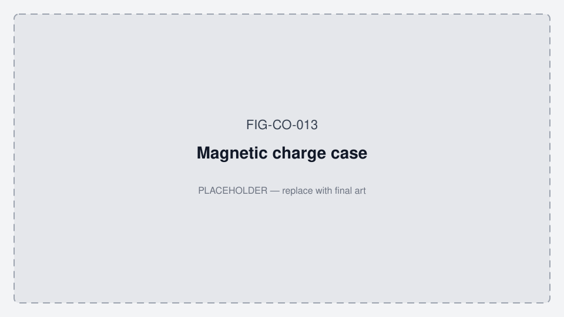
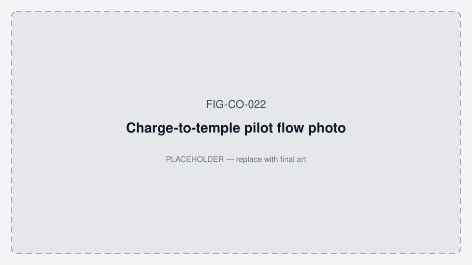

# Vitals Phase 0 — hardware generations & pilot workarounds

**Status:** Active pilot direction (July 2026)  
**Firmware:** **1.0.82** ship (minimum 1.0.63) · **App:** **4.3.3** vitals phase · see [VERSION_ALIGNMENT.md](./data_room/VERSION_ALIGNMENT.md)

**Strategy stack:** Stage A wellness wearable → Stage B medical (later) · new US patent embodiment · Ed/Pedro = patient app only.  
**Cost & timeline (planning):** [COST_AND_TIMELINE.md](./data_room/COST_AND_TIMELINE.md) — Phase 0 now–Sep 2026; Phase 1+ Q4’26–Q1’27; Gen2 parallel; Stage B H2’27–2028. Mid Stage A ~€200–250k; Stage A+Gen2 ~€350–450k; through Stage B ~€0.8–1.0M (ranges — not a budget).

**Canonical product/BOM map:** [PRODUCT_ROADMAP.md](./PRODUCT_ROADMAP.md) · **Figures:** [FIGURES.md](./FIGURES.md) · **App working diagrams:** [MOBILE_APP_FLOWS.md §2](../../oralable_swift/docs/MOBILE_APP_FLOWS.md#2-how-the-patient-app-works--phase-0)

*Figure FIG-CO-013 — Magnetic charge case (placeholder).*

*Figure FIG-CO-022 — Charge-to-temple pilot flow (placeholder).*

App diagrams: [MOBILE_APP_FLOWS.md §2](../../oralable_swift/docs/MOBILE_APP_FLOWS.md#2-how-the-patient-app-works--phase-0).

---

## 1. Product goal

Step back from muscle calibration and Protocol B. Deliver **reliable heart rate and SpO₂** on the **temple** with **honest device state** in the app — no user fit calibration.

Muscle / temporalis / clench detection remains **Phase 1+** after vitals gates pass.

---

## 2. Hardware generations (BOM-defined)

**Gen1 and Gen2 are hardware generations**, identified primarily by the **Kaga BLE module (U5)** and **BOM revision** — not firmware version or app phase.

| Hardware gen | Kaga module (U5) | Nordic SoC | BOM | PCB production data |
|--------------|------------------|------------|-----|---------------------|
| **Gen1** | **ES2832AA2** | nRF52832-QFAA-G-R | **PCB00003-TGM-BOM-REV8** | REV8 / REV10 (pilot) |
| **Gen2** | **ES4L15BA1** | nRF54L15 | **PCB00003-TGM-BOM-REV9** | **REV11** |

Both generations use the **same PCB00003 clip + case layout** (one BOM per rev): **LTC4124** RX on clip, **LTC6990** TX + **USB-C** on case, **MAXM86161**, **LIS2DTW12**, Würth **760308101216** coils — **not WPC Qi**.

| | **Gen1 (BOM REV8)** | **Gen2 (BOM REV9)** |
|--|---------------------|---------------------|
| **U5** | ES2832AA2 | **ES4L15BA1** |
| **Battery** | CG-320B ~15 mAh (typical build) | **LP260820** 30 mAh |
| **32 kHz crystal** | XTL1 ECS-.327-9-1210 | X1 (module-specific) |
| **Firmware target** | `pcb00003` / nRF52832 (**1.0.82** ship) | nRF54L15 board bring-up — see `oralable_nrf/docs/HARDWARE_ROADMAP_nRF54L15.md` |

**Ed / Pedro pilot kits (July 2026):** **Hardware Gen1** — **ES2832AA2**, **BOM REV8**, REV10 assembly · flash **1.0.82** · app **4.3.3**.

Source BOMs:
- Gen1: `PCB00003-TGM-PRODUCTION_DATA-REV8/PCB00003-TGM-BOM-REV8.xlsx`
- Gen2: `PCB00003-TGM-PROD_DATA-REV11_260620/PCB00003-TGM-BOM-REV9.xlsx`

---

## 3. Pilot workarounds (Gen1 units)

| Component | Role | Limitation | Mitigation (software) |
|-----------|------|------------|------------------------|
| **chrsts GPIO (P0.05)** | LTC4124 STAT → nRF | **Not broken** — STAT **blinks** while charging, **steady** on taper. Pre-1.0.70 FW required a stable level → never latched | **FW 1.0.70:** STAT activity detector; manual placement still available; prefer **Automatic** after bench validate |
| **Battery ADC** | SOC % | **Inflated on charging case** (normal chemistry on pad) | Rough voltage gauge; solid/flash on pad follows STAT (1.0.70); **discard** implausible ADC samples |
| **Charge detect** | `charge_active` in status | Blink misread as off-dock | **1.0.70:** blink → `charge_active=1`; taper → `0` while `on_dock=1`; mode 1 still ORs mV rise |
| **Die temperature** | Logged only | Not a worn bit | **1.0.82:** Automatic worn = IR pulse; mode 3 still forces worn |
| **PPG (MAXM86161)** | HR (green), SpO₂ (R/IR) | Motion, pressure, temple ≠ cheek tuning | Quality gating in app; INT pin **ACTIVE_LOW** open-drain from DT; optional LED PA via `00B` 0x01 |
| **Accelerometer** | Motion artifact | No placement vector calibration | ACC gating in `UnifiedBiometricProcessor` |
| **BLE (nRF52832)** | Streaming | RSSI collapse, stuck advertising after drop | **1.0.66:** +4 dBm TX, fast reconnect adv; **1.0.67:** adv restart via NCS `.recycled` (no force-restart watchdog) |
| **Wireless charging** | Power | **Oralable case only** (LTC4124/LTC6990 — not WPC Qi); low SOC + PPG load → early disconnect | Charge **&gt;50%** before long sessions |

### Pilot state machine (implemented)

| State | Detection | LED (1.0.82) | Streaming |
|-------|-----------|--------------|-----------|
| On charger | Manual mode 1 or `on_dock` (STAT activity in 1.0.70+) | Green **flash** while charging; **solid green** on STAT taper | Off unless BLE + CCC |
| Bench idle | Not on pad, no BLE | Dark | Off |
| Linked | BLE + PPG/ACC CCC | Off (PPG sensing) | PPG + ACC @ 50 Hz even if `worn=0` |
| Below ~5% | Gauge &lt; 3.61 V | Status LEDs as above | PPG/ACC off; BLE stays |
| Vitals ready | App quality ≥0.5 HR & SpO₂ | Same as linked | Display HR / SpO₂ |

### Firmware lineage (folded into ship **1.0.82**)

- **1.0.63:** connect probe off
- **1.0.66:** +4 dBm TX; fast reconnect advertising
- **1.0.67:** `.recycled` adv; PPG DT IRQ; battery discard
- **1.0.68:** remapped battery gauge (3.61–4.35 V)
- **1.0.70:** LTC4124 STAT activity — blink = charging / on_dock
- **≥1.0.72:** status LEDs **green-only** (never red). Taper / hold = **solid green**. Red/IR is PPG only.
- **1.0.80:** PPG/ACC follow BLE + CCC
- **1.0.81:** below 5% sensors off, MCU up
- **1.0.82 (ship):** Automatic worn = IR pulse

### iOS changes (vitals phase · app **4.3.3**)

- **Vitals phase** feature flag (HR, SpO₂, battery cards; hide Protocol B / EMG / calibration UI)
- **VitalsDeviceStatusCard** — operational state from `009` + Charging/Taper chips
- **Device LED mirror** — STAT flash/taper policy via OralableCore
- **Automatic** placement preferred on FW **1.0.70+**; manual modes still available
- **FirmwareGate** min **1.0.63** · recommend **1.0.82**
- **Nordic/Apple CCC:** battery → status → PPG → ACC → temp, one-at-a-time awaited

---

## 4. Gen2 targets (BOM REV9 / REV11)

Improvements expected on **Gen2** (`ES4L15BA1`, LP260820, BOM REV9) vs Gen1 pilot units:

| Area | Gen2 target | vs Gen1 |
|------|-------------|---------|
| **MCU / BLE** | **ES4L15BA1** (nRF54L15, BLE 6.0) | More RAM/Flash; module antenna; re-validate cheek RF |
| **Battery** | **LP260820** 30 mAh | Longer sessions; re-tune charge current (LTC4124 strap) |
| **chrsts / charge sense** | Re-verify LTC4124 STAT → nRF on REV11 | May enable automatic `on_dock` |
| **Battery sense** | Calibrated divider + charge-state compensation | Accurate SOC on case |
| **Dedicated status LED** | RGB or dual LED outside PPG | No PPG/solid-green confusion |
| **Skin temperature** | Thermistor at clip face | Worn detect without die-heat false positives |
| **Firmware** | nRF54L15 build + auto state machine default | Placement picker “advanced” only |

---

## 5. Sensor combination matrix

| Signal | On charger | Bench | On body | Vitals OK |
|--------|------------|-------|---------|-----------|
| Accelerometer | Low variance | Low variance | Moderate | Stable |
| Die temp | Ambient | Ambient | Elevated | Elevated |
| PPG green | Off / status | Off / status | AC present | Strong AC, SNR |
| PPG red/IR | Off / status | Off / status | DC in range | Stable ratio |
| Status byte0 `on_dock` | 1 (when chrsts works) / manual mode 1 (pilot) | 0 | 0 | 0 |
| Status byte1 `worn` | 0 | 0 | 1 | 1 |
| Status byte4 `charge_active` | 1 if mV rising | 0 | 0 | 0 |

---

## 6. iOS-configurable parameters (GATT `00B`)

| Opcode | Name | Use in vitals phase |
|--------|------|---------------------|
| 0x01 | LED PA (G/IR/R) | Temple tuning |
| 0x04 | Battery interval | Default OK |
| 0x05 | Temp interval | Default OK |
| 0x06 | Stream mask (PPG/ACC) | Keep both on for worn |
| 0x07 | Status snapshot | Bench debug |
| 0x09 | User device mode | **Primary pilot control** (manual placement) |
| 0x0A | Debug reboot seconds | Bench only (0=off) |

Connect probe restart (0x08) is a no-op when probe duration Kconfig = 0.

---

## 7. References

- System architecture matrix: [ORALABLE_SYSTEM_ARCHITECTURE.md](./ORALABLE_SYSTEM_ARCHITECTURE.md)
- **Gen1 → Gen2 migration (capabilities, roadmap, repo):** [GEN1_GEN2_MIGRATION.md](./GEN1_GEN2_MIGRATION.md)
- **Living timeline / G2-P0…P6 checklist:** [GEN1_GEN2_TRACKING.md](./GEN1_GEN2_TRACKING.md)
- Ed/Pedro test plan: [data_room/VITALS_PILOT_TEST_PLAN.md](./data_room/VITALS_PILOT_TEST_PLAN.md)
- Flash: [data_room/FIRMWARE_1.0.82_FLASH.md](./data_room/FIRMWARE_1.0.82_FLASH.md) · [VERSION_ALIGNMENT.md](./data_room/VERSION_ALIGNMENT.md)
- Kaga modules: ES2832AA2 (Gen1) · ES4L15BA1 (Gen2) datasheets (Seed A data room)
