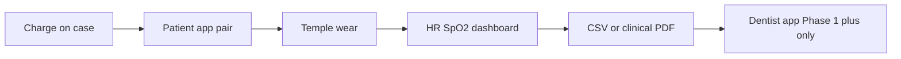

# Patient app · Professional app · Revenue — where we sit (July 2026)

**App working diagrams:** [MOBILE_APP_FLOWS.md §2](../../../oralable_swift/docs/MOBILE_APP_FLOWS.md#2-how-the-patient-app-works--phase-0)

**Status:** Evaluation snapshot · aligns with [PRODUCT_ROADMAP.md](../PRODUCT_ROADMAP.md) · [IP_NORTH_STAR.md](../IP_NORTH_STAR.md) · [GTM_ONE_PAGE.md](./GTM_ONE_PAGE.md) · [COST_AND_TIMELINE.md](./COST_AND_TIMELINE.md) · `MOBILE_APP_FLOWS.md`

**Strategy stack:** Stage A wellness wearable first; Stage B medical later. New US patent embodiment. Ed/Pedro use the patient app only.  
**Cost & timeline (planning):** [COST_AND_TIMELINE.md](./COST_AND_TIMELINE.md) — Phase 0 now–Sep 2026; Phase 1+ Q4’26–Q1’27; Gen2 parallel; Stage B H2’27–2028. Mid Stage A ~€200–250k; Stage A+Gen2 ~€350–450k; through Stage B ~€0.8–1.0M (ranges — not a budget).



*Patient app Phase 0 path; dentist / CloudKit stay dark until Phase 1+. Full diagrams: [MOBILE_APP_FLOWS.md §2](../../../oralable_swift/docs/MOBILE_APP_FLOWS.md#2-how-the-patient-app-works--phase-0).*

---

## 1. One-line verdict

**North star:** [IP_NORTH_STAR.md](../IP_NORTH_STAR.md) — **Stage A wellness wearable first**, **Stage B medical device later**; ship the **new US patent being submitted** (Temporalis OMG / IR-DC / TFI / SASHB). Foundation granted US and EU patents sit underneath.

**Phase 0 Gen1 kits** prove hardware, BLE, and vitals for that invention **as a wearable**. They do **not** yet deliver the bruxism-native UX that drives consumer Premium or dentist Practice subscriptions. Near-term revenue is **hardware plus careful wellness IAP**; durable B2B2C waits on **Phase 1+ embodiment and CloudKit**. **Ed/Pedro use the patient app only.** Do **not** claim medical-device status in this iteration.

### How money, IP, and regulatory stages relate

| Priority | Outcome |
|----------|---------|
| 1 | **Stage A:** Working wearable embodiment of the new US filing (Phase 1+ in patient app + exports) |
| 2 | Overnight evidence from Ed/Pedro / Beacon (prosecution + future Stage B dossier) |
| 3 | Consumer Premium once the wearable embodiment is honest and useful |
| 4 | Professional app / practice IAP **after** shareable Phase 1+ rollups |
| 5 | **Stage B (later):** Medical device clearance path — higher ASP, separate gate |

### Policy: Ed / Pedro Phase 0 — patient app only

**Do not activate Oralable for Dentists** for the initial Ed/Pedro iteration.

| In scope | Out of scope |
|----------|--------------|
| **Oralable** patient app (TestFlight, vitals phase) | **Oralable for Dentists** install / onboarding |
| Local export / CSV / vitals logs | CloudKit share codes to a dentist account |
| Temple HR/SpO₂ reliability gates | Practice / Professional IAP, participant roster |
| Beacon / clinical partners as **observers of patient-app evidence** | Treating dentist app as part of the pilot protocol |

**Why:** Phase 0 delivers temple vitals, not TFI/SASHB handshake value. The professional app would add support load and clinical-looking UX without a shareable product story. Turn on Path B after Phase 0 passes **and** Phase 1+ rollups and CloudKit production are ready. Overnight patient-app logs still feed the **new US patent implementation** evidence path.

---

## 2. How the two apps sit today

| | **Oralable (patient / consumer)** | **Oralable for Dentists (professional)** |
|--|-----------------------------------|------------------------------------------|
| Bundle | `com.jacdental.oralable` | `com.jacdental.oralable.dentist` |
| Shared core | OralableCore (BLE, algorithms, handshake export) | Same |
| **Ed/Pedro Phase 0** | **ACTIVE** — temple HR/SpO₂, state, placement, Device LED | **NOT ACTIVATED** for this iteration |
| **Phase 1+ (needed for Path B)** | TFI, SASHB, IR-DC events, overnight report, share to dentist | Participants, historical TFI/SASHB, CSV import, handshake PDF |
| Monetization hooks (code) | Premium €9.99/mo · €99.99/yr | Professional €29.99/mo · Practice €99.99/mo (+ yearly) |
| Launch flags | `showSubscription` **false** · `showCloudKitShare` **false** | Keep dark until Path B gate |
| Blockers | Phase 0 field proof · later IAP | Phase 0 pass → Phase 1+ metrics → CloudKit prod → then activate |

**Coupling:** Professional revenue is **patient-mediated**. Until the patient app has shareable overnight muscle and vitals rollups, dentist seats stay **off**.

```
Gen1 kit (BOM REV8 / REV10 / FW 1.0.84 · app 4.3.3 build 5)
        │
        ▼
 Patient app ──Phase 0 (Ed/Pedro)──► temple vitals ──► CSV / local evidence
        │
        ├──Phase 1+──► TFI / SASHB / IR-DC ──CloudKit share──► Dentist app  ◄── activate here
        │
        └── Premium IAP (later)                                    Practice IAP (later)
```
---

## 3. Revenue stack (what can actually bill)

| Layer | When it can generate cash | Depends on | Risk if Phase 0 only |
|-------|---------------------------|------------|----------------------|
| **Hardware (clip + case)** | Now / pilot → limited retail | Gen1 yield, charging reliability, temple UX | Low volume; not SaaS |
| **Consumer Premium IAP** | After IAP live + credible dashboard | Phase 0: weak vs Oura/Wellue; Phase 1+: strong vs “bruxism clip” | Competing as generic SpO₂ clip = **hard** |
| **Dentist Professional / Practice IAP** | After CloudKit + shareable clinical rollups | Phase 1+ handshake (TFI/SASHB) | Dentists won’t pay for HR/SpO₂ alone |
| **Path C (cleared device)** | 18–36+ mo | Clinical evidence, regulatory | Not Year-1 revenue |

**Draft Year-1 GTM targets** (assumptions, not proven): 500 consumer downloads · 20 dentist accounts · 50 share connections — see GTM one-pager. **Ken gap:** measured CAC after 90 days live.

---

## 4. Phase alignment vs monetization

| Product phase | Patient app story | Dentist app story | Revenue implication |
|---------------|-------------------|-------------------|---------------------|
| **Phase 0 Vitals** | “Temple HR & SpO₂ that works overnight” | **Off for Ed/Pedro** — no professional app in kit | Hardware / pilot evidence only; no B2B ARPU |
| **Phase 1+ Muscle** | “See jaw load / grinding patterns; share with dentist” | **Activate** — “Review patient nights (TFI/SASHB)” | **Unlocks** consumer Premium + dentist seats |
| **Gen2 hardware** | Longer nights, fewer dock/SOC bugs, same apps | Same GATT — apps unchanged | Improves **retention** and overnight sessions → better LTV |
| **Path C medical** | Locked claims / IFU | Clinical workflow | **Stage B** — highest ASP; after Stage A wearable proof |

---

## 5. Strategic fit (honest)

**What is strong now**
- Dual-app architecture and StoreKit product matrix are already in code.
- B2B2C loop (patient → share → dentist) is designed into OralableCore.
- Phase 0 cuts false promises (no fake muscle UI) while proving Gen1 kit and BLE.

**What is misaligned if we sell too early**
- Marketing and search terms (“bruxism”, “grinding”) imply Phase 1+; Phase 0 delivers **vitals**.
- Dentist app copy can read more clinical than wellness posture — keep it aligned until Path C.
- Landscape doc still assumes Jan 2026 Path A launch timing in places — treat as stale vs mid-2026 Phase 0 reality.

**Recommendation**
1. **Ed/Pedro Phase 0:** Patient app **only** — no Oralable for Dentists, no share-to-dentist, no practice IAP.  
2. **Near term otherwise:** Kit, pilot, and Beacon evidence; free or soft Premium; Path B dark.  
3. **Turn on the professional app** only after Phase 0 pass, Phase 1+ rollups, and CloudKit production.  
4. **Gate consumer Premium positioning** on overnight report honesty (vitals now; TFI/SASHB when ready).  
5. **Gen2** is retention and quality, not a new app SKU.

---

## 6. 90-day revenue readiness checklist

| # | Item | Owner | Unlocks |
|---|------|-------|---------|
| 1 | Ed/Pedro Phase 0 pass (temple HR/SpO₂) — **patient app only** | Pilot | Credible patient app evidence |
| 2 | App Store Connect IAP live | Product | Any subscription cash (consumer first) |
| 3 | Phase 1+ TFI/SASHB in patient app + handshake | Eng / science | Something worth sharing |
| 4 | CloudKit production schema | Eng | Path B share loop |
| 5 | **Activate Oralable for Dentists** + `showCloudKitShare` | Product | B2B2C flywheel |
| 6 | Turn on `showSubscription` with Phase-honest paywall | Product | Consumer ARPU |

---

*Evaluation only — not financial advice. Numbers from the GTM one-pager are draft assumptions.*
