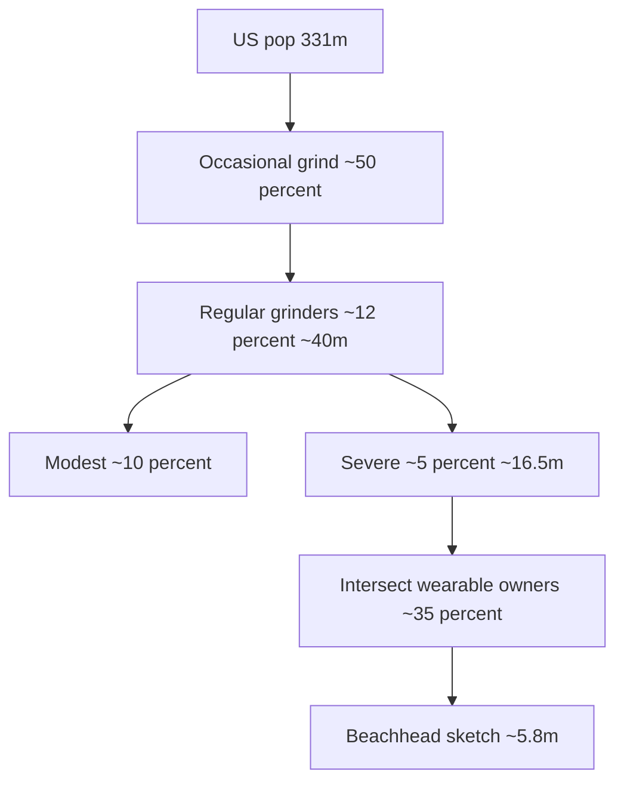

# Market sizing sketch (US) — for Ken / pitch

**Status:** Founder worksheet distill · **not** a validated TAM/SAM/SOM study  
**Source image:** `06_GTM_260609_Market_Sizing_Venn_Diagram_Calculations` (Seed A / Drive; also in Cursor assets)  
**As at:** July 2026 capture  

---

## 1. Funnel (hand diagram)

| Layer | Label on sketch | Implied pop. (US) |
|-------|-----------------|-------------------|
| Universe | US population **331m** (2022) | 331,000,000 |
| Occasional grind | **~50%** occasionally | ~165m |
| Regular grinders | **~12%** grinders *(literature: SB adults ~8–16% Li 2025; ~12.8±3.1% Lobbezoo/BruxScreen cites; awake often higher — see [LITERATURE_AND_PRIOR_ART.md](./LITERATURE_AND_PRIOR_ART.md))* | ~40m |
| Modest | **~10%** modest | ~33m |
| Severe | **~5%** severe | ~16.5m |
| Wearable owners | **~35%** have a wearable *(overlaps all rings)* | — |
| Target hatch | Severe ∩ wearable | ~5.8m if 5%×35% of 331m — sketch emphasises nightguard path below |

---

## 2. Nightguard path → SOM (sketch math)

| Step | Calc on page | Result |
|------|--------------|--------|
| Custom nightguard users | `8000 × 262 × 2` | **~4.1 million** |
| Interested in smart nightguard | `4.1 × 0.35` | **~1.4 million** |

**Pitch one-liner (US, draft):** ~**4.1M** custom nightguard users → ~**1.4M** wearable-adopting prospects for a “smart nightguard / jaw-load” product.

---

## 3. How to map to TAM / SAM / SOM (suggested labels)

| Label | Use this number | Caveat |
|-------|-----------------|--------|
| **TAM** | US grinders ~**12% of 331m ≈ 40m** (or adult dental-aware subset) | Broad; not Oralable’s Year-1 buyable market |
| **SAM** | Custom nightguard users **~4.1m** | Assumes 8k practices × 262 pts × 2 — **source undocumented** |
| **SOM (beachhead)** | **~1.4m** wearable-interested smart nightguard | Overlap heuristic only |

**Stage A fit:** Phase 0 sells **temple vitals reliability**, not nightguard replacement. Use **1.4m** as Phase 1+ / bruxism narrative ceiling; do not oversell Phase 0 as capturing that SOM.

---

## 4. Still GAP for Ken Market area

- Cite **primary sources** for 12% / 5% / 8k×262×2  
- Ireland / UK home-market cut (launch geography)  
- Competitive share vs ANR / rings / Wellue  
- € revenue model from 1.4m (ASP × attach × Year-1 penetration)

---

*Related:* [PITCH_DECK_KEN.md](./PITCH_DECK_KEN.md) · [GTM_ONE_PAGE.md](./GTM_ONE_PAGE.md) · `oralable_nrf/docs/ORALABLE_MARKET_LANDSCAPE.md`
