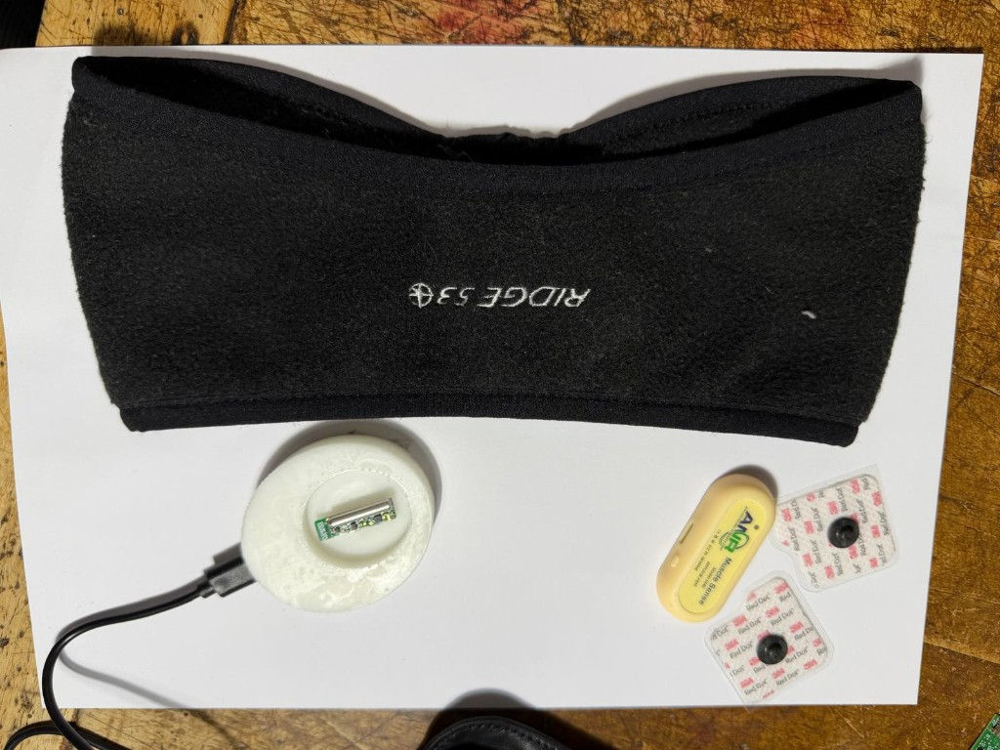
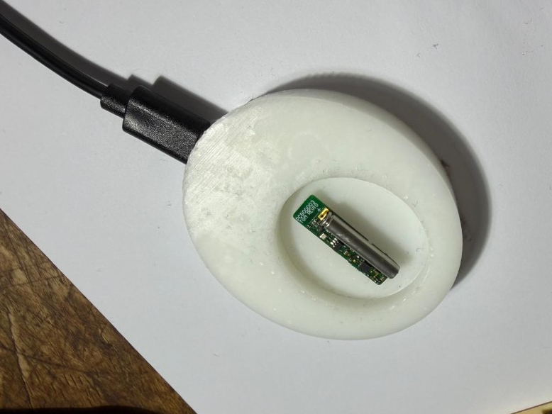
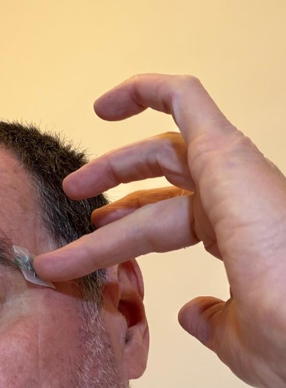
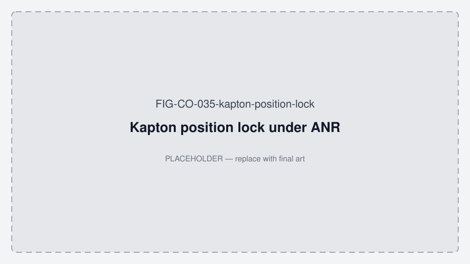
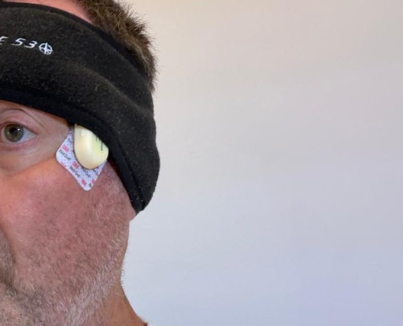
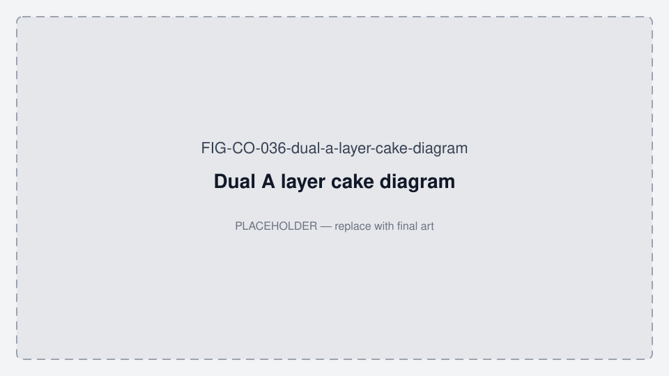

# Oralable Research Kit — canonical definition

**As at:** 30 Aug 2026 · Pack **1.1.68** · FW **1.0.84** · app **4.3.3** (build **5**)  
**Status:** Working definition for Beacon / IEEE Paper A feasibility · **5 kits → Pedro by 31 Aug 2026**  
**Ship gate:** Charge-to-temple on each Oralable unit (see [ED_PEDRO_QUICK_START.md](./ED_PEDRO_QUICK_START.md))  
**Sendables:** [PEDRO_STATUS_UPDATE_2026-08.md](./PEDRO_STATUS_UPDATE_2026-08.md) · [PITCH_PEDRO_ED_FF.md](./PITCH_PEDRO_ED_FF.md) · protocol [PAPER_A_FEASIBILITY_PROTOCOL.md](./PAPER_A_FEASIBILITY_PROTOCOL.md) · data handoff [PAPER_A_DATA_HANDOFF_SOP.md](./PAPER_A_DATA_HANDOFF_SOP.md) · construct map [MEASUREMENT_CONSTRUCT_MAP.md](./MEASUREMENT_CONSTRUCT_MAP.md) · Pedro construct note [PEDRO_CONSTRUCT_MAP_NOTE.md](./PEDRO_CONSTRUCT_MAP_NOTE.md) / [PDF](./PEDRO_CONSTRUCT_MAP_NOTE.pdf)  
**Visual direction (locked):** [VISUAL_AND_VOICE_DIRECTION.md](./VISUAL_AND_VOICE_DIRECTION.md) · hero [FIG-CO-054](../figures/FIG-CO-054-matisse-photo-dual-a-stack.png) · catalog [RESEARCH_KIT_PHOTO_SELECTION.md](./RESEARCH_KIT_PHOTO_SELECTION.md)  
**IP (pitch-safe):** US provisional **64/033,978** filed **9 Apr 2026** — *Apparatus and Method for Muscle Activity Monitoring* · Temporalis OMG / IR-DC path · **patent pending** — [IP_PORTFOLIO_STATUS.md](./IP_PORTFOLIO_STATUS.md) · do **not** attach provisional PDF / claim text

**One-liner:** Temple **Oralable MAM** + **ANR M40** sEMG + **iOS app** for 1–6 h+ BLE wear. Mac Dual Protocol A for labeled concordance (+ SpO₂∩EMG nest + research `session.edf`). Basis for IEEE feasibility n≈5 (Koorosh + Pedro). Measured eng Dual A: `20260812_085110` (layout only — kits still gated).

---

## 1. BOM (per kit)

| Item | Spec / role |
|------|-------------|
| **Oralable Gen1 clip** | BOM REV8 · PCB REV10 · ES2832AA2 · FW **1.0.84** — temple PPG (R/G/IR) + ACC |
| **Magnetic charge case** (or research dock) | USB-C · charge before temple wear — **not** Qi / MagSafe |
| **ANR M40** + **3M Red Dot** snaps | Temporalis sEMG comparator — Dual Protocol A |
| **Kapton** + **silicone** tape | Position-lock Oralable under ANR; optical seal / comfort |
| **Headband** (e.g. Ridge) | Optional long-wear compression for Dual A |
| **iPhone + Oralable TestFlight** | App **4.3.3** build **5+** · Protocol A Setup · research / long-wear (1–6 h+) |
| **Quick start** | [ED_PEDRO_QUICK_START.md](./ED_PEDRO_QUICK_START.md) — first worn session = Phase 0 vitals |
| **Protocol A Dual cue card** | 5-tap sync + lock sequence ([TEMPORALIS_COLLECTION_PROTOCOL.md](../TEMPORALIS_COLLECTION_PROTOCOL.md) Dual A) |
| **Export path** | iOS Share/CSV · Mac Dual A logs · `align_anr_oralable_concordance.py` → `NEST.md` + **`session.edf`** |



*Figure FIG-CO-016 — Research Kit flat-lay (headband, charge dock with Oralable, ANR M40, Red Dots). Photo selection: [RESEARCH_KIT_PHOTO_SELECTION.md](./RESEARCH_KIT_PHOTO_SELECTION.md).*



*Figure FIG-CO-013 — Oralable research module in charge dock (pre-deploy).*

**Out of kit (product):** Oralable for Dentists, CloudKit share-to-dentist, practice IAP, FDA/CE claims.

---

## 2. Collection modes

| Mode | Where | Duration | Purpose |
|------|-------|----------|---------|
| **Core vitals** | iOS Oralable | ≥5–10 min | Setup, comfort, HR/SpO₂ QC, export |
| **Arm P (Pedro)** | iOS Oralable | **1–2 h** | Oxygen burden ± MAD (not AHI); iOS overnight bands unlock from **≥1 h** |
| **Arm E/J stretch** | iOS Oralable | **≥6 h** (goal 8 h) | Ideal overnight hypnogram / Paper A Results; band recalibration |
| **Dual Protocol A** | **Mac** (`scripts/run_dual_protocol_a_session.py`) | ~6 min cues | Labeled Oralable + ANR concordance @ shared wall clock — **primary** for methods until iOS proven |
| **Dual Protocol A (iOS)** | Patient app · `showDualProtocolA` (Developer Settings, **default OFF**) | ~6 min cues + EMG preflight | Optional research path; Share `TEMPORALIS` + `ANR_EMG` + `DUAL_PAIR` + **`session.edf`** (EMG inside) |
| **Concordance post** | Mac | offline | `scripts/align_anr_oralable_concordance.py` → IR-DC/EMG F1 + **SpO₂∩EMG nest** (`NEST.md`) + **`session.edf`**; SASHB = SpO₂&lt;90 AUC — **not** Azarbarzin HB; nest ≠ AHI |

**iOS Dual A:** Opt-in in Developer Settings only (default OFF). Sleep / long wear is the normal path. Mac remains primary for Paper A methods figures until a TestFlight pack aligns cleanly. Dual A overnight / ≥6 h paired wear is later. Soft ACC + skin-temp corroboration: [SENSOR_CORROBORATION.md](./SENSOR_CORROBORATION.md).

---

## 2b. Dual A temple wear stack (provisional ↔ practice)

US provisional **64/033,978** (filed 9 Apr 2026) describes a **temporalis optical sensor** for **OMG / IR-DC** hemodynamic occlusion (not EMG). Coupling, pressure, and alignment matter for the optical data. SpO₂, ACC, and multi-hour burden sit on the same path. The Dual A wear stack is how we practice that for concordance. **ANR is the electrical comparator, not the invention.**

**Locate point:** Clench. Find the **anterior temporalis** bulge between the eyebrow tail and the ear (vertical elevating fibers — Kenhub). Seat the Oralable optical window on that peak; ANR long-axis **vertical** on the same belly. Placement detail + derived signals: [TEMPORALIS_ANATOMY_AND_PLACEMENT.md](./TEMPORALIS_ANATOMY_AND_PLACEMENT.md).

**Layer cake (research Dual A):**

```text
Charge Oralable on dock / magnetic case
  → Skin / temporalis
  → Oralable PPG window (optical in)
  → Kapton (shear / position lock when ANR is added)
  → Silicone if used (comfort / seal; keep Red Dot gel on skin)
  → ANR M40 on Red Dots — long axis VERTICAL (parallel to fibers)
  → Headband optional (long-wear compression)
```

ANR does **two jobs:** measure temporalis sEMG **and** press the optical stack into the temple. Pedro Day-1 stays Phase 0 vitals on the Gen1 clip ([ED_PEDRO_QUICK_START.md](./ED_PEDRO_QUICK_START.md)). Dual A is for labeled concordance and Paper A methods figures.

| Step | Figure |
|------|--------|
| Seat Oralable + silicone |  |
| Kapton lock |  — **photo TBD** |
| ANR vertical |  |
| Headband |  |
| Layer-cake diagram |  |

---

## 3. Competitor / reference landscape (outputs compared, not replaced)

| Rank | Device | Job | Oralable relationship |
|------|--------|-----|------------------------|
| 1 | **ANR M40** | Research temporalis sEMG | **In-kit** Dual A comparator ([ANR_M40_CONCORDANCE.md](./ANR_M40_CONCORDANCE.md)) |
| 2 | **AcuPebble** | Pedro’s OSA HSAT / **AHI** | Nest alongside Arm P — Oralable ≠ AHI clone ([ACUPEBBLE_VS_ORALABLE_ANR.md](./ACUPEBBLE_VS_ORALABLE_ANR.md)) |
| 3 | **GrindCare** | Anterior temporalis **sEMG** | Peer class at same muscle site; Oralable is **optical** OMG |
| 4 | **Bruxoff** | Masseter sEMG + ECG ambulatory SB tool | **Reference** for ambulatory EMG-class outputs when available — not PSG gold ([BRUXOFF_PSG_GOLD_STANDARD.md](./BRUXOFF_PSG_GOLD_STANDARD.md)) |
| 5 | **Happy Ring** | Oura-like finger ring; FDA **hAHI** HSAT SaMD | Same AHI-class shelf as AcuPebble — different site; not jaw ([HAPPY_RING.md](./HAPPY_RING.md)) |

Full ranked landscape (rings, OAT, MCU peers): [`ORALABLE_MARKET_LANDSCAPE.md` §7.0](../../../oralable_nrf/docs/ORALABLE_MARKET_LANDSCAPE.md#70-ranked-by-oralable-relevance).

**Claim discipline:** No AHI equivalence; no “superior to Bruxoff”; Dual A concordance = descriptive; PSG-AV remains diagnostic gold standard for SB.

Figures: FIG-CO-026 ANR · FIG-CO-027 Bruxoff · FIG-CO-028 AcuPebble · FIG-CO-029 GrindCare — placeholders until photos ([FIGURES.md](../FIGURES.md)).

---

## 4. Paper A / IEEE path

- Protocol: [PAPER_A_FEASIBILITY_PROTOCOL.md](./PAPER_A_FEASIBILITY_PROTOCOL.md)  
- Draft: [PAPER_A_IEEE_TEMPORALIS_OMG_DRAFT.md](./PAPER_A_IEEE_TEMPORALIS_OMG_DRAFT.md)  
- Collab: [COLLAB_NABAVI_MCGILL.md](./COLLAB_NABAVI_MCGILL.md) · n≈5 Beacon · Koorosh methods · Pedro Arm P · Ed overnight stretch  

---

## 5. Ship plan — 5 kits to Pedro by 31 Aug 2026

See § Research Kit ship in [PILOT_DRY_RUN_CHECKLIST.md](./PILOT_DRY_RUN_CHECKLIST.md).

| Gate | Owner |
|------|--------|
| Charge-to-temple closed on pilot, then each of 5 units | John |
| Flash/verify 5× FW **1.0.84** · pack cases + clips | John |
| Allocate 5× ANR M40 (state shortfall if any) | John |
| TestFlight invite Pedro (+ Ed) | John |
| Print quick start + Dual A cue card | John |
| Dry-run one full kit | John |
| Hand off / ship by **31 Aug 2026** | John → Pedro |
| Ethics + Arm P calendar | Pedro (+ Ed) |

---

## 6. Related scripts (Mac)

| Script | Role |
|--------|------|
| `scripts/run_protocol_a_session.py` | Oralable-only Protocol A |
| `scripts/run_anr_emg_session.py` | ANR-only EMG log |
| `scripts/run_dual_protocol_a_session.py` | **Dual A** — Oralable + ANR shared cues |
| `scripts/align_anr_oralable_concordance.py` | Align @ 50 Hz + SpO₂∩EMG nest (`NEST.md`) + research EDF+ |
| `scripts/export_dual_a_edf.py` | Convenience Dual A → pack including `session.edf` |
| `scripts/generate_overnight_night_report.py` | Night report pack |

**Engineering precursor (not kit *N*):** Mac Dual A `20260812_085110` — concordance + SpO₂/SASHB + EDF; hypnogram layout at `plots/overnight_report/TEMPORALIS_20260812_085110_dualA/` (~6 min).

---

*Canonical kit definition. Day-1 vitals handout: [ED_PEDRO_QUICK_START.md](./ED_PEDRO_QUICK_START.md).*
