# Extraoral Temporalis Optical Myography at 50 Hz: Research Kit, Pipeline, and Feasibility — Draft (Paper A)

**PDF:** [PAPER_A_IEEE_TEMPORALIS_OMG_DRAFT.pdf](./PAPER_A_IEEE_TEMPORALIS_OMG_DRAFT.pdf) · [HTML](./PAPER_A_IEEE_TEMPORALIS_OMG_DRAFT.html)  
**Status:** Working draft for co-author review (Koorosh Nabavi / McGill–RI-MUHC · Dr Edward Owens · Dr Pedro Mayoral Sanz · John A. Cogan)  
**As at:** 30 Aug 2026 · Pack **1.1.68** · Research Kit + Dual A SpO₂∩EMG nest + **measured Mac Dual A** `20260812_085110` + research EDF+  
**Intended venue:** `[PLACEHOLDER — OWNER: Koorosh]` IEEE JBHI / EMBC / Sensors / other — shortlist 2–3  
**Format note:** Markdown for markup; convert to IEEEtran after venue lock.  
**Review cover:** [PAPER_A_REVIEW_COVER.md](./PAPER_A_REVIEW_COVER.md)  
**Feasibility protocol:** [PAPER_A_FEASIBILITY_PROTOCOL.md](./PAPER_A_FEASIBILITY_PROTOCOL.md) · kit [ORALABLE_RESEARCH_KIT.md](./ORALABLE_RESEARCH_KIT.md) · placement [TEMPORALIS_ANATOMY_AND_PLACEMENT.md](./TEMPORALIS_ANATOMY_AND_PLACEMENT.md)  
**Alignment audit:** [PAPER_A_VALIDATION_AND_FUTURE_WORK.md](./PAPER_A_VALIDATION_AND_FUTURE_WORK.md)  
**Canonical collab truth:** [COLLAB_NABAVI_MCGILL.md](./COLLAB_NABAVI_MCGILL.md) · lit distill [LITERATURE_AND_PRIOR_ART.md](./LITERATURE_AND_PRIOR_ART.md) · figures [../FIGURES.md](../FIGURES.md) · Ed/Pedro SB theory [ED_PEDRO_SB_FEP_DRAFT_PAPER.md](./ED_PEDRO_SB_FEP_DRAFT_PAPER.md)

**Claim tone (locked for this draft):** Stage A **measurement / methods + small feasibility** paper. Device-inferred overnight states, Dual A concordance, and burden metrics are **engineering phenotypes**, not clinical diagnoses of sleep bruxism, OSA, or disease. No AHI claims. No claim of superiority to Bruxoff. No FDA/CE clearance claims. Patent: “US provisional filed / patent pending” only — **no claim text**.

---

## Title (working)

**Oralable Research Kit for Extraoral Temporalis Optical Myography: A 50 Hz Pipeline, Dual sEMG Concordance Path, and Beacon Feasibility (n≈5)**

> **[PLACEHOLDER — OWNER: All]** Final title after venue lock.

---

## Authors and affiliations (order TBD)

| # | Name | Affiliation (draft) | Role |
|---|------|---------------------|------|
| `[TBD]` | John A. Cogan, PhD | JAC Dental Solutions Limited, Ireland | Device, pipeline, draft |
| `[TBD]` | Seyedfakhreddin (Koroosh) Nabavi, PhD, P.Eng. | McGill University / RI-MUHC, Canada | Signal processing / methods |
| `[TBD]` | Edward Owens, B.A., B.Dent.Sc., M.S.D. | Beacon Hospital / Dental Sleep Medicine, Ireland | Clinical protocol |
| `[TBD]` | Pedro Mayoral Sanz, M.S.D., PhD | Beacon Hospital / Dental Sleep Medicine, Ireland | Clinical protocol |
| `[TBD]` | *Additional co-authors* | `[PLACEHOLDER]` | `[PLACEHOLDER]` |

**Corresponding author:** `[PLACEHOLDER — OWNER: John + Koorosh]`  

> **[PLACEHOLDER — OWNER: Koorosh]** Exact McGill / RI-MUHC departmental line for byline.  
> **[PLACEHOLDER — OWNER: All]** Authorship order and CRediT contributions after first call.

**Conflicts / hats:** Phase 1 academic work runs through **McGill / RI-MUHC**. A later Dianyx path (if any) does not change Paper A inventorship. Nabavi’s Dianyx CIO role goes in COI (see § Conflicts).

---

## Abstract

Sleep bruxism (SB) assessment still leans on polysomnography with audio-visual recording (PSG-AV). Ambulatory tools are mostly surface EMG (GrindCare, Bruxoff), mandibular motion, acoustic home sleep tests (AcuPebble), or intraoral force sensing. Recent reviews list few **extraoral temporalis** optical ambulatory devices. We describe the **Oralable Research Kit**: extraoral temple PPG plus accelerometry (MAM) seated on the **anterior temporalis** elevating belly, optional temporalis sEMG (ANR M40) for Dual Protocol A concordance, and a **50 Hz** optical myography (OMG) pipeline. MAM senses hemodynamic occlusion (IR-DC) and vitals; ANR senses electrical motor activity of the same belly. IR-DC occlusion features feed a **state hypnogram** and engineering burden metrics over multi-hour wear (1–6 h+). A Beacon feasibility protocol (n≈5) nests Pedro Mayoral’s 1–2 h oxygen / MAD arm with AcuPebble AHI context. We do not claim AHI equivalence.

> **[PLACEHOLDER — OWNER: John]** Results sentences — fill after pilot *N*, e.g.:  
> *“In *N*=[ ] Research Kit participants, [ ]% of sessions exported CSV; Arm P windows *n*=[ ]; Dual A Mac sessions *n*=[ ]; ≥6 h nights *n*=[ ].”*

**Index terms**—photoplethysmography, optical myography, temporalis, sleep bruxism, wearable sensors, surface EMG, overnight monitoring, SpO₂, accelerometry.

---

## I. Introduction

Sleep bruxism is repetitive masticatory muscle activity during sleep. Clinicians often judge masseter and temporalis patterns against PSG-AV. Ambulatory devices are mainly screening tools until validation improves [1].

Through late 2024, commercial ambulatory systems are mostly **sEMG**, Type II PSG, mandibular movement, or **intra-splint force** [1]. That leaves room for a small **extraoral** optical sensor on the anterior temporalis—outside the mouth—for multi-night home wear.

Prior jaw-adjacent optical work includes (i) **intraoral** PPG for sleep cardiorespiratory monitoring [2], and (ii) **awake** chewing detection with ear-hook PPG, audio, and accelerometry [3]. Neither targets overnight **temporalis OMG** via IR-DC hemodynamic occlusion for jaw-load phenotyping.

This Paper A contributes:

1. A system description of the **Oralable Research Kit** (Gen1 temple MAM + ANR M40 sEMG + iOS/Mac capture paths, 50 Hz research grid), including anterior temporalis seat rationale.  
2. A signal-processing pipeline for heart-rate band PPG, IR-DC occlusion features, overnight state classification, and Dual Protocol A alignment vs temporalis sEMG (optical vs electrical paths on the same belly).  
3. An overnight **state hypnogram** as the primary at-a-glance map for multi-hour wear (1–2 h Arm P; stretch ≥6 h).  
4. A Beacon feasibility protocol (n≈5) with Pedro Mayoral’s oxygen / MAD arm and a descriptive competitor landscape (Bruxoff, GrindCare, AcuPebble).

Paper **B** (clinical phenotype / intake labels) and deeper PSG-AV concordance are future work (§IX). Dual A / ANR descriptive concordance is **in scope for methods + precursor results** in this rewrite; diagnostic SB claims are not.

**Scope note (Research Kit):** Field sessions start with temple HR/SpO₂ and wear QC on Gen1 hardware. The same kit supports Dual Protocol A (Mac) and longer iOS wear. IR-DC jaw-load and Dual A outputs are engineering phenotypes. Research Kits stay **gated / not yet shipped** until charge-to-temple clears; target **5 kits to Pedro by 31 Aug 2026** [8].

---

## II. Related Work

### A. Ambulatory sleep bruxism and related devices

Li *et al.* review ambulatory SB devices. EMG-only tools can overestimate SB without audio-visual context. Several commercial tools report partial PSG-AV comparisons with mixed sensitivity and specificity [1]. Their commercial table lists **no temple optical / PPG–OMG ambulatory device**—the gap this Research Kit targets.

| Device / class | Modality | Primary outputs | Role vs Oralable |
|----------------|----------|-----------------|------------------|
| **ANR M40** | Temporalis research sEMG | EMG amplitude / bouts | **In-kit** Dual A comparator |
| **AcuPebble** | Neck acoustic HSAT ± SpO₂ | **AHI / ODI** | Pedro’s OSA reference — nest, do not replace [13] |
| **GrindCare** | Anterior temporalis **sEMG** | Muscle activity / biofeedback | Peer class at same site; Oralable is **optical** OMG |
| **Bruxoff** | Masseter sEMG + ECG | Ambulatory SB-oriented counts | **Reference** ambulatory EMG (not PSG gold) [12] |
| **Happy Ring** | Finger PPG ring (Oura-like) | **hAHI** (FDA MNR SaMD) | Same HSAT-output class; not temporalis / SB [16] |
| **Oralable MAM** | Temple PPG + ACC | HR, SpO₂, IR-DC OMG, hypnogram | Extraoral optical jaw-load + vitals |

Cid-Verdejo *et al.* compare Bruxoff to PSG in OSA cohorts and report overestimation risk [12]. Bruxoff is a useful ambulatory reference, not a diagnostic gold standard.

### B. Screening questionnaires

Lobbezoo *et al.* describe BruxScreen (patient questionnaire + clinical form) as a lighter alternative to full STAB assessment for everyday practice [4]. We use BruxScreen as an **optional clinical intake / label** for later phenotype papers, not a substitute for instrumented overnight mapping.

### C. Adjacent optical mastication sensing

Papapanagiotou *et al.* detected chewing with ear PPG, audio, and ACC in awake settings [3]. That shows PPG near the jaw can carry masticatory information. Our goal differs: overnight SB-related load vs nutrition/chewing; temple temporalis vs ear; IR-DC occlusion / TFI vs SVM late fusion.

### D. Prior intraoral PPG (authors’ related history)

Nabavi, Cogan, Roy, *et al.* reported sleep monitoring with **intraorally** measured PPG [2]. Paper A is anatomically distinct: **extraoral temporalis** clip sensing. Intraoral appliance sensing is out of scope for this collaboration’s product and paper framing [5].

> **[PLACEHOLDER — OWNER: Koorosh]** Confirm preferred citation form / DOI for [2] and any additional McGill wearables papers to cite.

### E. Clinical theory (Beacon co-authors; not methods)

Owens and Mayoral outline an FEP-informed account of SB endotypes and a MAD-selective RMMA hypothesis (airway-linked episodes should fall when MAD/CPAP works; stress- or dopamine-linked episodes should not) [17]. That paper is **Hypothesis and Theory**. It supplies clinical motivation for Pedro’s oxygen/MAD arm and for later phenotype work. It is **not** a device, pipeline, or feasibility methods source for this manuscript. Paper A does not test FEP constructs or report homeostatic latency.

---

## III. System and Hardware — Oralable Research Kit

### A. Kit definition

The **Oralable Research Kit** combines (i) Gen1 Oralable temple MAM, (ii) ANR M40 temporalis sEMG, (iii) magnetic charge case, and (iv) iOS Oralable app for 1–6 h+ BLE collection, with Mac Dual Protocol A for labeled concordance [8], [14], [15].

| Kit item | Role |
|----------|------|
| Oralable Gen1 clip + case | Temple PPG/ACC · FW **1.0.84** |
| ANR M40 | Temporalis Analog EMG (~10 Hz notify) |
| iOS Oralable **4.3.3** | Long-wear vitals / overnight export |
| Mac Dual A scripts | Shared Protocol A cues · paired logs |

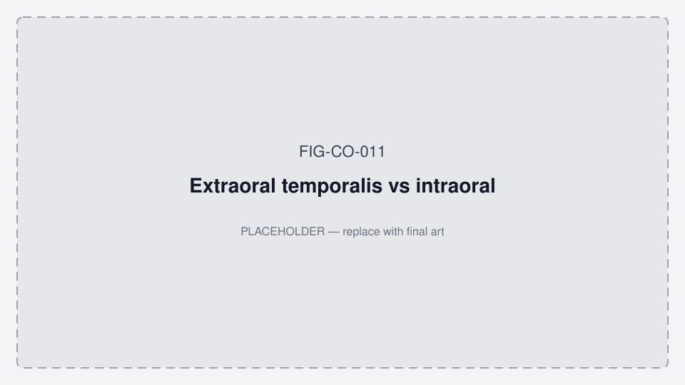

*Fig. 1. Extraoral temporalis sensing (this work) versus intraoral appliance sensing (out of scope). Asset: FIG-CO-011 — **placeholder SVG; redraw for publication**.*

### A2. Anatomical target — anterior temporalis

The temporalis is a fan-shaped masticatory muscle arising from the temporal fossa and inserting on the coronoid process. Functionally it has an **anterior** belly with near-**vertical** fibers that **elevate** the mandible (tooth occlusion / bite) and a **posterior** belly with near-**horizontal** fibers that assist elevation and uniquely **retract** the mandible [15]. The Research Kit seats both Oralable and ANR on the **anterior elevating belly** (clench bulge between the eyebrow tail and the ear)—the same site class as anterior-temporalis sEMG peers (e.g. GrindCare)—not on the posterior retracting belly [14], [15].

| Device | Physics on the anterior belly | Primary derived quantities |
|--------|-------------------------------|----------------------------|
| **Oralable MAM** | Optical PPG (+ ACC): muscle stiffening compresses local perfusion | **IR-DC / OMG** troughs; **HR**; **SpO₂**; SASHB; motion / sync taps |
| **ANR M40** | Surface EMG (Analog `0x2A58`) | Raw amplitude; **bout** onset/offset for Dual A concordance |

EMG bout onset typically **leads** the IR-DC trough by about **1–5 s** (hemodynamic lag). Dual A electrode long axis is **vertical**, parallel to anterior fibers [14].

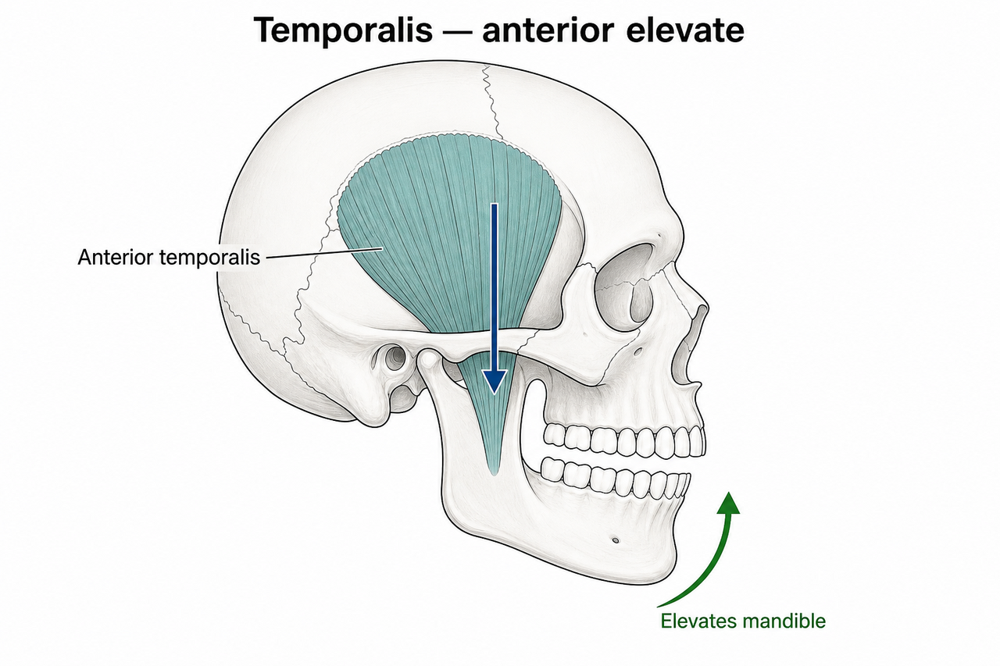

*Fig. 2(a). Temporalis function — anterior (vertical) fibers elevate the mandible. Oralable schematic FIG-CO-056 after standard anatomy [15]. **Primary Research Kit seat** for Oralable PPG and ANR.*

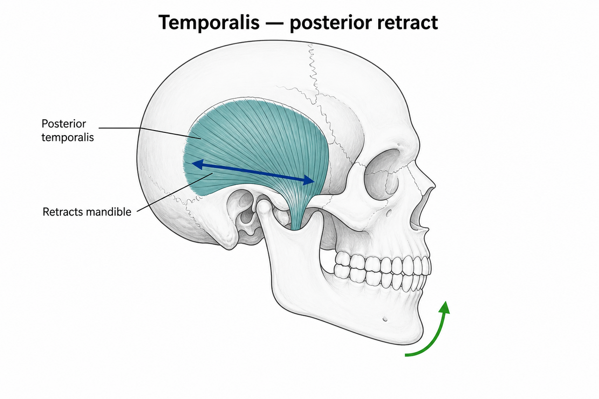

*Fig. 2(b). Temporalis function — posterior (near-horizontal) fibers retract the mandible [15] (asset FIG-CO-057). Shown for anatomical contrast; **not** the primary Dual A seat.*

*Fig. 2(c). Temple placement schematic (practice overlay). Asset: FIG-CO-003 — placeholder; align marks with Fig. 2(a) anterior belly.*

*Fig. 2(d). Gen1 Oralable device. Asset: FIG-CO-012 — **[PLACEHOLDER — OWNER: John]**.*

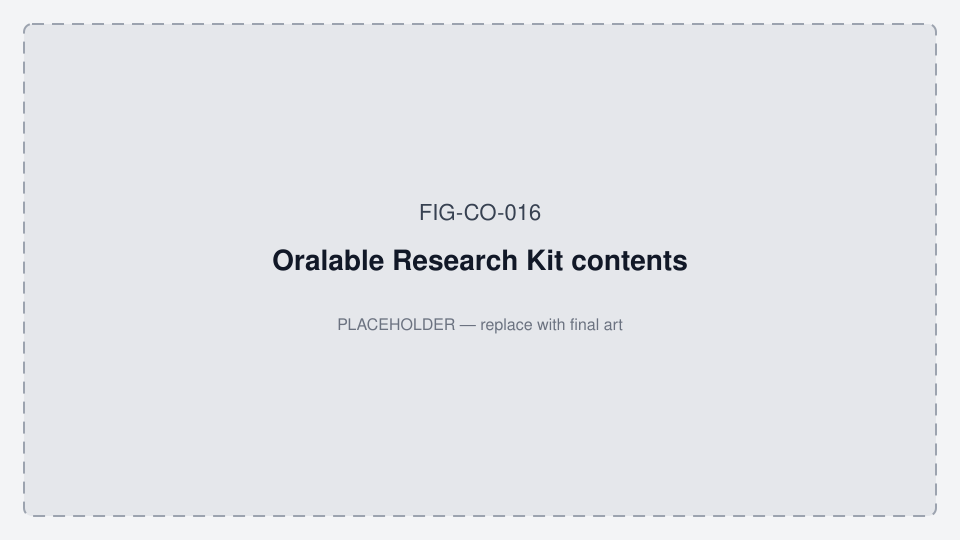

*Fig. 2(e). Research Kit contents. Asset: FIG-CO-016 — **[PLACEHOLDER — OWNER: John]**; photo path also FIG-CO-016 PNG / FIG-CO-049.*

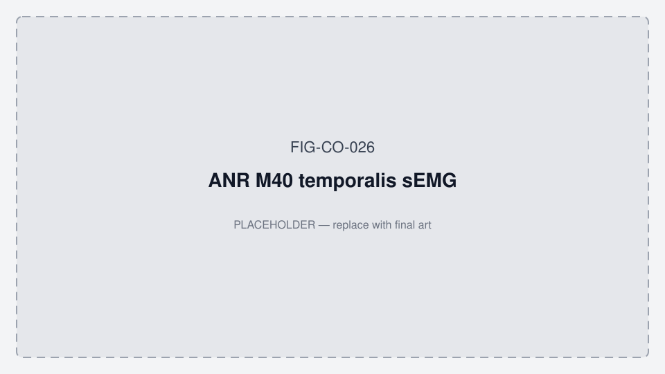

*Fig. 2(f). ANR M40. Asset: FIG-CO-026 — prefer photo FIG-CO-026 PNG when publishing.*

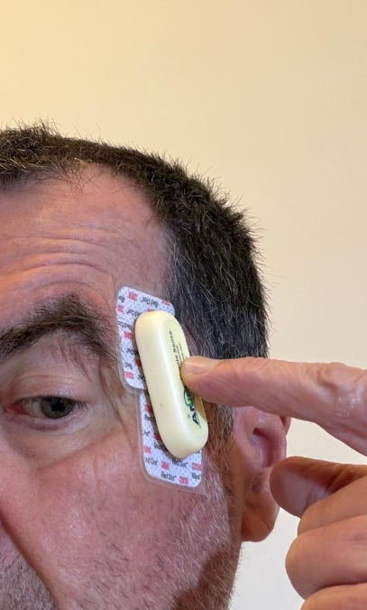

*Fig. 2(g). Dual A practice: ANR long-axis **vertical** on anterior temporalis over / pressing the Oralable optical stack (asset FIG-CO-031). Related: FIG-CO-054 hybrid · FIG-CO-055 finger-press placement.*

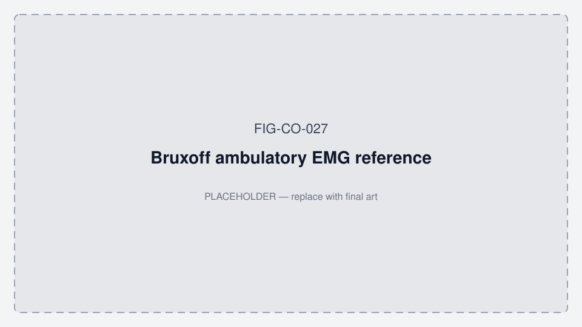

*Fig. 2(h)–related. Bruxoff / AcuPebble / GrindCare photo slots: FIG-CO-027 / 028 / 029 — **[PLACEHOLDER — OWNER: Pedro / John]**.*

### B. Sensing and electronics (summary)

| Item | Draft specification |
|------|---------------------|
| PPG | Maxim **MAXM86161** (multi-wavelength; Red / Green / IR used in pipeline) |
| Accelerometer | **LIS2DTW12** (actigraphy / sync taps / motion context) |
| MCU / radio | Kaga **ES2832AA2** (nRF52832) Gen1 |
| BOM / PCB | Gen1 · BOM REV8 · PCB REV10 |
| Stream | BLE notify path; research grid **50 Hz** (20 ms) after resampling |
| Firmware (pilot) | **1.0.70** ship (min gate 1.0.63) |
| Companion app | iOS Oralable patient app **4.3.3** (vitals + overnight report path) |
| Dual A sEMG | ANR M40 Automation IO Analog EMG `0x2A58` |

> **[PLACEHOLDER — OWNER: John]** Add a concise electrical block diagram from Altium / system architecture — no confidential claim charts.

### C. Data products

Raw and derived channels export as time-aligned CSV (50 Hz grid) for offline analysis; the patient app can render an overnight state hypnogram and export a multi-page clinical Temporalis PDF. Dual A produces paired Oralable + ANR logs and concordance packs via `align_anr_oralable_concordance.py`. Methods parity targets exist between Python research tooling and Swift production (`OralableCore`) [6].

---

## IV. Signal Processing Methods

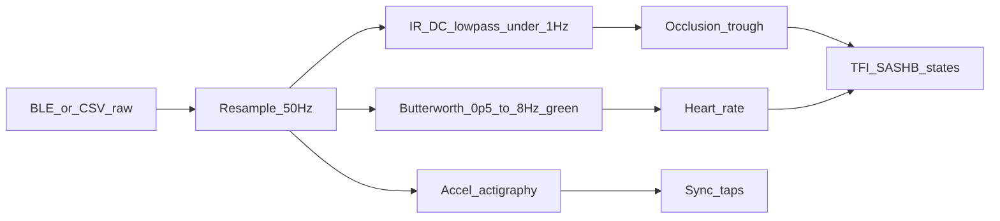

*Fig. 3(a). Processing overview (methods draft).*

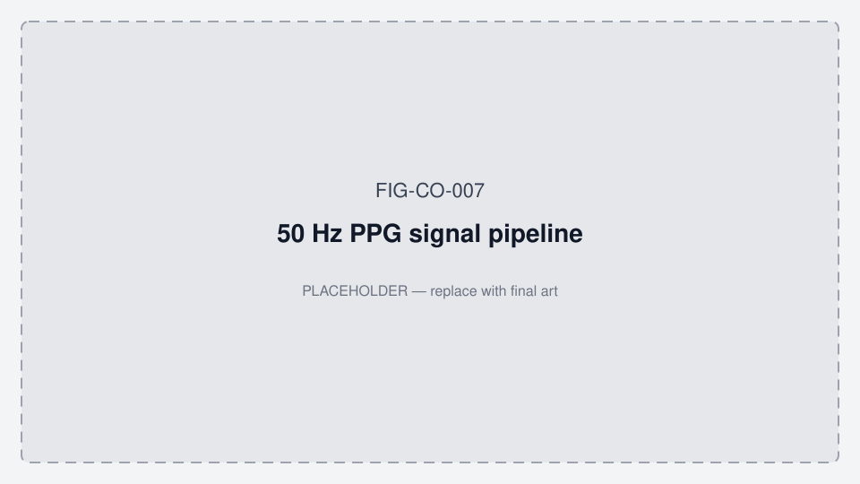

*Fig. 3(b). 50 Hz PPG pipeline figure slot. Asset: FIG-CO-007 — replace with publication redraw.*

### A. Resampling

All analysis channels are linearly interpolated onto a strict **50 Hz** grid (20 ms). Accelerometer samples acquired at higher rates are synchronized to the same grid for overnight fusion.

### B. Heart-rate PPG path

Green (or configured AC) channel: Butterworth bandpass approximately **0.5–8.0 Hz** for pulsatile analysis and heart-rate estimation under temple coupling. SpO₂ estimation uses red/IR ratio methods with quality gating.

> **[PLACEHOLDER — OWNER: Koorosh + John]** Exact filter order, SOS coefficients, and SpO₂ calibration coefficients for the paper table (from shared algorithm spec).

### C. IR-DC occlusion / OMG path

Infrared DC is low-pass filtered (**&lt;1 Hz**) to extract slow hemodynamic shifts associated with temporalis load (optical myography / occlusion troughs). Clench-related detections are cross-checked against IR-DC trough depth [6].

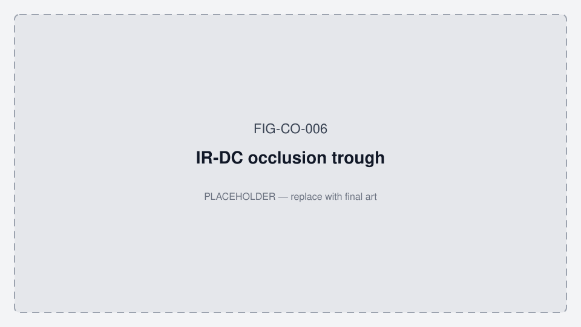

*Fig. 4. IR-DC occlusion trough illustration. Asset: FIG-CO-006 — **[PLACEHOLDER — OWNER: John]** replace with real annotated bout from Protocol A / overnight log.*

### C2. Dual Protocol A concordance (ANR M40)

Labeled Dual Protocol A runs Oralable and ANR M40 in parallel on the **anterior temporalis** under shared wall-clock cues (5-tap sync at Protocol A minute 01:00) via Mac scripts [14], [15]. ANR Red Dots are oriented with long axis **vertical** (parallel to anterior fibers); an EMG amplitude preflight (rest → hard clench → rest) gates contact quality before cues. Post-hoc alignment resamples EMG and optical features onto the **50 Hz** grid for descriptive bout timing and amplitude comparison (electrical lead vs IR-DC lag). The same pack nests Oralable SpO₂ / SASHB with ANR EMG bouts (desat events lasting ≥10 s; co-occurrence within ±5 s) as an **AcuPebble-style oxygen-burden context** — not claimed ODI/AHI and not Bruxoff equivalence [13], [14]. Align also writes a research **EDF+** (`session.edf`) with ANR `EMG` when Dual A is used; iOS Dual A Share can include the same. Mac remains the methods reference until iOS parity is proven. This is a **Paper A methods path and precursor result**, not PSG-AV SB diagnosis.

**Engineering precursor (12 Aug 2026):** Mac Dual A session `20260812_085110` completed (EMG preflight gate 70; clench max 83). Concordance pack `plots/concordance/20260812_085110/` includes overlay, `NEST.md`, and `session.edf`. Temple SpO₂ was computed (aligned mean ≈ 89.5%); engineering SASHB ≈ 929 %·s. Median EMG→IR-DC lag ≈ 4.9 s. Bout F1 vs Protocol A labels was 0 on this pack — placement/QC follow-up, not partner *N*. A state-hypnogram **layout** pack from the same Dual A gold is at `plots/overnight_report/TEMPORALIS_20260812_085110_dualA/` (wear ≈ 6.0 min — not an evaluable overnight).

### D. Session metrics (engineering)

| Metric | Definition (draft) | Notes |
|--------|--------------------|-------|
| **TFI** | Temporalis Fatigue Index, 0–100 session score from IR-DC / green AC slopes | Engineering load index |
| **SASHB** | Engineering SpO₂&lt;90% area (%·s): Σ (90 − SpO₂)·dt | Rate = total ÷ wear hours; **not** Azarbarzin event-linked HB; **not** AHI |
| **SpO₂∩EMG nest** | Fraction of ANR EMG bouts co-occurring with SpO₂ &lt; 90% ≥10 s (±5 s) | Dual A pack (`NEST.md`); **not** ODI/AHI |
| **Research EDF+** | 50 Hz Dual A time series (+ ANR `EMG` when used) | `session.edf` — research handoff; **not** PSG |
| **Rescue rate** | Rescue-class events ÷ wear hours | Device-inferred; **not** AHI |
| **Activity mix** | Tonic minutes ÷ wear hours (phasic secondary) | Banded for evaluable nights |

Band cutoffs (Low / Moderate / High) are **provisional pilot defaults** for UI/reporting and must be recalibrated from ≥6 h cohort distributions [7].

### E. Overnight state classifier

Epochs are labeled into device-inferred states: **quiet**, **tonic**, **phasic**, **rescue**, **recovery** (implementation: Python `overnight_states` with Swift `OvernightStateClassifier` parity target) [6], [7].

> **[PLACEHOLDER — OWNER: Koorosh + John]** Publishable state machine / feature table (window length, thresholds, hysteresis). Keep wellness wording.

---

## V. Overnight Representation: State Hypnogram

The primary overnight graphic is a **state hypnogram**—a barcode-style map of quiet / tonic / phasic / rescue / recovery across the night. Layout resembles a sleep-stage hypnogram, but bands show **device-inferred jaw-load / recovery states**, not PSG sleep stages [7].

**Evaluable night rule (Paper A / Arm E/J):** primary overnight Results and band recalibration require **≥6 h** worn (goal 8 h). The iOS app may unlock provisional morning-card bands from **≥1 h** for pilot UX; do not treat 1 h sessions as Paper A overnight *N*. Protocol A/B minutes are not sleep sessions.

*Fig. 5. Illustrative state hypnogram from engineering pack TEMPORALIS_20260724 (asset FIG-CO-025). **Important:** wear ≈ **6.0 min** — **not** an evaluable ≥6 h overnight. A second layout pack from Dual A `20260812_085110` is at `plots/overnight_report/TEMPORALIS_20260812_085110_dualA/02_state_hypnogram.png` (also ~6 min). Replace with consented ≥6 h nights before claiming overnight results.*

*Fig. 5 (supplement). Band-chip layout stub (FIG-CO-019) — optional panel beside hypnogram.*

**Graphing hierarchy for partner review:** (1) state hypnogram, (2) hourly stacked burden + SASHB, (3) IR-DC + SpO₂ dual-rail, (4) event table; 3D cluster appendix only [7].

---

## VI. Pilot Protocol (Beacon · Research Kit · n≈5)

Canonical ops protocol: [PAPER_A_FEASIBILITY_PROTOCOL.md](./PAPER_A_FEASIBILITY_PROTOCOL.md) · kit [ORALABLE_RESEARCH_KIT.md](./ORALABLE_RESEARCH_KIT.md).

### A. Clinical setting

Dental Sleep Medicine partners at **Beacon** (Owens, Mayoral) run Research Kit feasibility: home or clinic wear, chairside review of the overnight map, and Pedro’s MAD titration context nested with AcuPebble AHI when available [8], [13].

### B. Structured collection

| Protocol / arm | Purpose | Anchor | Duration |
|----------------|---------|--------|----------|
| **Core** | Setup, comfort, HR/SpO₂ QC, export | Temple mount | ≥5–10 min |
| **Arm P (Pedro)** | Oxygen burden ± MAD | Continuous wear | **1–2 h** |
| **Arm E/J** | Evaluable overnight hypnogram | Home wear | **≥6 h** (goal 8 h) |
| **Protocol A / Dual A** | Labeled training + ANR concordance | 5-tap sync | ~6 min Mac Dual A |
| **Protocol B** | Validation gates (later) | First 3-tap | ~4.5 min |

Details: [../TEMPORALIS_COLLECTION_PROTOCOL.md](../TEMPORALIS_COLLECTION_PROTOCOL.md).

**Optional intake:** BruxScreen-Q (± BruxScreen-C) [4] for Paper B labels.  
**Landscape nesting:** Bruxoff when available [12]; AcuPebble AHI context [13]; GrindCare as peer class in discussion.

### C. Ethics, consent, and data governance

> **[PLACEHOLDER — OWNER: Ed/Pedro]** Beacon / local ethics path, consent language (wellness research vs clinical study), data controller, retention.  
> **[PLACEHOLDER — OWNER: Koorosh]** McGill / RI-MUHC REB requirements if analyzing data under McGill affiliation.  
> **[PLACEHOLDER — OWNER: John]** JAC data-processing agreement template for partner CSV/PDF sharing (no inventorship transfer).

### D. Target sample

| Tier | Target | Use |
|------|--------|-----|
| **Paper A feasibility** | **n≈5** Beacon (Pedro ± Ed first, then +3) | Wear, QC, Arm P, Dual A precursor, landscape |
| Research Kit ship | **5 kits by 31 Aug 2026** | Field *N* gate [14] |
| Tier 1 (later) | ≈ **20–30** users × 3–5 Protocol A | Core ML cohort [9] |
| Overnight subset | ≥6 h nights | Hypnogram / band recalibration |
| Deeper EMG / PSG-AV | Later papers | Bruxoff/PSG-AV diagnostic concordance |

> **[PLACEHOLDER — OWNER: All]** Lock inclusion/exclusion, demographics stratification (sex, age, habitus, skin tone) [9].

---

## VII. Results

> **All quantitative results below are placeholders.** Do **not** treat the TEMPORALIS_20260724 exemplar as study results.

### A. Cohort (Table I)

| Item | Value |
|------|-------|
| Enrolled *N* | `[PLACEHOLDER — OWNER: Ed/Pedro + John]` |
| Evaluable overnight nights (*n*) | `[PLACEHOLDER]` |
| Mean ± SD wear hours | `[PLACEHOLDER]` |
| % nights ≥6 h | `[PLACEHOLDER]` |
| Demographics | `[PLACEHOLDER]` |

### B. Signal quality / coupling (Table II)

| Metric | Value |
|--------|-------|
| IR-DC coupling in-range fraction | `[PLACEHOLDER — OWNER: John]` |
| Green PPG SNR (dB) after BP filter | `[PLACEHOLDER — OWNER: Koorosh + John]` |
| SpO₂ quality-gate pass rate | `[PLACEHOLDER]` |
| Dropouts / BLE gaps | `[PLACEHOLDER]` |

### C. Overnight phenotype descriptives (Table III) — engineering only

| Metric | Median (IQR) or Mean ± SD |
|--------|---------------------------|
| TFI | `[PLACEHOLDER]` |
| SASHB / h (%·s / h) | `[PLACEHOLDER]` |
| Rescue events / h | `[PLACEHOLDER]` |
| Tonic min / h | `[PLACEHOLDER]` |
| State-time fractions (quiet/tonic/phasic/…) | `[PLACEHOLDER]` |

### D. Illustrative short-session examples (non-inferential)

Two ~6 min engineering packs demonstrate layout / Dual A toolchain. **Neither** is an evaluable ≥6 h overnight.

| KPI | TEMPORALIS_20260724 | Dual A 20260812_085110 |
|-----|---------------------|-------------------------|
| Wear | ~360.8 s (~6.0 min) | ~358.6 s (~6.0 min) |
| TFI | ~47.7 | ~45.2 |
| SASHB (session total) | ~688.5 %·s | ~929 %·s |
| SpO₂ mean / min | ~91.9 / 85.0 | ~90.5 / 85.0 (overnight clip); aligned min ≈ 63.8 |
| EMG→IR-DC median lag | — | ≈ 4.9 s |
| Hypnogram layout | FIG-CO-025 | `…/TEMPORALIS_20260812_085110_dualA/02_state_hypnogram.png` |
| Research EDF+ | — | `plots/concordance/20260812_085110/session.edf` |

> **[PLACEHOLDER — OWNER: John]** Replace with a consented **≥6 h** night before overnight inferential claims. Do not treat Dual A minutes as partner *N* or as Azarbarzin HB.

### E. Engineering readiness (as at 12 Aug 2026 — not partner *N*)

| Item | Status |
|------|--------|
| Mac Protocol A + Core ML Tier 0 (TEMPORALIS_20260724) | Done (~6 min eng pack) |
| Overnight report toolchain + hypnogram layout | Done (layout on eng + Dual A packs) |
| Mac Dual Protocol A + align + SpO₂∩EMG nest | **Measured** pack `20260812_085110` |
| Research EDF+ (`session.edf` with ANR EMG) | Mac default on; iOS Dual A Share |
| iOS Oralable long wear (1–6 h+) | Supported (no hard duration cap) |
| iOS Dual A overnight / ≥6 h paired | Follow-on |
| Research Kits with Pedro | **Gated** — target 5 kits by 31 Aug 2026 |

### F. Agreement endpoints

| Comparison | Statistic | Scope |
|------------|-----------|-------|
| Dual A Oralable vs ANR bout timing | Precursor: median lag ≈ 4.9 s (`20260812_085110`); F1 vs labels = 0 this pack — `[PLACEHOLDER — more packs]` | Paper A precursor |
| vs Bruxoff (when available) | Descriptive output classes | Paper A landscape |
| vs AcuPebble AHI/ODI | Nest only — no AHI claim | Arm P context |
| vs BruxScreen / dentist impression | `[PLACEHOLDER — Paper B]` | Later |
| vs PSG-AV RMMA | `[PLACEHOLDER — later]` | Later |

---

## VIII. Discussion

### A. Positioning

This draft treats the **Oralable Research Kit** as an **extraoral anterior-temporalis OMG** system for multi-hour jaw-load and vitals mapping [15]. Oralable MAM and ANR sense the same elevating belly by different physics (optical occlusion + vitals vs surface EMG). The kit complements PSG-AV diagnosis [1] and AcuPebble AHI [13]; finger HSAT rings such as Happy Ring [16] sit on the same AHI-class shelf. It does not replace them. Bruxoff and GrindCare are the ambulatory EMG peer class [1], [12]. ANR Dual A is the in-kit electrical comparator. The state hypnogram is the proposed primary display for 1–6 h+ home wear.

### B. Competitor output comparison (plan)

| Device | Typical headline outputs | Oralable Kit outputs (this paper) |
|--------|--------------------------|-----------------------------------|
| ANR M40 | EMG amplitude / bouts | Dual A alignment vs IR-DC |
| AcuPebble | AHI, ODI | SpO₂ burden / wear — **not** AHI |
| GrindCare | Temporalis sEMG activity | Optical OMG at same site class |
| Bruxoff | EMG/ECG ambulatory SB-oriented counts | IR-DC / states / TFI (engineering); optional nest |
| Happy Ring | hAHI (finger ring HSAT) | SpO₂ burden / wear — **not** AHI [16] |

### C. Limitations

1. **No PSG-AV concordance in Paper A** (planned later).  
2. Dual A concordance is **descriptive**, not diagnostic SB validation.  
3. State labels are **device-inferred**; orofacial confounding is possible (as with EMG ambulatory tools [1]).  
4. Band cutoffs are provisional.  
5. Temple optical coupling depends on **anterior-belly** placement, motion, and skin/hair; QC gates (and Dual A EMG preflight) are required. Posterior temporalis is anatomically real but is not the primary occlusion seat [15].  
6. Stage A wellness framing—do not present results as medical diagnosis.  
7. Engineering exemplars (~6 min) are not cohort evidence; kits were not shipped as of this draft.

### D. Relation to prior intraoral PPG

Extraoral temporalis sensing must stay distinct from prior intraoral PPG [2]. That keeps this McGill academic work separate from intraoral appliance product lines [5].

---

## IX. Future Work — Study Ladder

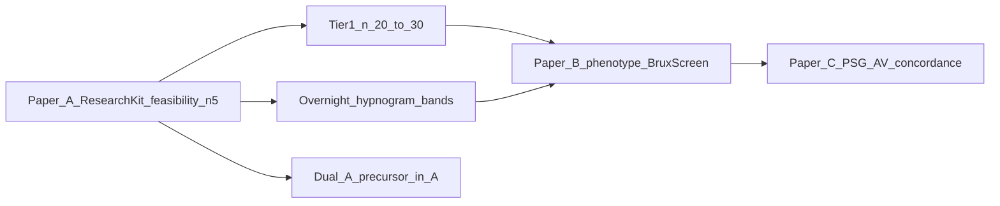

*Fig. 6. Proposed publication / evidence ladder (not a results claim).*

| Paper | Focus | Dependencies |
|-------|-------|--------------|
| **A** (this draft) | Research Kit methods, Dual A precursor, hypnogram, Beacon n≈5 | Ethics + 5 kits + pilot *N* |
| **B** | Phenotype vs intake / dentist labels; overnight band recalibration; optional Owens–Mayoral endotype / MAD-selective RMMA tests [17] | BruxScreen pathway [4]; ≥6 h nights; MAD setting log |
| **C** | Deeper EMG / Bruxoff / **PSG-AV** concordance | Larger *N*; lab PSG-AV |

> **[PLACEHOLDER — OWNER: Koorosh]** Preferred venue sequence (journal vs conference first).  
> **Follow-on engineering:** Harden iOS Dual A overnight (paired cues + unified export).

### Directions for future investigation

See also the full audit checklist in [PAPER_A_VALIDATION_AND_FUTURE_WORK.md](./PAPER_A_VALIDATION_AND_FUTURE_WORK.md) §7.

1. **True overnight corpus** — consented temple nights with wear ≥6 h (goal 8 h); regenerate Fig. 5; recalibrate band cutoffs.  
2. **Publishable algorithm appendix** — filter SOS/order, state-machine thresholds, SpO₂ curve coefficients; Python↔Swift epoch parity report.  
3. **Signal QC endpoints** — IR-DC coupling in-range fraction (10M–70M raw class), green SNR post-bandpass, SpO₂ quality-gate rate, BLE gap statistics (Table II).  
4. **Motion / orofacial confounding** — ACC-informed rejection of false tonic/phasic; compare to awake PPG+ACC chewing literature [3] without conflating goals.  
5. **Literature refresh** — re-verify Li ambulatory gap for temple optical devices published after Dec 2024.  
6. **Clinical labels (Paper B)** — BruxScreen-Q/C vs device-inferred load fractions; chairside hypnogram usability. Natural home for Owens & Mayoral (2026) endotypes and homeostatic-latency operationalization [17] — not Paper A endpoints.  
7. **Deeper EMG / PSG-AV (Paper C)** — expand Dual A precursor (in Paper A) to Bruxoff/PSG-AV RMMA subsets.  
8. **Ethics / data governance** — Beacon + optional McGill REB; DPA before raw log exchange; COI text finalized.  
9. **Hardware enablement** — charge-to-temple + **5 Research Kits to Pedro by 31 Aug 2026**; publication photos replacing placeholder SVGs (FIG-CO-012/016/026–029).  
10. **iOS Dual A overnight** — harden dual central + paired export after kit handoff.

---

## Acknowledgments

> **[PLACEHOLDER — OWNER: All]** Beacon Hospital, McGill / RI-MUHC, hardware partners (as appropriate), funding statements.  
> Do not include investor valuation language.

---

## Conflicts of Interest

> **[PLACEHOLDER — OWNER: Koroosh]** Draft disclosure: Research Associate, McGill / RI-MUHC; officer role at Dianyx Innovations (if still accurate) — **this manuscript concerns Oralable / JAC extraoral temporalis work under McGill academic collaboration.** Any later complementary Dianyx commercial path is separate from Paper A inventorship.  
> **[PLACEHOLDER — OWNER: John]** Inventor / JAC Dental Solutions Limited; US provisional on Temporalis OMG path (patent pending — no claim text).  
> **[PLACEHOLDER — OWNER: Ed/Pedro]** Clinical practice disclosures / Beacon affiliations.

---

## Ethics Statement

> **[PLACEHOLDER — OWNER: Ed/Pedro + Koorosh]** IRB/REB protocol numbers, consent, and whether data are wellness pilot vs interventional study.

---

## Data and Code Availability

> **[PLACEHOLDER — OWNER: All]** Policy before sharing raw logs: de-identification, partner agreements, and whether algorithms are described at methods level only vs open-source release.  
> Internal references (not public): `src/analysis/overnight_states.py`, `OralableCore` processors, overnight report scripts [6], [7].

---

## References

1. Li C, Yap S, Loh A, Yap YJ, Kujan O, Balasubramaniam R. Ambulatory devices to detect sleep bruxism: a narrative review. *Aust Dent J.* 2024;69(1 Suppl):S53–S62. doi:[10.1111/adj.13057](https://doi.org/10.1111/adj.13057).  
2. Nabavi S, Cogan J, Roy A, Canfield B, Kibler R, Emerick C. Sleep Monitoring with Intraorally Measured Photoplethysmography (PPG) Signals. *2022 IEEE Sensors.* doi:[10.1109/SENSORS52175.2022.9967075](https://doi.org/10.1109/sensors52175.2022.9967075). *(Confirm author line with Koorosh; contrast-only vs Oralable extraoral temporalis.)*  
3. Papapanagiotou V, Diou C, Zhou L, *et al.* A novel chewing detection system based on PPG, audio, and accelerometry. *IEEE J Biomed Health Inform.* 2017;21(3):607–618. doi:[10.1109/JBHI.2016.2625271](https://doi.org/10.1109/JBHI.2016.2625271).  
4. Lobbezoo F, Ahlberg J, Verhoeff MC, *et al.* The bruxism screener (BruxScreen): Development, pilot testing and face validity. *J Oral Rehabil.* 2024;51:59–66. doi:[10.1111/joor.13442](https://doi.org/10.1111/joor.13442).  
5. Oralable collaboration note — McGill / RI-MUHC academic engagement; extraoral temporalis anatomy; not Dianyx JV. Internal: [COLLAB_NABAVI_MCGILL.md](./COLLAB_NABAVI_MCGILL.md). *(Remove or replace with public URL before submission.)*  
6. Oralable algorithm architecture — Python ↔ Swift pipeline (Butterworth HR band, IR-DC LP, TFI/SASHB, overnight states). Internal: [../ALGORITHM_ARCHITECTURE.md](../ALGORITHM_ARCHITECTURE.md). *(Replace with citable methods appendix.)*  
7. Overnight night report — hypnogram-first bands and evaluable-night rules. Internal: [../OVERNIGHT_NIGHT_REPORT.md](../OVERNIGHT_NIGHT_REPORT.md).  
8. Product roadmap / Phase 0 temple vitals on Gen1. Internal: [../PRODUCT_ROADMAP.md](../PRODUCT_ROADMAP.md).  
9. Core ML training cohort plan (Tier 1 ≈ 20–30 users). Internal: [../CORE_ML_TRAINING_COHORT.md](../CORE_ML_TRAINING_COHORT.md).  
10. `[PLACEHOLDER — OWNER: Koorosh]` Charlton / pulse-wave analysis references as used in PPG morphology methods.  
11. `[PLACEHOLDER — OWNER: All]` Additional SB / RMMA / ICAB–STAB normative cites for Introduction.  
12. Cid-Verdejo et al. — Bruxoff vs PSG in OSA (see [BRUXOFF_PSG_GOLD_STANDARD.md](./BRUXOFF_PSG_GOLD_STANDARD.md) for full cite + claim discipline).  
13. AcuPebble / Acurable HSAT landscape — nest with Arm P; Oralable ≠ AHI ([ACUPEBBLE_VS_ORALABLE_ANR.md](./ACUPEBBLE_VS_ORALABLE_ANR.md)).
16. Happy Ring / Happy Health — Oura-like finger HSAT (K240236 monitoring; K242224 hAHI SaMD); nest class, not Oralable substitute ([HAPPY_RING.md](./HAPPY_RING.md)).  
14. Oralable Research Kit + Dual A Mac scripts — internal: [ORALABLE_RESEARCH_KIT.md](./ORALABLE_RESEARCH_KIT.md) · [ANR_M40_CONCORDANCE.md](./ANR_M40_CONCORDANCE.md) · [TEMPORALIS_ANATOMY_AND_PLACEMENT.md](./TEMPORALIS_ANATOMY_AND_PLACEMENT.md). *(Replace with citable methods before submission.)*  
15. Kenhub. Muscles of mastication (tutorial / anatomy education). Temporalis anterior (elevate) vs posterior (retract) fiber actions. Used as anatomy teaching source for placement; publication figures FIG-CO-056 / FIG-CO-057 are Oralable originals. *(Optional: add a journal-preferred textbook cite beside Kenhub.)*  
17. Owens E, Mayoral P. Sleep bruxism: a novel theoretical perspective through the lens of the free energy principle (FEP). *Front Behav Neurosci.* 2026;20:1920406. doi:[10.3389/fnbeh.2026.1920406](https://doi.org/10.3389/fnbeh.2026.1920406). *(Clinical/neuro framing + Paper B; not Paper A methods. Bookmark: [ED_PEDRO_SB_FEP_DRAFT_PAPER.md](./ED_PEDRO_SB_FEP_DRAFT_PAPER.md).)*

---

## Appendix A — Figure checklist (publication)

| Fig | Asset / content | Status | Owner |
|-----|-----------------|--------|-------|
| 1 | Extraoral vs intraoral | Placeholder SVG (FIG-CO-011) | John + illustrator |
| 2(a)–(b) | Temporalis function — anterior elevate / posterior retract | FIG-CO-056 / 057 Oralable schematics (ready) | John — polish labels if venue requires |
| 2(c)–(h) | Placement practice + device + Kit + ANR + Dual A wear + landscape | FIG-CO-003/012/016/026/031; landscape 027–029 | John / Pedro |
| 3 | 50 Hz pipeline | Mermaid + FIG-CO-007 | Koorosh + John |
| 4 | IR-DC trough bout | Placeholder → real log | John |
| 5 | State hypnogram | FIG-CO-025 eng exemplar (~6 min) | John → pilot nights |
| 6 | Study ladder A→B→C | Mermaid in this draft | All |
| Table I–III | Cohort / QC / KPIs | Empty | Ed/Pedro + John |

## Appendix B — What this draft deliberately excludes

- Provisional patent claim text or claim charts  
- Investor financials / valuation  
- Dianyx product co-development framing  
- Diagnostic claims (SB disorder, AHI, medical clearance)

---

*End of Paper A working draft. Markup welcome as comments or tracked edits. Convert to IEEEtran after venue and authorship lock.*
