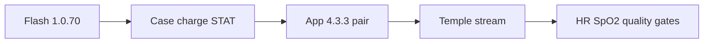

# Vitals pilot — firmware & iOS validation plan (Ed / Pedro)

**App working diagrams:** [MOBILE_APP_FLOWS.md §2](../../../oralable_swift/docs/MOBILE_APP_FLOWS.md#2-how-the-patient-app-works--phase-0)

**Firmware:** **1.0.70** (hard min 1.0.63; kits must ship **1.0.70**) · **Board:** pcb00003 · **Ground truth:** nRF Connect logs + app nRF-style CSV export  
**iOS:** TestFlight Oralable **4.3.3+** — recommend FW **1.0.70**, Automatic dock, Device LED STAT mirror

Flash files: [FIRMWARE_1.0.70_FLASH.md](./FIRMWARE_1.0.70_FLASH.md)

**Strategy stack:** Stage A wellness wearable → Stage B medical (later) · new US patent embodiment · Ed/Pedro = patient app only.  
**Cost & timeline (planning):** [COST_AND_TIMELINE.md](./COST_AND_TIMELINE.md) — Phase 0 now–Sep 2026; Phase 1+ Q4’26–Q1’27; Gen2 parallel; Stage B H2’27–2028. Mid Stage A ~€200–250k; Stage A+Gen2 ~€350–450k; through Stage B ~€0.8–1.0M (ranges — not a budget).



---

## A. Pre-ship checklist (John — bench)

| # | Step | Pass |
|---|------|------|
| A1 | Flash `merged.hex` **1.0.70**, verify `006` reads **1.0.70** | ☐ |
| A2 | Off pad: green flash (dim asymmetric pulse) or solid if truly full | ☐ |
| A3 | On **Oralable case** (Automatic or mode 1): red **flash** + `charge_active=1` | ☐ |
| A4 | Stay on case until STAT taper: solid red, `on_dock=1`, `charge_active=0` | ☐ |
| A5 | Connect probe: **no** dim green for 10 s after BLE connect | ☐ |
| A6 | Mode 3 worn: PPG/ACC notify @ ~50 Hz in nRF Connect | ☐ |
| A7 | Disconnect → Oralable reappears in scan within 15 s | ☐ |
| A8 | TestFlight: gate accepts 1.0.63+; recommends 1.0.70; **Automatic** + Device LED mirror | ☐ |

---

## B. Firmware validation (nRF Connect)

**Setup:** Subscribe **`3A0FF004`** (battery), **`3A0FF009`** (status). Optional: PPG/ACC for rate check.

### B1 — Charger LED matrix (STAT activity · 1.0.70)

1. App placement → **Automatic** (or **On wireless charger**)
2. Place on **Oralable magnetic charging case** 60 s
3. Record: LED colour, status bytes `[on_dock, worn, state, bat%, charge_active]`

| Expect (1.0.70) | LED | byte0 `on_dock` | byte4 `charge_active` | Notes |
|-----------------|-----|-----------------|------------------------|-------|
| Charging (STAT blink) | Red flash | **1** | **1** | Prefer Oralable case only |
| Charge taper (STAT steady) | Solid red | **1** | **0** | Not necessarily 4.2 V full |
| mV on pad | — | — | — | May read high — rough % only |

### B2 — Bench LED matrix

1. Off pad → placement **Off charger (not worn)**
2. Wait 60 s

| Expect | LED |
|--------|-----|
| Green flash (or solid if Vmax) | ✓ |

### B3 — Worn streaming

1. Placement **Worn on temple**
2. Connect; enable PPG + ACC notify
3. 120 s on temple (or finger for smoke test)

| Metric | Gate |
|--------|------|
| PPG notify rate | ~50 Hz ±10% |
| ACC notify rate | ~50 Hz ±10% |
| Status worn byte | 1 (may lag until temp — mode 3 forces policy) |
| Disconnect recovery | Re-advertise ≤15 s |

### B4 — BLE stability (optional stress)

- 5 min connected, phone at 30 cm → no drop
- Walk to 2 m → note RSSI; expect possible drop below −85 dBm
- Debug reboot: Developer Settings → 5 min → device reboots once (bench only)

**Export:** Save nRF Connect log CSV → `data/validation_logs/nrf_vitals_YYYYMMDD.csv`

---

## C. iOS app validation

### C1 — Connect flow

| Step | Expect |
|------|--------|
| Scan → connect | Ready within ~5 s |
| Placement applied | Log line: mode title |
| No Protocol B section | Share tab when vitals phase on |
| Vitals card visible | On Dashboard when connected |

### C2 — Operational states

| Scenario | App state | HR/SpO₂ |
|----------|-----------|---------|
| Automatic / mode 1 on pad (charging) | On charger · Charging chip | Hidden or searching |
| Automatic / mode 1 on pad (taper) | On charger · Taper chip | Hidden or searching |
| Mode 2 on table | Bench / idle | Not shown as ready |
| Mode 3 on temple, good contact | On body → Vitals ready | Values + “Good signal” |
| Mode 3 poor contact | On body | “Searching…” / “Poor signal” |

### C3 — Data integrity (compare nRF vs app)

For 60 s worn session, export both:

1. nRF Connect CSV (PPG/ACC hex)
2. App nRF-style BLE log (Developer Settings)

| Check | Method |
|-------|--------|
| Status bytes match | Compare `009` hex in both logs |
| Sample count ~3000/min | Count PPG rows @ 50 Hz |
| HR plausible | 50–120 BPM at rest |
| SpO₂ plausible | 94–100% at rest (well perfused) |
| No duplicate timestamps storm | App log not stalling UI |

**Python gate (optional):** `scripts/self_validate.py` on exported log — adapt for vitals-only (no Protocol B phases).

### C4 — Export path

| Action | Expect |
|--------|--------|
| Share → CSV | File in Documents / Files app |
| Save to Files | No LaunchServices -10814 error |

---

## D. Ed / Pedro field protocol (simple)

Each tester (3 sessions minimum):

| Session | Duration | Placement | Record |
|---------|----------|-----------|--------|
| 1 | 5 min | Temple, seated still | HR, SpO₂, CSV |
| 2 | 5 min | Temple, light head movement | Quality drops OK — note behaviour |
| 3 | 10 min | Temple, normal use | Disconnect count, RSSI notes |

**Before each session:** battery &gt;50%, placement set **before** mounting, phone nearby.

**Email John:** CSV + 3 bullet observations (LED, disconnects, vitals quality).

---

## E. Failure triage

| Failure | First action |
|---------|--------------|
| Wrong LED colour | Confirm FW **1.0.70** + placement; STAT flash≠taper; use app **Device LED** mirror |
| No scan | J-Link `--reset`; unplug during RF test |
| CBError 6 @ low battery | Charge on **Oralable case** (mode 1) |
| CBError 6 @ good battery | RSSI / distance; retry closer |
| HR=0, SpO₂=0 | Press clip; wait; check worn mode |
| Stuck after disconnect | Enable 5 min debug reboot (dev only) |

---

## Sign-off

Phase 0 vitals pilot **passes** when:

- [ ] A1–A8 bench complete (John)
- [ ] Ed: 3 temple sessions + 3 CSVs
- [ ] Pedro: 3 temple sessions + 3 CSVs
- [ ] ≥80% sessions show HR **or** SpO₂ with quality ≥0.4 for ≥2 min
- [ ] No blocking crash / export failure on TestFlight build

Then: schedule Protocol B / muscle phase or **Gen2 (REV11 / ES4L15BA1)** bring-up.

---

## Flash command (reference)

```bash
nrfjprog --snr 1050090445 --recover
nrfjprog --snr 1050090445 --program build_pcb00003/merged.hex --sectorerase --verify --reset
```
