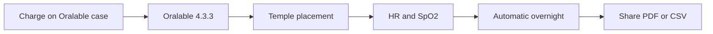

# Oralable — Ed & Pedro quick start (Phase 0 Vitals)

**One page · 7 Aug 2026 · Heart rate + SpO₂ on temple (extraoral · temporalis)**  
**Kit program:** [ORALABLE_RESEARCH_KIT.md](./ORALABLE_RESEARCH_KIT.md) — first worn session on every kit is this vitals path · status [PEDRO_STATUS_UPDATE_2026-08.md](./PEDRO_STATUS_UPDATE_2026-08.md)

**Partners:** [Dr Edward Owens](https://beaconconsultantssleephealthclinic.ie/team-member/dr-edward-owens/) · [Dr Pedro Mayoral Sanz](https://beaconconsultantssleephealthclinic.ie/team-member/dr-pedro/) — Beacon Consultants Sleep Health Clinic  
Full test plan: [VITALS_PILOT_TEST_PLAN.md](./VITALS_PILOT_TEST_PLAN.md) · Flash: [FIRMWARE_1.0.84_FLASH.md](../firmware/FIRMWARE_1.0.84_FLASH.md) · prior [FIRMWARE_1.0.82_FLASH.md](../firmware/FIRMWARE_1.0.82_FLASH.md) · Hardware: [VITALS_PHASE_GEN1_GEN2.md](../../VITALS_PHASE_GEN1_GEN2.md) · Cost/timeline: [COST_AND_TIMELINE.md](../governance/COST_AND_TIMELINE.md)  
IEEE / McGill track: [COLLAB_NABAVI_MCGILL.md](./COLLAB_NABAVI_MCGILL.md) · **Figures:** [../FIGURES.md](../../FIGURES.md) · **App working diagrams:** [oralable_swift/docs/MOBILE_APP_FLOWS.md §2](../../../../oralable_swift/docs/MOBILE_APP_FLOWS.md#2-how-the-patient-app-works--phase-0)

**Support:** John Cogan (JAC / Oralable)

*Figure FIG-CO-003 — Temporalis clip placement (placeholder).*

*Figure FIG-CO-016 — Research Kit flat-lay (draft photo). Full photo guide: [RESEARCH_KIT_PHOTO_SELECTION.md](./RESEARCH_KIT_PHOTO_SELECTION.md).*

*Figure FIG-CO-022 — Charge-to-temple pilot flow (placeholder).*

*Figure FIG-CO-013 — Magnetic charge case (placeholder).*

Full app diagrams: [MOBILE_APP_FLOWS.md §2](../../../../oralable_swift/docs/MOBILE_APP_FLOWS.md#2-how-the-patient-app-works--phase-0).

---

## Pilot ship status (as at 7 Aug 2026)

| Item | Status |
|------|--------|
| **Research Kits with Ed/Pedro** | **Not yet shipped** — target **5 by 31 Aug 2026** ([ORALABLE_RESEARCH_KIT.md](./ORALABLE_RESEARCH_KIT.md)) |
| **Build / flash / app** | Gen1 kits + FW **1.0.84** + patient app **4.3.3** (build **5**) — **ready to hand off** once gate clears |
| **Ship gate** | Charge on **Oralable case** to a **temple-ready SOC** (target **≥50%** remapped gauge) and hold a short worn **HR + SpO₂** session without brownout |
| **Charge status (firmware)** | **1.0.84** STAT blink = charging / on_dock; IR-pulse worn; sensors follow BLE; pad/desk recover. Do **not** say “chrsts broken on REV10” |
| **Still closing** | Energy / case coupling so the cell **actually rises** to the worn-session floor (hardware + validation, not a missing app) |
| **After Phase 0 gates** | Reinstate **muscle / occlusion** metrics for patent embodiment; **professional app** later |
| **Gen2 (parallel)** | Larger cell, re-verified STAT/dock, better SOC / status LED path — removes this class of issue longer term; **not** on these pilot kits |

**One-liner for partners:** *Ready ≠ delivered — **5 Research Kits** to Pedro by **31 Aug 2026** after charge-to-temple is proven under **1.0.84** on each unit ([ORALABLE_RESEARCH_KIT.md](./ORALABLE_RESEARCH_KIT.md)).*

---

## What you are running

| Item | Version / note |
|------|----------------|
| **Firmware** | **1.0.84** ([flash guide](../firmware/FIRMWARE_1.0.84_FLASH.md); prior [1.0.82](../firmware/FIRMWARE_1.0.82_FLASH.md)) — sense-on-BLE · IR-pulse worn · STAT blink · pad/desk recover |
| **iOS app** | **Oralable 4.3.3** build **5** (TestFlight) — Protocol A Setup gate · vitals phase; recommends FW **1.0.84**; hard min **1.0.63** |
| **Hardware** | Gen1 · BOM **REV8** · PCB **REV10** · Kaga **ES2832AA2** · Oralable magnetic case (**not Qi / MagSafe**) |

---

## What changed (vs Protocol B / older kits)

| Before | Now (Phase 0 · 1.0.84) |
|--------|-------------------------|
| Cheek + muscle / Protocol B | **Temple** + **HR / SpO₂ only** |
| Fit calibration required | **No user calibration** |
| “chrsts broken” / forced manual only | **STAT blink = on case**; **Automatic OK** on 1.0.70+ |
| Green LED on charger | Flash **green** / **solid green** on taper — never red (1.0.84) |
| MagSafe / Qi pads | **Oralable case + USB-C only** |
| Battery % as fuel gauge | **Rough voltage estimate** (0% ≈ 3.61 V, 100% = 4.35 V) |

**Legacy kits on 1.0.66 / 1.0.70:** still work with the new app using **manual** or Automatic (1.0.70+). Prefer flash/OTA to **1.0.84** before Day 1 (1.0.82 still OK to connect).

---

## What’s in the kit

**Full program BOM:** [ORALABLE_RESEARCH_KIT.md](./ORALABLE_RESEARCH_KIT.md) (Oralable MAM + ANR M40 + iOS + Dual A cue card). On day 1, every kit runs Phase 0 vitals below.

| Item | Notes |
|------|--------|
| Oralable REV10 clip | Flash **1.0.84** before handoff ([FIRMWARE_1.0.84_FLASH.md](../firmware/FIRMWARE_1.0.84_FLASH.md); prior [1.0.82](../firmware/FIRMWARE_1.0.82_FLASH.md)) |
| **Oralable magnetic charging case** | USB-C — matched LTC6990 TX for this clip |
| **ANR M40** (Research Kit) | Temporalis sEMG — Dual Protocol A on Mac; see Research Kit doc |
| iPhone + **Oralable** (patient) app | TestFlight **4.3.3** build **5+** (FW **1.0.84** aligned) · Protocol A Setup · vitals · Automatic · Device LED · 1–6 h+ feasibility arms |
| This sheet + Dual A cue card | Keep with the clip |

**Out of scope:** **Oralable for Dentists**, CloudKit share-to-dentist, practice IAP. Export CSV / session logs from the patient app only.

**Charging:** Clip + case are one BOM (ADI **LTC4124** RX / **LTC6990** TX). **Not WPC Qi.**

**Wellness disclaimer:** Stage A wellness wearable validation — **not** a medical device.

---

## Critical: device placement

**Charge status** = LTC4124 **STAT** pattern (blink = charging; steady = taper/hold). Battery **%** is voltage-based and can read high on the pad — normal chemistry.

**Setup / Settings → Device placement** (applied on each BLE connect):

| Mode | When to use | LED |
|------|-------------|-----|
| **Automatic** | Preferred on **1.0.70+** + Oralable case | **≥1.0.72:** flash/solid **green**. 1.0.70: red flash / solid red on taper |
| **On wireless charger** | Force “on case” if Automatic unclear | Same as Automatic |
| **Off charger (not worn)** | Table / off case | Status dark (FW ≥ 1.0.72) |
| **Worn on temple** | Vitals session | Status LEDs off; PPG red/IR is sensing, not status |

**Rules:**

1. Set placement **before** Connect when using manual modes (or leave **Automatic** on 1.0.70).
2. **Never** change placement while connected — disconnect first.
3. Use **Oralable case + USB-C** only — not MagSafe/Qi.

**App mirror:** Dashboard **Device LED** plus **Dock / Charging / Taper** chips. The physical LED is dim on purpose.

---

## Day 1 — Charge on case (3 steps)

1. Seat clip on **Oralable magnetic case** (USB-C) → placement **Automatic** (or **On wireless charger**) → **Connect**. Confirm FW reads **1.0.84** if shown.
2. Confirm **green flash** on FW ≥ 1.0.72 (1.0.70 kits: red flash), or app Charging + flash Device LED. Leave **30–60 min** (phone within ~30 cm).
3. When battery **≥50%**, ready for temple. % may step — watch the **trend**. After long charge, LED may go **solid green** (taper, FW ≥ 1.0.72; 1.0.70: solid red) while still on the case — that is expected, not “broken full at 4.2 V.” Never treat red as a status colour on current FW.

Re-open the app later: it should **auto-reconnect**. One attempt; wait ~20 s.

---

## Day 1+ — Temple vitals (4 steps)

1. **Remove from case** → Settings → **Worn on temple** → **Connect** (or stay Automatic only if you will remount immediately — preferred: set **Worn** explicitly).
2. Mount on **temple**. Dashboard → **On body**, then **Vitals ready** when signal is good (~30 s).
3. Confirm **Heart rate** and **SpO₂** (“Good signal” when stable). Session **≥5 min**.
4. **Share** → export CSV. Do **not** use Protocol B (hidden in vitals phase).

Keep phone within **~30 cm**.

---

## What to record and send back

After each session (~5–10 min on temple):

1. **Share** → **Export nRF-style CSV** (Developer Settings) or session CSV from Share.
2. Email: placement mode, FW string if known, disconnects, phone distance, battery %.
3. Optional: screenshot of vitals card + Device LED row when **Vitals ready**.

Rename: `Oralable_VITALS_Ed_YYYYMMDD.csv` (or `Pedro_…`).

---

## LED quick reference (FW 1.0.70)

| Location | Condition | Device LED | App mirror |
|----------|-----------|------------|------------|
| On Oralable case | STAT blinking (charging) | **Red flash** | Flash red · Charging |
| On Oralable case | STAT steady (taper / hold) | **Solid red** | Solid red · Taper |
| Table / bench | Not full | Green flash | Flash green |
| Table / bench | Truly full (Vmax) | Solid green | Solid green |
| On temple (worn) | Any | PPG red/IR glow (status off) | LED off |

---

## Troubleshooting

| Symptom | Fix |
|---------|-----|
| On case but Dock/Charging off | Confirm **1.0.70**; wait one blink window (~few s); try **On wireless charger** then reconnect |
| Solid red on case before “100%” | Normal **taper** — current falling, not necessarily 4.2 V |
| Battery % jumps on pad | Voltage on wireless dock — watch **30 min trend** |
| “Firmware too old” | Need **≥ 1.0.63** — flash **1.0.84** |
| App warns below recommended | Kit below **1.0.84** — flash **1.0.84** (Automatic needs **1.0.70+**) |
| No HR / SpO₂ | **Worn on temple**; adjust pressure; wait 30 s |
| Green on case | Placement still off-dock — set **On wireless charger** or **Automatic** on 1.0.70; reconnect |
| Red on table | Set **Off charger (not worn)** |
| BLE drops after Worn | Charge to **≥50%** first; phone **~30 cm**; RSSI **≥ −70 dBm** |
| MagSafe / Qi used | Stop — use **Oralable case only** |
| No LED (black clip) | Power-cycle; charge 10 min on case; contact John |

---

## Success criteria (Phase 0)

Ed and Pedro each complete:

- [ ] FW **1.0.84** confirmed (`3A0FF006` or app)
- [ ] 1× charger check (red flash → optional solid taper on **Oralable case**)
- [ ] 1× bench LED check (green off pad)
- [ ] 3× temple sessions (≥5 min) with HR and SpO₂ at least once
- [ ] 1× CSV export per session

Protocol B / overnight muscle study **deferred** until vitals stable.  
When overnight muscle evaluation starts: **≥ 6 h** worn (goal **8 h**). Review the **state hypnogram first** in the **patient app** (Dashboard morning card + Share preview — adapts [FIG-CO-025](../figures/FIG-CO-025-state-hypnogram-exemplar.png); **that asset is a ~6 min layout exemplar**, not an overnight). Or use Share → Clinical Temporalis PDF + Mac `generate_overnight_night_report.py`. Bands Low/Moderate/High per [OVERNIGHT_NIGHT_REPORT.md](../../OVERNIGHT_NIGHT_REPORT.md).

**Sign-off:** [VITALS_PILOT_TEST_PLAN.md § Sign-off](./VITALS_PILOT_TEST_PLAN.md#sign-off)
