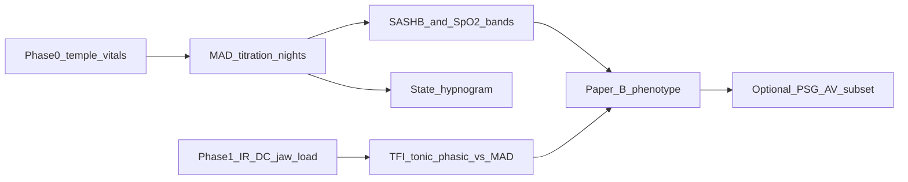

# Mayoral Method × Oralable — validation map

**As at:** 30 Aug 2026 · Pack **1.1.68** (method content unchanged; stack FW **1.0.84** / app **4.3.3** build **5**)  
**Audience:** Pedro Mayoral Sanz · Ed Owens · John · (later) Paper B  
**Tone:** Stage A wellness measurement — not AHI diagnosis / not FDA claims  
**Related:** [ED_PEDRO_AGENDA_2026-06-07.md](../archive/ED_PEDRO_AGENDA_2026-06-07.md) (names “Mayoral Method titration ground-truth”) · [ED_PEDRO_QUICK_START.md](./ED_PEDRO_QUICK_START.md) · [ED_PEDRO_SB_FEP_DRAFT_PAPER.md](./ED_PEDRO_SB_FEP_DRAFT_PAPER.md) (Owens & Mayoral 2026 SB × FEP — published) · [MEASUREMENT_CONSTRUCT_MAP.md](./MEASUREMENT_CONSTRUCT_MAP.md) · [PAPER_A_FEASIBILITY_PROTOCOL.md](./PAPER_A_FEASIBILITY_PROTOCOL.md) (feasibility n≈5 · Arm P 1–2 h) · [ACUPEBBLE_VS_ORALABLE_ANR.md](../bookmarks/ACUPEBBLE_VS_ORALABLE_ANR.md) · [OVERNIGHT_NIGHT_REPORT.md](../../OVERNIGHT_NIGHT_REPORT.md) · [PAPER_A_IEEE_TEMPORALIS_OMG_DRAFT.md](./PAPER_A_IEEE_TEMPORALIS_OMG_DRAFT.md)

---

## 1. What “Mayoral Method” means publicly

Pedro’s published dental-sleep work is not a trademarked product name. It centers on **how MAD / OAT is designed and titrated**, especially:

| Theme | Core claim | Key cite |
|-------|------------|----------|
| **A. Vertical opening vs effective protrusion** | As inter-incisal vertical opening ↑, mandible rotates posteriorly → **effective protrusion range ↓ ~0.3 mm per 1 mm vertical** (up to ~8 mm) → prefer **minimal VDO** MAD designs | Mayoral P, Lagravère MO, Míguez-Contreras M, Garcia M. *BMC Oral Health* 2019;19:85. doi:[10.1186/s12903-019-0783-8](https://doi.org/10.1186/s12903-019-0783-8) |
| **B. Device design / Orthoapnea-style titration** | Custom two-piece MAD; controlled advancement; limit opening without mandibular retrusion; progressive titration to symptom / objective improvement | Mayoral P, Lagravère MO, Miguez M. Orthoapnea case report. *J Dent Sleep Med* 2020. doi:[10.15331/jdsm.7132](https://doi.org/10.15331/jdsm.7132) |
| **C. Comorbid SB + OSA** | Sleep bruxism and OSA often coexist; **one MAD** can address both from a dental perspective when dentist is trained | Mayoral Sanz P, Lagravere Vich M, Correa L. *Universitas Odontologica* 2023. [article](https://revistas.javeriana.edu.co/index.php/revUnivOdontologica/article/view/37887) |
| **D. Comparative VDO designs** | Different MAD vertical builds change required advancement and outcomes | Mayoral & Lagravere 2024 BJSTR (vertical mouth opening comparison) |

Beacon bio: OAT for apnea/snoring + **sleep bruxism** — [beaconconsultantssleephealthclinic.ie](https://beaconconsultantssleephealthclinic.ie/team-member/dr-pedro/).

**Internal agenda language:** position Oralable vs acoustic-only tools using **“Mayoral Method titration ground-truth framing”** ([ED_PEDRO_AGENDA](../archive/ED_PEDRO_AGENDA_2026-06-07.md)).

---

## 2. What Oralable can / cannot validate

| Mayoral claim / practice step | Oralable role | Direct? |
|-------------------------------|---------------|---------|
| George Gauge / max protrusion at fixed VDO forks | Chairside dentistry — **not** Oralable | No |
| 0.3 mm protrusion loss per 1 mm VDO (kinematics) | Ceph / gauge study — Oralable does **not** measure mm protrusion | No |
| **Titration response** — is *this* MAD setting better overnight? | **Yes — primary use** — multi-night SpO₂ burden, hypnogram, jaw-load | Physiological surrogate |
| SB phenotype under MAD vs no MAD | **Yes — Phase 1+** — TFI, tonic/phasic/rescue fractions, state hypnogram | Engineering phenotype |
| OAT efficacy vs PSG AHI | Later / Stage B — Oralable alone ≠ PSG-AV | Partial (SpO₂ only) |
| Mouth-opening mm overnight | Temple ACC is **actigraphy / vibration**, not calibrated VDO goniometer | Weak / exploratory |

**One-liner for Pedro:** Oralable does not replace his kinematic MAD design work. It can be the **home overnight ground-truth layer** while he titrates advancement and VDO — oxygen burden and jaw-load, night by night.

---

## 3. Staged validation ladder (recommended)

### Stage 0 — Feasibility (current Phase 0)

**Goal:** Wear temple Oralable ≥6 h with MAD in place; honest device state; CSV + hypnogram PDF.  
**Endpoints:** wear hours, coupling QC, SpO₂ quality-gate, usability with appliance.  
**Does not claim:** MAD efficacy.

### Stage 1 — Titration ground-truth (Mayoral Method core)

**Design (n-of-1 / small series):**

| Night block | MAD setting (Pedro logs) | Oralable |
|-------------|--------------------------|----------|
| Baseline | No MAD or habitual | ≥6 h temple |
| Titration A | Setting 1 (advancement / VDO as charted) | ≥6 h |
| Titration B | Setting 2 | ≥6 h |
| Stable | Final therapeutic setting | ≥2 nights |

**Chairside log (Pedro):** date, device type, **vertical opening (mm)**, **advancement (mm or % max)**, symptoms (ESS / snore / partner).  
**Oralable metrics (engineering):**

| Metric | Hypothesis if Mayoral titration “works” |
|--------|----------------------------------------|
| **SASHB / h** | Falls as therapeutic protrusion reached |
| SpO₂ mean / time &lt;90% | Improves (same direction) |
| **Rescue events / h** | Falls or clusters differently |
| State hypnogram | Fewer rescue/recovery bars; more quiet |
| HR overnight | Secondary (arousal / effort context) |

**Analysis:** within-subject change vs baseline; Spearman of ΔSASHB vs Δadvancement (mm); **not** AHI. SASHB here = engineering SpO₂&lt;90 AUC (%·s) — **not** Azarbarzin hypoxic burden. Wellness copy only. AcuPebble remains Pedro’s AHI reference.

### Stage 2 — Comorbid SB + OSA (Mayoral theme C)

Same nights, add Phase 1+ jaw-load:

| Metric | Hypothesis under effective MAD |
|--------|--------------------------------|
| TFI | ↓ or stabilize |
| Tonic min / h · phasic bouts | ↓ if MAD reduces SB load |
| Hypnogram quiet fraction | ↑ |

**Cross-check:** nights where SpO₂ improves but jaw-load stays high → residual bruxism phenotype (clinically interesting).

### Stage 3 — Design contrast (optional)

Compare **low-VDO vs high-VDO** MAD builds at matched *effective* protrusion (Pedro sets), using Oralable overnight metrics as outcome — physiological echo of his BMC Oral Health design rule (without re-measuring the 0.3 mm/mm kinematics).

### Stage 4 — Concordance (later)

Subset with HSAT / PSG-AV AHI vs Oralable SASHB. The **Research Kit** can add optional ANR Dual A as a **descriptive Paper A precursor** ([ORALABLE_RESEARCH_KIT.md](./ORALABLE_RESEARCH_KIT.md) · [ANR_M40_CONCORDANCE.md](./ANR_M40_CONCORDANCE.md)); Arm P oxygen/MAD windows do not require Dual A. Pedro’s HSAT peer today is **AcuPebble** — see [ACUPEBBLE_VS_ORALABLE_ANR.md](../bookmarks/ACUPEBBLE_VS_ORALABLE_ANR.md) (Oralable does not replace AcuPebble AHI). Deeper PSG-AV / Bruxoff diagnostic concordance stays later.

---

## 4. Protocol sketch (ops)

1. Ethics / consent: Beacon wellness or clinical investigation as Pedro/Ed decide.  
2. Kits: Gen1 · FW **1.0.84** · app **4.3.3** (build **5**) — temple placement **with MAD** (fit check — clip must not fight appliance straps).  
3. Evaluable night: **≥6 h** worn ([OVERNIGHT_NIGHT_REPORT](../../OVERNIGHT_NIGHT_REPORT.md)).  
4. Export: Share → Clinical Temporalis PDF (hypnogram-first) + CSV; Mac night pack if needed.  
5. Case report form: MAD settings table + Oralable KPI strip per night.  
6. Minimum series before expanding: **Pedro ± Ed self-nights** (titration A/B) then 5–10 OAT patients.

---

## 5. Fit to Oralable product / papers

| Oralable asset | Mayoral use |
|----------------|-------------|
| Phase 0 SpO₂ / SASHB | Titration oxygen-burden ground-truth |
| State hypnogram | Night-by-night visual for dentist + patient |
| Smoking-gun dual rail (IR-DC + SpO₂) | Mechanism review once Phase 1+ on |
| Paper A | Methods substrate |
| Paper B | Phenotype under MAD / BruxScreen labels |
| Ed/Pedro agenda competitive block | “Mayoral Method titration ground-truth” vs acoustic-only tools |

**Vs Dianyx t.e.s.a.:** Dianyx sits **inside** the appliance. Oralable sits **outside** on temporalis (vitals and bruxing / jaw-load) and runs **with any MAD** without OEM integration — a measurement layer for Pedro’s titration practice. **Collab staging:** work with Koroosh/McGill first; bring Dianyx in later only where it complements ([COLLAB_NABAVI_MCGILL.md](./COLLAB_NABAVI_MCGILL.md)).

---

## 6. Limits & claim discipline

- Do **not** say Oralable validates AHI or “proves” MAD FDA-style efficacy.  
- Do **not** claim Oralable measures vertical opening mm.  
- Do say: home multi-night **oxygen-burden and jaw-load maps** while the dentist applies Mayoral titration and low-VDO design principles.  
- Recalibrate overnight bands only after true ≥6 h MAD nights (FIG-CO-025 is not an overnight).

---

## 7. Ask Pedro (first 30 min)

1. Confirm “Mayoral Method” in Beacon practice = **low-VDO + protrusion titration** + SB/OSA comorbidity?  
2. Preferred MAD brands at Beacon for a pilot series?  
3. Accept Oralable SpO₂/SASHB as **titration feedback** before any PSG repeat?  
4. Ethics path for OAT patients wearing temple device?  
5. Interest in Paper B case series: “Home optical titration adjunct to Mayoral MAD protocol”?

---

## 8. Future investigation

1. Pilot n=5 OAT titration series (Stage 1 endpoints).  
2. Quantify MAD-on vs MAD-off hypnogram + SASHB (paired).  
3. Test whether temple ACC features correlate with self-reported mouth-opening nights (exploratory).  
4. Align CRF fields with Pedro’s teaching (UCAM Master’s) for publishable methods.  
5. Optional: low-VDO vs high-VDO appliance contrast study (Stage 3).

---

*Draft for Pedro markup. Not a clinical protocol until ethics + his method definition are locked.*
