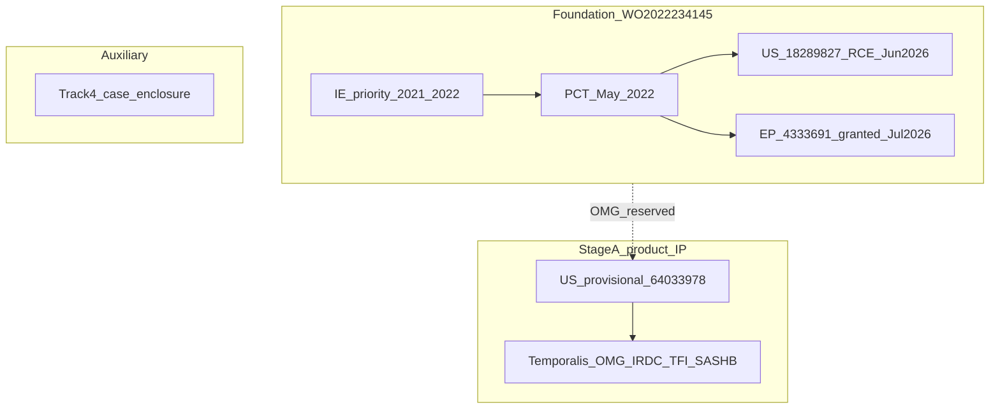

# IP evaluation and competitive landscape — Ken diligence

**As at:** **26 Jul 2026** · Pack aligns with data room **1.1.42**  
**Audience:** Ken / Point B diligence · founder prep for Peacock / PurdyLucey  
**Status:** Working evaluation · counsel PDFs ingested · **not legal advice · not an FTO opinion**  
**Counsel:** Justin Muehlmeyer (Peacock Law, US) · Michael Lucey (PurdyLucey, EU)  
**Companion:** [IP_PORTFOLIO_STATUS.md](./IP_PORTFOLIO_STATUS.md) · [../IP_NORTH_STAR.md](../../IP_NORTH_STAR.md)

**Default scope:** diligence + prosecution timeline + landscape · foundation intraoral **and** Temporalis Stage A · temple-first FTO depth.

---

## 1. Executive verdict

1. **European foundation patent is granted and certificated** — **EP 4 333 691 B1** (*Masseter Muscle Activity Monitoring*), proprietor **JAC Dental Solutions Limited**; Bulletin **8 Jul 2026**; certificate transmitted **21 Jul 2026**; term to **9 May 2042** (renewals); opposition window to **8 Apr 2027**.
2. **US utility still pending** — **18/289,827** RCE filed **12 Jun 2026**; awaiting examiner.
3. **Product–claim mismatch is the main issue** — Stage A ships **temple / Temporalis**; the foundation covers **intraoral masseter** optical monitoring. Stage A commercial IP depends on provisional **64/033,978**.
4. **AESYRA US2020/0345536 is competitor landscape**, not Oralable IP. B1 cited art includes **Kuhar** US2018/0220956.
5. **Post-grant:** IE/UK validation **steps taken** (Lisa 22 Jul); **John must sign IE Authorisation of Agent** and return. **UP** still due **8 Aug 2026**. Renewals IE/UK **31 May 2027**.
6. **Ken gaps left:** sign AoA · UP receipt · clarify inv. “Spain” · provisional→JAC · Lisa Curley deed · Track 4 · temple FTO · post-RCE US status.

---

## 2. Track matrix

| Track | Family / no. | What it protects (theme) | Phase | Product fit | Main risk |
|-------|--------------|--------------------------|-------|-------------|-----------|
| **1** | US provisional **64/033,978** (filed 9 Apr 2026) | Temporalis / OMG / IR-DC / TFI / SASHB / ear-anchor / pouch matrix | Filed · convert by **~9 Apr 2027** | **Primary** for Stage A temple wearable | Inventor-owned until assignment; enablement must match ship |
| **2** | US **18/289,827** · WO2022234145 national | Intraoral tooth-fixed optical masseter monitor | RCE filed 12 Jun 2026 · awaiting examiner | Intraoral Gen1/Gen2 / competitor optical nightguards | Allowance uncertain; “interior” amend builds prosecution history |
| **3** | **EP 4 333 691 B1** (app **22728460.1**) | Same foundation as Track 2 | **Granted + certificate** · IE/UK **steps taken** · UP pending | EU foundation — UP + Ireland + UK | **Sign IE AoA**; UP by **8 Aug**; register extracts **GAP** |
| **4** | Case / enclosure / charge (number **GAP**) | Physical enclosure + charging ecosystem | Assignment at USPTO | Accessory moat | Confirm app/patent no. + recordation |

---

## 3. Product ↔ claim map (Stage A → Stage B)

Counsel owns claim wording. Engineering builds embodiments that match ([../IP_NORTH_STAR.md](../../IP_NORTH_STAR.md) §4).

| Product embodiment | Primary track | Foundation track role |
|--------------------|---------------|----------------------|
| Temple placement overnight | **1** | Weak / none unless dependent “sensor elsewhere” survives US |
| IR-DC hemodynamic occlusion / TFI | **1** | Reserved from Track 2 narrowing |
| SASHB / SpO₂ ↔ muscle crash timing | **1** | Reserved |
| Intraoral masseter PPG / OMG | **2** + **3** | Core foundation — **EP granted** |
| Magnetic case / charger | **4** | N/A |
| Stage B medical labeling | Same families + evidence | Regulatory, not new inventorship by default |

**Counsel strategy (unchanged):** Track 2 gets a minimal response. Do not put Temporalis / Airway Rescue into the old claim set during RCE.

---

## 4. Competitive landscape (first-cut)

### 4.1 Cited in Final OA (own cold)

| Reference | Pub | Theme | Relation to Oralable |
|-----------|-----|-------|----------------------|
| **Shanjani** | US2020/0093571 | Intraoral optical sensors; Examiner: surface / wear | Distinguished as surface reflection, not **interior** muscle penetration |
| **Nduka** | US2019/0380644 | Optical / facial muscle; topography / biofeedback | Extrinsic vs hemodynamic / OMG intrinsic |
| **Logan** | US2015/0306486 | Dependent claim art | Dependent §103 |
| **Kuhar** | US2018/0220956 | Dependent claim art; also **temple optical** landscape | Dual role: OA cite + Stage A FTO focus |

### 4.2 In Seed A TEC (misfiled as “patent” beside own family)

| Reference | Pub | Theme | Diligence use |
|-----------|-----|-------|---------------|
| **AESYRA** | **US2020/0345536 A1** | Force/contact nightguard pads | Modality contrast vs OMG / IR-DC |

### 4.3 Stage A temple FTO focus (verify status with counsel)

| Reference | Theme | Why it matters |
|-----------|-------|----------------|
| **Kuhar** US2018/0220956 | Headband / temporalis optical thickness / multi-λ transflectance | Closest public optical-temporalis narrative — **verify legal status** |
| US10820853 + continuations | Temporalis **pressure** / biofeedback | Different sensor physics |
| WO2023049189 | Bruxism / sleep platform | Chart if shipping clinical-adjacent features |
| Bruxa-type smart nightguards | Instrumented nightguard | Intraoral competitor class |
| EMG wearables | Electrical muscle activity | Different modality; market comps |

### 4.4 Differentiation thesis (diligence language — not claim text)

1. **Foundation (EP granted):** tooth-fixed buccal support, optical sensor toward masseter, interior muscle hemodynamics / OMG — not bite-force pads, not surface-only reflection, not skin-topography facial sensors.
2. **Stage A provisional themes:** Temporalis, IR-DC / TFI / SASHB, ear-anchor / pouch matrix (Master IP Status 26 Mar 2026).

---

## 5. Prosecution & grant timeline

| Date | Event |
|------|-------|
| 7 May 2021 / 25 Feb 2022 | IE priority filings |
| 9 May 2022 | PCT/EP2022/062515 filed |
| 10 Nov 2022 | WO2022234145 A1 published |
| 7 Nov 2023 | US national stage **18/289,827** |
| 18 Jul 2024 | US20240237944A1 published |
| 14 Jan 2026 | US assignment / name change recorded JAC |
| 19 Jan 2026 | EP Rule 71(3) communication (basis for grant) |
| 20 Apr 2026 | US Final Office Action (Shanjani + Nduka) |
| **11 Jun 2026** | EPO **Decision to Grant** EP **4333691** to JAC |
| **12 Jun 2026** | US **RCE + After Final response filed** (PC 77368950) |
| 30 Jun 2026 | Peacock forwards provisional **64/033,978** filing receipt |
| **8 Jul 2026** | EP grant mention — Bulletin **2026/28** · **B1** |
| 7 Jul 2026 | Michael: UP by **8 Aug**; IE/UK by **10 Oct** — John instructs proceed |
| **21 Jul 2026** | EPO transmits **certificate** (Rule 74); PurdyLucey inv. **24886-26** |
| **22 Jul 2026** | Sheila: certificate + UP proceeding; Lisa: **IE/UK validation steps taken**; AoA for signature; inv. **24892-26** |
| **8 Aug 2026** | **UP request deadline** (~€1,550 est.) |
| **31 May 2027** | IE + UK **renewal fees** due |
| **8 Apr 2027** | EP **opposition period** ends |
| **TBD** | Next US examiner action — **GAP G7** |

Track 1 conversion hard stop: **~9 Apr 2027**.

---

## 6. Pitch-safe / do-not-say

### May say (counsel-aligned, high level)

- European patent **EP 4 333 691 B1** (*Masseter Muscle Activity Monitoring*) granted to **JAC Dental Solutions Limited** (2026) from the **WO2022234145** family; certificate issued.
- Post-grant: national validation in **Ireland** and the **UK** underway (counsel confirms steps taken); **Unitary Patent** request in progress (deadline 8 Aug 2026).
- US utility **18/289,827** pending; prosecution continued via RCE (Jun 2026).
- New US provisional (Apr 2026) covers muscle-activity monitoring refinements for the Temporalis / OMG product path.
- Counsel: Peacock (US) / PurdyLucey (EU).

### Do not say / do not publish

- Unpublished provisional claim text or detailed amendment language on oralable.com or decks.
- “Patents granted in US” until a US grant issues.
- That the **Unitary Patent** is already registered (still to be filed by 8 Aug).
- Listing **AESYRA** or other third-party pubs as company patents.
- FDA/CE medical clearance from patent status alone (Stage A = wellness wearable).
- That temple Temporalis product is covered by the foundation masseter buccal claims without counsel sign-off.

---

## 7. Supporting-document pull-list (owners)

Drive root (Seed A): `…/Oralable Seed A Data Room/04_TEC/`  
Counsel pack also received via Downloads (22 Jul 2026). Do **not** commit unpublished provisional claim drafts to public git.

### Critical

| # | Document | Owner | Status |
|---|----------|-------|--------|
| D1 | USPTO filing receipt **+ ADS** for **64/033,978** | Peacock / John | **PARTIAL** — receipt confirmed (inv. 84566); ADS still **GAP** |
| D2 | Assignment inventor(s) → **JAC** for provisional | Peacock / John | **GAP** |
| D3 | Filed 12 Jun 2026 RCE pack + any action since | Peacock | **RECEIVED** — `efilingAck77368950`, `RCE.pdf`, `2026-06-12 Response.pdf`, `N417.PYMT.pdf`; post-RCE OA still **GAP** |
| D4 | EP grant + **B1 certificate** + reporting email | PurdyLucey | **RECEIVED** — Decision + certificate (**EP 4 333 691 B1**) + Sheila 22 Jul (UP/IE/UK proceeding) |
| D4b | Designated-states translation list + UP / UPC client notes | PurdyLucey | **RECEIVED** — `List of Designated States 2026.pdf` · UP note · UPC note |
| D5 | **Lisa Curley** inventor deed (US + EP) | John / counsel | **GAP** |
| D6 | Track 4 case/enclosure number + recordation | Peacock | **GAP** |

### High value (landscape / FTO)

| # | Document | Owner | Status |
|---|----------|-------|--------|
| D7 | Claim chart vs Shanjani / Nduka | Peacock | **GAP** |
| D8 | Annotated **Kuhar** + temple FTO note | Peacock | **GAP** |
| D9 | Provisional **as-filed** specification (Drive only) | Peacock / John | **GAP** |
| D10 | Written FTO memo | Peacock | **GAP** |

### Nice to have

| # | Document | Owner | Status |
|---|----------|-------|--------|
| D11 | Master IP Status after 26 Mar 2026 | John | **GAP** |
| D12 | Confirm Temporalis pivot still governing | John | **CONFIRM** |
| D13 | Public disclosure calendar vs provisional date | John | **GAP** |
| D14 | Strand Two / corporate IP schedule | Strand Two / Amstrow | **GAP** |
| D15 | Peacock invoice / docket corroboration | Peacock | **RECEIVED** — `35803.1001_Stmt_84566.pdf` ($3,030 · period to 30 Jun 2026) |
| D16 | PurdyLucey grant/certificate invoice | PurdyLucey | **RECEIVED** — `24886-26.pdf` (€1,076.25 · billed Byteexplain) |

### Counsel pack indexed (Downloads · 22 Jul 2026)

| File | Use |
|------|-----|
| `P16000EPPC-2026.06.11-22728460-2006A - Decision to Grant.pdf` | Decision to Grant |
| `P16000EPPC EP PATENT CERTIFICATE.pdf` | **B1 certificate** + specification cover (Rule 74 · 21 Jul 2026) |
| `Gmail - REPORTING EP PATENT CERTIFICATE…pdf` | Sheila 22 Jul — certificate + UP proceeding |
| `Gmail - RE_ REPORTING DECISION TO GRANT…pdf` | Lisa 22 Jul — IE/UK steps taken + AoA request |
| `AOA JAC Dental Solutions Limited.doc` | **IE Authorisation of Agent** — sign for Patent 4 333 691 |
| `24886-26.pdf` | PurdyLucey inv. grant/certificate |
| `24892-26.pdf` | PurdyLucey inv. IE/UK validation (€848.70) |
| `efilingAck77368950.pdf` · `RCE.pdf` · `2026-06-12 Response.pdf` · `N417.PYMT.pdf` | US RCE filing evidence |
| `List of Designated States 2026.pdf` | Validation translation tiers |
| `Unitary Patent Client Note Jan 2023.pdf` | UP request / cost / central revocation trade-offs |
| `Unified Patent Court Jan 2023.pdf` | UPC jurisdiction + opt-out mechanics |
| `35803.1001_Stmt_84566.pdf` | Peacock fees + provisional receipt corroboration |

---

## 8. Document ingestion log

| ID | Received? | Date in | Effect |
|----|-----------|---------|--------|
| D1 ADS | Partial | — | Receipt yes; ADS no |
| D2 Prov assignment | No | — | G1 open |
| D3 Filed RCE pack | **Yes** | 22 Jul 2026 | Track 2 filing verified; post-RCE still open |
| D4 EP Decision to Grant | **Yes** | 22 Jul 2026 | Grant confirmed |
| D4b UP/UPC notes + states list | **Yes** | 22 Jul 2026 | Strategy: **UP + IE + UK** |
| D4d B1 certificate + Sheila email | **Yes** | 22 Jul 2026 | Certificate; counsel proceeding; opp. to 8 Apr 2027 |
| D4c IE/UK counsel confirmation | **Yes** | 22 Jul 2026 | Lisa: steps taken (P16000GB/IEEP); register extracts still nice-to-have |
| D4e IE Authorisation of Agent | **Form received — unsigned** | 22 Jul 2026 | John must sign & return |
| D4f UP filing receipt | No | — | Due 8 Aug |
| D16 PurdyLucey inv. 24886-26 | **Yes** | 22 Jul 2026 | Grant/certificate fees |
| D17 PurdyLucey inv. 24892-26 | **Yes** | 22 Jul 2026 | IE/UK validation (€848.70); check “Spain” wording |
| D5 Lisa Curley deed | No | — | G3 open |
| D6 Track 4 | No | — | Open |
| D7–D10 FTO pack | No | — | Open |
| D15 Peacock inv. 84566 | **Yes** | 22 Jul 2026 | Docket corroboration |

**Ingestion rule:** Keep unpublished claim text in Drive / counsel vault. Git gets status, dates, and high-level themes only.

---

## 9. Recommended next actions (founder + counsel)

1. **Today:** Sign IE **Authorisation of Agent** (`AOA JAC Dental Solutions Limited.doc`) as JAC director and email scan to Lisa/Sheila at PurdyLucey.
2. **Ask Lisa** to confirm inv. **24892-26** “Spain” line is a typo (strategy is IE/UK only).
3. **Track UP** filing by **8 Aug 2026** (~€1,550) — get receipt into diligence pack.
4. Ask Justin for post-RCE Patent Center status on **18/289,827**.
5. Assign provisional **64/033,978** → JAC; Lisa Curley deeds; Track 4 number; temple FTO.
6. Calendar: IE/UK renewals **31 May 2027**; opposition to **8 Apr 2027**; provisional convert before **~9 Apr 2027**.

---

*Last updated: 2026-07-22 (counsel pack ingested) · Related: [IP_PORTFOLIO_STATUS.md](./IP_PORTFOLIO_STATUS.md) · [../IP_NORTH_STAR.md](../../IP_NORTH_STAR.md) · [PITCH_DECK_KEN.md](../pitches/PITCH_DECK_KEN.md)*
