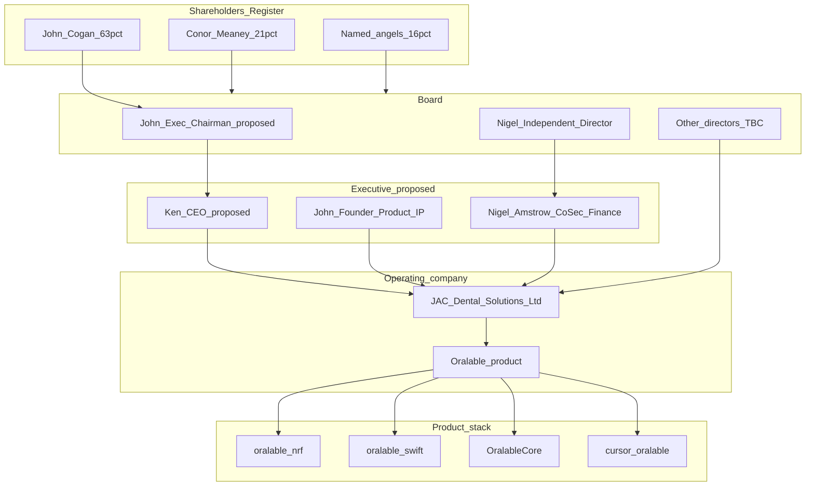
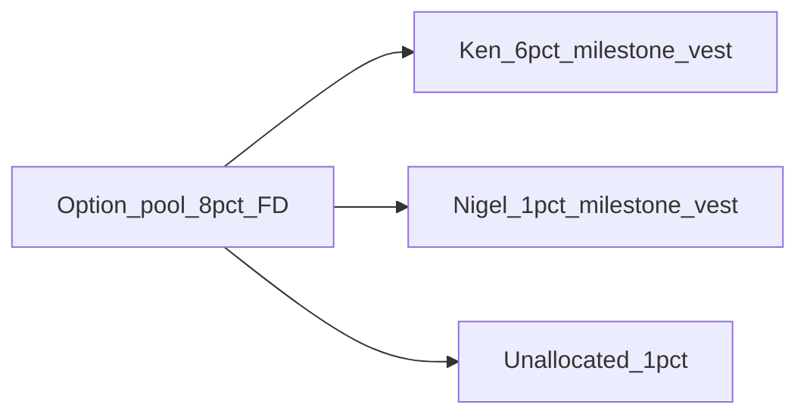

# JAC Dental Solutions — Corporate Structure & Cap Table Synopsis

**Status:** Canonical governance brief for Ken / BalancePoints · **as at 22 Jul 2026**  
**Entity:** JAC Dental Solutions Limited · CRO **697987** · 18 Eaton Square, Blackrock, A94 X023, Ireland  
**Product brand:** Oralable  
**Clean snapshot:** [CURRENT_GOVERNANCE_STATUS.md](./CURRENT_GOVERNANCE_STATUS.md) · **Today’s meeting:** [MEETING_BRIEF_KEN_NIGEL_2026-07-22.md](../archive/MEETING_BRIEF_KEN_NIGEL_2026-07-22.md)

**Source hierarchy (what wins when older NotebookLM notes conflict):**

| Topic | Authoritative source |
|-------|----------------------|
| Ownership % | Register of Members distill — [FUNDING_POINT_B_AND_CAP_TABLE.md](./FUNDING_POINT_B_AND_CAP_TABLE.md) |
| Cash / Point B ask | [FINANCIALS_CASH_SNAPSHOT.md](./FINANCIALS_CASH_SNAPSHOT.md) + Point B table in funding doc |
| Ken / Point A | [PITCH_DECK_KEN.md](../pitches/PITCH_DECK_KEN.md) · [README.md](./README.md) |
| Nigel board role | **Founder-confirmed Independent Director** — attach CRO Form B10 / minutes when available (**GAP** in git) |
| PwC / Noonan / CEO redesign | Founder working notes — see [INTERNAL annex](#internal-annex--founder-only); Ken CEO = **proposed** until board resolution + contract |
| Conor share purchase | **Live negotiation** (Amstrow Cosec · Jul 2026) — INTERNAL §A; register unchanged until completion |

---

## Paste-ready synopsis (NotebookLM re-ingest)

JAC Dental Solutions Limited (CRO 697987) grew out of Byteexplain share-issue history. It is the Irish company behind **Oralable** — a temple-worn optical wearable for overnight vitals and, later, jaw-load / sleep-bruxism metrics.

July 2026 Register of Members: **11,901** ordinary shares at €0.01. John Cogan **~63%**. Conor Meaney (register: Meany) **~21%**. Named angels **~16%**. Irish special resolutions need **75%**. Conor’s ~21% can block them. That is a funding constraint, not a branding issue.

**19–23 Jul 2026:** Amstrow Cosec is brokering a purchase of Conor’s shares. The register is unchanged until completion.

Cash is thin: **€1,293** at 17 Jul 2026. ~€63.5k director loans came in during the period. Near-term capital is Ken/BalancePoints **Point B €180k by 31 Oct 2026** (€50k F&F equity + €100k EI PSSF CLN + €30k HPSU grant).

Board today: John Cogan (majority shareholder; acting founder-CEO) and **Nigel Woods (Amstrow) as Independent Director**. Amstrow Cosec (Collette Brown) runs corporate secretarial mail on the Conor buyout.

**Proposed** model (not board-approved, not contracted): Ken Kinsella **CEO** (fundraising, commercial); John **Executive Chairman / Founder** (product, clinical, IP); Nigel **Company Secretary + Amstrow finance** (registers, books, R&D tax reclaim). Ken and Nigel are not on the register. Option / success equity stays open with Point B.

IP, product, and regulatory detail sit in other data-room docs. This file is entity, register, and roles.

---

## 1. Entity synopsis

These notes replace an older NotebookLM synopsis that mixed P&amp;L, counsel transition, MAXM86161 hardware, market/patent analysis, and EEA compliance. Keep that material in product / IP docs. **This file is corporate structure and ownership only.**

| Layer | Fact |
|-------|------|
| Legal name | **JAC Dental Solutions Limited** |
| Trading / product | **Oralable** |
| Prior framing | Byteexplain share-issue workbooks (historical dilution / valuations) |
| Strategy | Wellness-first wearable → clinical / Stage B medical when evidence allows — see [../PRODUCT_ROADMAP.md](../../PRODUCT_ROADMAP.md), [../IP_NORTH_STAR.md](../../IP_NORTH_STAR.md) |
| Hardware (pointer only) | Gen1 pcb00003 / MAXM86161 optical path; Gen2 nRF54L15 track — not restated here |
| IP (pointer only) | Portfolio under counsel — [IP_PORTFOLIO_STATUS.md](./IP_PORTFOLIO_STATUS.md) · [IP_EVAL_AND_LANDSCAPE.md](./IP_EVAL_AND_LANDSCAPE.md) |

**Ken / Caroline open flags (still open):** Strand Two IP advice · **Conor share purchase completion** (Amstrow Cosec live) · Byteexplain vs JAC entity alignment · balance-sheet / solvency restructure · personal vs corporate IP ownership · proposed Ken CEO contract.

---

## 2. Corporate structure (current + proposed)

Equity holders remain separate from executive titles. Ken is **not** on the Register of Members. Nigel is Independent Director (confirmed); fuller CoSec/finance remit and Ken CEO are **proposed**.

**Board slate note:** Document as **John + Nigel (+ others TBC)**. Do **not** assert 2-to-1 voting arithmetic until every current director (e.g. whether Tim Murphy remains a director) is confirmed in writing / CRO.

---

## 3. Cap table — current (Register of Members)

Ordinary shares @ **€0.01**. Membership not ended. Distilled from Seed A `02_LEG` Register of Members (Drive — not committed to git).

| Member | Shares | ≈ % |
|--------|-------:|----:|
| **John Cogan** | 7,500 | **63.0%** |
| **Conor Meaney** (register: Meany) | 2,500 | **21.0%** |
| Cableville Limited | 321 | 2.7% |
| Guac Partners LLC | 385 | 3.2% |
| Sinead McDonald | 225 | 1.9% |
| Laura Anne Burke | 225 | 1.9% |
| Evans N Themeles | 225 | 1.9% |
| Traian Smarandache | 135 | 1.1% |
| Gabriel Scallon | 124 | 1.0% |
| Ciaran McCourt | 109 | 0.9% |
| Tim Murphy | 108 | 0.9% |
| Anne Murphy | 44 | 0.4% |
| **Total** | **11,901** | **100%** |

**One-liner:** John ~**63%** · Conor ~**21%** · angels ~**16%** of 11,901 ords. (**Live buyout negotiation — register not yet updated.**)

**Constitutional flag:** Irish Companies Act 2014 special resolutions generally need a **75%** voting majority. A ~21% ordinary block can veto special resolutions even when the founder holds an ordinary majority. This is a **funding and restructuring constraint**, not a branding issue. Active purchase track via Amstrow Cosec (Jul 2026) — detail in [INTERNAL §A](#a-cap-table-cleanup--live-conor-meaney-negotiation-jul-2026).

**Implied last round valuation (Byteexplain share-issue workbook, Feb 2025 Guac):** ~**€2.66M** (historical; not a Ken-approved F&amp;F price).

**Not current register fact:** “95.6% founder/control ownership” appears in older NotebookLM pitch language as a **cleanup target**, not as today’s cap table.

**Equity default for leadership redesign:** Ken and Nigel receive **no immediate register equity** in this pass. Option / success equity may be negotiated alongside Point B instruments — open item.

---

## 4. Shareholder roles (investor-safe)

| Person / entity | Register role | Operating role (safe language) |
|-----------------|---------------|--------------------------------|
| **John Cogan** | Majority ordinary (~63%) | Founder; primary director-loan funder; product and IP driver; **today** acting CEO; **proposed** Executive Chairman under leadership redesign |
| **Conor Meaney** | Ordinary ~21% (2,500) | Inactive operational contributor; **Amstrow-brokered share purchase in negotiation** (Jul 2026); until completion, holding creates special-resolution friction for institutional rounds and EI HPSU-style governance |
| **Tim Murphy** | Ordinary 108 (~0.9%) | Early angel (also linked historically to Guac / EIIS-era raise narrative); director status **TBC** |
| **Guac Partners LLC** | 385 (~3.2%) | Institutional/angel vehicle from prior priced issue |
| **Cableville Limited** | 321 (~2.7%) | Minority corporate holder |
| **Other named individuals** | 1.9% or less each | Minority angels |

Sensitive conflict / PwC detail is **not** in this section — see [INTERNAL annex](#internal-annex--founder-only).

---

## 5. Proposed leadership model (working)

**Status:** `PROPOSED — not yet board-approved / not yet contracted`

| Seat | Person | Notes |
|------|--------|-------|
| **CEO** | Ken Kinsella | External / contracting CEO; fundraising + commercial execution; BalancePoints relationship restructured into CEO engagement |
| **Executive Chairman / Founder** | John Cogan | Majority shareholder (~63%); retains product, clinical, IP technical authority; chairs board with Nigel |
| **Independent Director + Company Secretary / Finance lead** | Nigel Woods (Amstrow) | Board independence preserved for governance votes; fuller **operating** remit via Amstrow engagement letter: statutory registers, bookkeeping, R&amp;D tax reclaim, debt-to-equity mechanics with counsel |

**Why this shape:** EI HPSU and many investors want the **founder visible** and an **independent director who is not day-to-day CEO**. Ken as CEO, John as Executive Chairman, Nigel as Independent Director / CoSec-finance keeps register control with John and puts raise and finance on clearer footing.

**Transition conditions before calling Ken “CEO” externally:**

1. Board resolution appointing / authorising the CEO role  
2. Written CEO engagement (cash vs success fee; BalancePoints Advisors Limited conflict check)  
3. Cash or Point B path that can fund the role  
4. Clear bank / IP signing authority matrix (John vs Ken vs Nigel)

**Recognition package (milestones + equity):** working proposal in [INTERNAL §G](#g-proposed-recognition--ken--nigel-milestones--equity) — not offered / not approved.

---

## 6. Ken Kinsella / BalancePoints — role definition

| Attribute | Current | Proposed |
|-----------|---------|----------|
| Firm | [BalancePoints](https://balancepoints.co.uk) (Balancepoints Advisors Limited) | Same — restructure engagement into CEO contract |
| Status | **External advisor** (Point A → Point B) | **CEO** (contracting / hire) — **not yet appointed** |
| Equity | **Not** on Register of Members | Working proposal: **6% FD** milestone options — [INTERNAL §G](#g-proposed-recognition--ken--nigel-milestones--equity) |
| Board | **Not** a director | Remains non-director unless separately appointed |
| Mandate today | Investment readiness; F&amp;F pack; EI PSSF / HPSU pathway; investor interface support | Fundraising + commercial execution reporting to board |
| Point A baseline | **1.5 / 5.0** Essential (9 Jun 2026) — see [README.md](./README.md) | — |
| Point B target | **€180k by 31 Oct 2026** = €50k F&amp;F + €100k EI PSSF CLN + €30k HPSU grant | CEO owns delivery of Point B under board oversight |
| Commercial evidence in bank skim | **€2,000** · “Oak” (22 May 2026) — [FINANCIALS_CASH_SNAPSHOT.md](./FINANCIALS_CASH_SNAPSHOT.md) | Superseded by new CEO terms when signed |
| Deferred / success-fee model | Negotiation item | Likely core of pre-cash CEO terms |

**Interface rule (target):** Ken as CEO may lead investors and day-to-day commercial work. John stays Executive Chairman and majority owner. Ken does **not** vote John’s shares and does **not** replace the board.

---

## 7. Nigel Woods / Amstrow — Independent Director (confirmed) + fuller remit (proposed)

**Board role — confirmed:** Nigel Woods is an **Independent Director** of JAC Dental Solutions Limited (founder confirmation).  

**Cosec live:** Amstrow Corporate Services (Ireland) Limited / Amstrow Cosec (**Collette Brown**) is actively administering the Conor Meaney share-purchase correspondence (offer letter 17 Jul 2026; thread cc Nigel).  

**Evidence GAP:** Attach CRO Form B10 (or equivalent) and board minutes to the Seed A legal folder / cite path here when available. Appointment date and full director slate remain to be documented in git.

| Attribute | Definition |
|-----------|------------|
| Person / firm | Nigel Woods · Amstrow (corporate / accounting services) |
| Board role | **Independent Director — confirmed** |
| Cosec / operating remit | **In progress:** share-purchase admin via Cosec; **proposed fuller:** Company Secretary + finance lead — statutory registers, bookkeeping, R&amp;D tax reclaim, debt-to-equity support **with** corporate counsel |
| Equity | Not on Register of Members; working proposal **1% FD** milestone options — [INTERNAL §G](#g-proposed-recognition--ken--nigel-milestones--equity) |
| Independence | Preserve on board votes that conflict with Amstrow fee arrangements (disclose and recuse as required) |
| Why it matters | Aligns corporate services with cash preservation and HPSU-grade statutory registers |

**Do not invent:** 2-to-1 voting arithmetic or a complete named board slate beyond John + Nigel until others are confirmed.

---

## 8. Cash and ask (context for governance timing)

| Item | Figure | Source |
|------|--------|--------|
| Closing cash (17 Jul 2026) | **€1,293.52** | [FINANCIALS_CASH_SNAPSHOT.md](./FINANCIALS_CASH_SNAPSHOT.md) |
| Director loans in (period) | ~**€63.5k** | Same |
| Product revenue visible | ~€0 | Same |
| Point B ask stack | **€180k** by 31 Oct 2026 | [FUNDING_POINT_B_AND_CAP_TABLE.md](./FUNDING_POINT_B_AND_CAP_TABLE.md) |
| Gen2 Kaga sample lot | **€3,735** | [GEN2_COGS_KAGA_QUOTE.md](../hardware/GEN2_COGS_KAGA_QUOTE.md) |

Older NotebookLM “€15.4k runway / €2.4k corporate” figures are **superseded** by the mid-July bank skim. A cash CEO salary is not fundable from current bank balance without Point B or founder funding.

---

## 9. Corrections vs older NotebookLM / prior brief language

| Older claim | Correction |
|-------------|------------|
| ~€15.4k runway / €2.4k corp cash (mid-June narrative) | Closing **€1,293** (17 Jul 2026) |
| 95.6% ownership as current | **Current** John ~63%; 95.6% is a **cleanup target**, not register fact |
| Seed A “clean register” as achieved | Cleanup still an **open** Ken/Caroline flag |
| Ken forever “advisor only” / John forever sole CEO | **Today:** John acting CEO, Ken advisor. **Proposed:** Ken CEO, John Executive Chairman |
| Nigel appointment “provisional / intended” | **Confirmed** Independent Director; Amstrow Cosec **live** on Conor buyout; CRO evidence still **GAP** |
| Board 2-to-1 majority as settled fact | **Do not assert** until full director slate confirmed |
| Conor cleanup only a “thesis” | **Live negotiation** Jul 2026 — counters €10k (keep 400) / €15k (all); deadline **23 Jul 17:00**; register unchanged until done |

---

## INTERNAL annex — founder only

**Disclaimer:** Strategic working notes for Dr. John A. Cogan. **Not legal advice.** Not for F&amp;F packs, EI applications, or external decks. Verify with counsel and board minutes before acting. Do not treat NotebookLM chronology as evidence.

### A. Cap-table cleanup — live Conor Meaney negotiation (Jul 2026)

**Problem (unchanged until deal closes):** Conor Meaney’s **2,500** ordinary shares (~21%) can block special resolutions (75% threshold).

**Sources (founder — do not commit signed PDFs with personal emails to public git unless intentional):**
- Amstrow letter: `Amstrow_JAC_Letter of offer to CM_17.07.2026_final verison_JC Signed.pdf` (DocuSign **62F475F1-…**; John signed **17 Jul 2026**)
- Gmail forward: `Gmail - FW_ Offer to Purchase Shares in JAC Dental Solutions Limited.pdf` (Collette → John / Ken, 20 Jul 2026)

**Calls 2–3 Jul 2026:** founder confirmation — **only Ken Kinsella** spoke with Conor (not John, not Nigel). Conor alleges he recorded those calls.

#### Original Amstrow offer (17 Jul 2026) — lapsed **20 Jul 17:00**

| Term | Content |
|------|---------|
| Parties | Seller **Conor Meaney** → Purchaser **John Cogan** |
| Shares | **All 2,500** Ordinary Shares of €0.01 |
| Price | **€10,000** (€4.00 / share) |
| Transfer timing | Shares “deemed transferred **immediately upon signing**” |
| Payment timing | **Deferred:** €10,000 payable **once JAC has obtained sufficient funding** to facilitate return of that amount **via John Cogan’s Director’s Loan Account**; Amstrow to communicate when condition satisfied |
| Soft pressure language | If not accepted, “the Company may be required to pursue **other appropriate courses of action** in respect of the shareholding” |
| Acceptance window | Open until **17:00 Monday 20 Jul 2026**, then auto-lapse |
| Signatories | Offeror: John (DocuSign). Letter from **Nigel Woods** for Amstrow Corporate Services (Ireland) Ltd (CRO 632032). Acceptance block for Conor — **not signed** |

This deferred-funding structure is exactly what Conor rejected on CGT / certainty-of-payment grounds.

#### Timeline

| Date | Event |
|------|--------|
| **2–3 Jul 2026** | Ken–Conor phone calls (Ken only); Conor later claims audio recordings |
| **17 Jul 2026** | Amstrow Cosec sends signed offer letter (€10k / all 2,500 / pay after company funding via director’s loan) |
| **19 Jul 2026** | Conor rejects structure; two **cash-at-transfer** counters; new deadline **17:00 Thursday 23 Jul 2026** |
| **20 Jul 2026** | Original offer lapses unused; Collette forwards Conor reply to John + Ken |

#### Conor’s stated blockers to the original offer

1. **CGT cash timing:** Transfer = Irish CGT disposal; CGT due **15 Dec 2026**. Will not transfer while consideration is deferred / contingent on company funding.  
2. **Solvency narrative:** Asserts company is insolvent / cannot discharge creditors, so director’s-loan repayment path is unreliable.  
3. **Process / governance allegations:** Claims “duress” / “unethical coercion” from the Ken calls (day-job / outside-interest framing + fundraising linked to surrender); cites “other appropriate courses of action” wording; threatens Companies Act protection if counters rejected.

*(Allegations are Conor’s position — not findings. Written replies should stay calm, factual, and preferably counsel-reviewed.)*

#### Counter-offers (expire 17:00 **23 Jul 2026** unless extended)

| | Counter-offer 1 | Counter-offer 2 |
|--|-----------------|-----------------|
| Shares | Sell **2,100** of 2,500 to John; **retain 400** | Sell **all 2,500** to John |
| Price | **€10,000** cash **at transfer** | **€15,000** cash **at transfer** |
| vs original | Same headline €10k but **cash now** + keeps 400 | +€5k for clean exit vs original |
| Implied €/share | ~€4.76 on shares sold | €6.00 |
| Post-deal Conor % | ~**3.4%** | **0%** |
| Extra ask | Retained stake / lab-contact handover narrative (FL / AL / CA) | Clean exit |

#### Post-deal register math (if completed; still 11,901 ords — transfer, not new issue)

| Outcome | John shares | John % | Conor shares | Conor % | Special-resolution veto? |
|---------|------------:|-------:|-------------:|--------:|--------------------------|
| **Status quo** | 7,500 | 63.0% | 2,500 | 21.0% | Yes (~21%) |
| **Original offer** (if accepted as written) | 10,000 | **84.0%** | 0 | 0% | Removed — but payment deferred |
| **Counter 1** | 9,600 | **80.7%** | 400 | **3.4%** | No (below 25% block) |
| **Counter 2** | 10,000 | **84.0%** | 0 | 0% | Removed; John alone **&gt;75%** |

#### Cash reality vs counters

Company bank ~**€1.3k** (17 Jul) cannot fund €10k/€15k at transfer. Counters require **personal John** (or bridge) cash now — not the original “pay after raise via director’s loan” structure. Point B / F&amp;F may backfill personal liquidity after settlement.

#### Working thesis (updated)

- Original offer price (**€10k for 100%**) matched Counter 1’s cash amount but not its structure or residual stake — Conor is effectively asking for **cash certainty** (+ optionally +€5k for a full wipe).  
- Prefer **Counter 2** if €15k personal cash is available — clean register; John alone clears specials.  
- **Counter 1** = same €10k cash outlay as original headline price but leaves **3.4%** + process-claim risk — only with counsel side letter if taken.  
- Hybrid to explore with Amstrow/counsel before 23 Jul: **€10k cash at transfer for all 2,500** (original price + Conor’s cash certainty; no residual shares) — splits the difference between counters.  
- Ken should **not** lead the written reply on process allegations; Amstrow/counsel should.  
- **Do not** assign personally held Strand Two / provisional IP into JAC until veto cleared (or counsel signs off under Counter 1).

#### Information gaps (still open)

- Funding source / timing for **€10k** vs **€15k** (or hybrid €10k all-shares cash).  
- Decision by **23 Jul 17:00**: accept Counter 1, Counter 2, hybrid, or request extension.  
- Whether counsel reviews the reply (recommended given recording allegations against Ken’s calls).  
- SPA / stock-transfer form ready or still letter-only.

### B. Conor Meaney / PwC conflict narrative (founder facts for Ken)

Background for context. Settlement now runs through **Amstrow Cosec written offers**, not informal talks only:

1. Shane Kierans and Conor Meaney approached under PwC Start &amp; Scale-Up; John signed a PwC advisory contract.
2. After Shane left, Conor sought ~25% equity (structured as 2,500 ords), promising to leave PwC and join full-time; meanwhile used PwC role to promote the company and fundraising.
3. Documented use of `@pwc.com` email, Spencer Dock meeting rooms (incl. Valerie Rice marketing join), and PwC title in pitch materials toward investors and dental labs.
4. Tim Murphy investment narrative tied to PwC involvement / EIIS tax framing.
5. Key investor Derek Delaney declined while dual role unresolved; operational contribution then stalled while shareholding remained.
6. Prior working preference: quiet share purchase / surrender vs contested forfeiture (€20–30k legal fee band in older estimates). **Current path:** Amstrow letter + Conor cash counters (€10k / €15k).

Counsel hooks (Stephen Noonan engagement — evaluate before signing): PwC conflicts documentation is **client’s** to obtain; firm excludes tax advice; €6k+VAT retainer non-returnable but recoupable at €350/hr + VAT; 10-day LSRA cool-off unless waived; Eversheds file release / possible lien; premature IP assignment risk. **Reply to Conor’s 23 Jul deadline may need counsel review given duress/recording allegations.**

### C. Noonan timing vs cash

- Open-ended hourly corporate work is hard to fund at ~€1.3k bank cash.
- Prefer: capped Phase-1 (e.g. policy/share-issue audit) **after** soft money or R&amp;D reclaim visibility; keep US patent prosecution (Peacock) on its own critical path independent of Noonan.
- Innovation Voucher (€10k to academic partner; VAT deposit outlay) does **not** require a pristine cap table; HPSU matched funding **does** care about governance.

### D. John / Ken / Nigel interface rule (target RACI)

| Actor | Remains / becomes | Does not become |
|-------|-------------------|-----------------|
| **John** | Executive Chairman (proposed); majority owner; product / clinical / IP lead; board peer to Nigel | Absent; “Ken will handle the board”; silent on shareholder votes |
| **Ken** | CEO candidate — reports to board; may lead investor process and commercial ops | Shadow director without appointment; substitute for John’s register votes; **sole negotiator on Conor process allegations** (Ken-only calls 2–3 Jul — Amstrow/counsel should own written buyout replies) |
| **Nigel** | Independent Director (**confirmed**) + fuller Amstrow CoSec/finance remit (**proposed**) | Day-to-day CEO; spectator while Ken redesigns the board alone; conflicted voter on Amstrow fees without disclosure/recusal |

### E. Accounting pivot (working)

Contracting PLUS indicated R&amp;D tax reclaim is outside their expertise → migrate full bookkeeping + R&amp;D reclaim to **Amstrow** as part of Nigel’s fuller remit, commercially aligning the firm with Q3 runway pressure.

### F. CEO appointment checklist

Before external “Ken is CEO” language:

| # | Item | Owner |
|---|------|-------|
| 1 | Board resolution (John + Nigel + any other directors) authorising CEO appointment / engagement | Board |
| 2 | Written CEO term sheet: cash retainer vs success fee; duration; termination; IP / confidentiality | John + Ken + counsel |
| 3 | BalancePoints Advisors Limited conflict check (advisory fees vs CEO duties) | Ken + John |
| 4 | Signing matrix: bank mandate, contracts, patent counsel instructions | Board |
| 5 | CRO / public title: whether Ken is also appointed a **director** or remains officer/contractor only | Counsel |
| 6 | Shadow-director risk: if Ken directs board decisions without formal appointment, document and regularise | Counsel |
| 7 | Sequencing vs Conor cleanup: prefer not to grant Ken equity or assign personal IP into JAC until veto block path is clear | John + counsel |
| 8 | Amstrow engagement letter for CoSec + R&amp;D reclaim (parallel track; can precede Ken CEO cash terms) | Nigel + John |
| 9 | Point B cash path that can fund any cash CEO component | Ken + John |

### G. Proposed recognition — Ken & Nigel (milestones + equity)

**Status:** `WORKING PROPOSAL — not offered / not approved`  
**Not legal advice.** Options / conditional allotments require board authority, constitution check, and tax advice (Amstrow + counsel). Prefer **company pool** instruments — not transfers from John’s personal 7,500. Prefer **no immediate Register of Members certificates** until counsel clears sequencing vs Conor cleanup.

#### Pool

Create authority for an **~8% fully diluted** option / conditional-allotment pool (~**1,035** new ordinary shares if pool is 8% of post-pool FD on today’s 11,901). Allocate **6%** Ken · **1%** Nigel · **~1%** unallocated reserve.

**Dilution sketch (illustrative, pre–F&amp;F):** John ~63% → ~**58%** FD; Conor ~21% → ~**19%** FD. John’s ordinary majority for ordinary resolutions remains. Conor’s special-resolution veto problem is **not** solved by this package.

| Person | Instrument | Target FD | Cash alongside |
|--------|------------|-----------|----------------|
| **Ken Kinsella** | Options / conditional ords | **6.0%** | Success fee **3% of cash equity/CLN proceeds actually received**, capped at **€6k**, waived or reduced if he elects higher equity; **no cash salary** until Point B funds |
| **Nigel Woods** | Options / conditional ords | **1.0%** | Amstrow **monthly retainer** only after Point B (suggest **€1,250/mo** for CoSec + books); separate **15% of net R&amp;D tax cash recovered** (capped) as Amstrow success fee |

#### Ken — milestone vest (6% FD)

Grant clock starts on **signed CEO engagement**. Unvested forfeits on Bad Leaver / resignation without Good Leaver treatment. No acceleration on soft “introductions.” Board certifies each cash milestone. BalancePoints advisory fees stop or fold into CEO terms at K1.

| Tranche | % FD | Trigger (objective) |
|---------|-----:|---------------------|
| K1 | **1.0%** | Board resolves CEO appointment + signed engagement |
| K2 | **1.5%** | **€50k F&amp;F** priced equity closed (cash in company bank) |
| K3 | **2.0%** | Full **Point B €180k** secured (F&amp;F + PSSF draw or signed CLN + HPSU grant award letter totaling ≥€180k committed/received per board definition) |
| K4 | **1.5%** | Time: continuous CEO service **12 months** after K1 (monthly vest of this tranche) |

#### Nigel — milestone vest (1% FD)

| Tranche | % FD | Trigger |
|---------|-----:|---------|
| N1 | **0.25%** | Amstrow engagement letter signed for CoSec + bookkeeping; CRO director evidence filed/attached |
| N2 | **0.25%** | Statutory registers regularized to counsel/Amstrow checklist (share register, PSC, filings current) |
| N3 | **0.25%** | R&amp;D tax reclaim **filed** with Revenue (or payroll offset path started) |
| N4 | **0.25%** | Time: **24 months** continuous Independent Director service from N1 (quarterly vest) |

**Independence guardrails:**
- Nigel **recuses** on board votes approving Amstrow fees or his own option grant.
- Cap personal equity at **1% FD** unless a later Seed board (with new money) revisits.
- Prefer paying Amstrow in **cash after Point B** for operating work so equity stays thin and “independent.”

#### Sequencing

1. Board authority for option/allotment scheme (ordinary resolution / constitution check — counsel).  
2. Do **not** issue share certificates that require special resolutions or create new blocking allies before Conor path is clear.  
3. Ken K1–K2 can proceed on ordinary majority (John).  
4. Conor cleanup remains a **separate** track — Ken/Nigel grants neither wait forever nor replace it.  
5. Irish employment/BIK and unapproved-option tax — Amstrow + counsel, not founder DIY.

---

## Related documents

| Topic | Doc |
|-------|-----|
| Clean as-at snapshot | [CURRENT_GOVERNANCE_STATUS.md](./CURRENT_GOVERNANCE_STATUS.md) |
| 22 Jul meeting brief | [MEETING_BRIEF_KEN_NIGEL_2026-07-22.md](../archive/MEETING_BRIEF_KEN_NIGEL_2026-07-22.md) |
| Cap table + Point B ask | [FUNDING_POINT_B_AND_CAP_TABLE.md](./FUNDING_POINT_B_AND_CAP_TABLE.md) |
| Cash snapshot | [FINANCIALS_CASH_SNAPSHOT.md](./FINANCIALS_CASH_SNAPSHOT.md) |
| Ken pitch distill | [PITCH_DECK_KEN.md](../pitches/PITCH_DECK_KEN.md) |
| IP tracks | [IP_PORTFOLIO_STATUS.md](./IP_PORTFOLIO_STATUS.md) · [IP_EVAL_AND_LANDSCAPE.md](./IP_EVAL_AND_LANDSCAPE.md) |
| Data room index | [README.md](./README.md) |

---

*Bump [VERSION](./VERSION) when Ken CEO is contracted and CRO evidence for Nigel is cited; strip or move INTERNAL annex offline before investor-final.*
