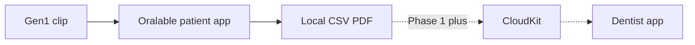
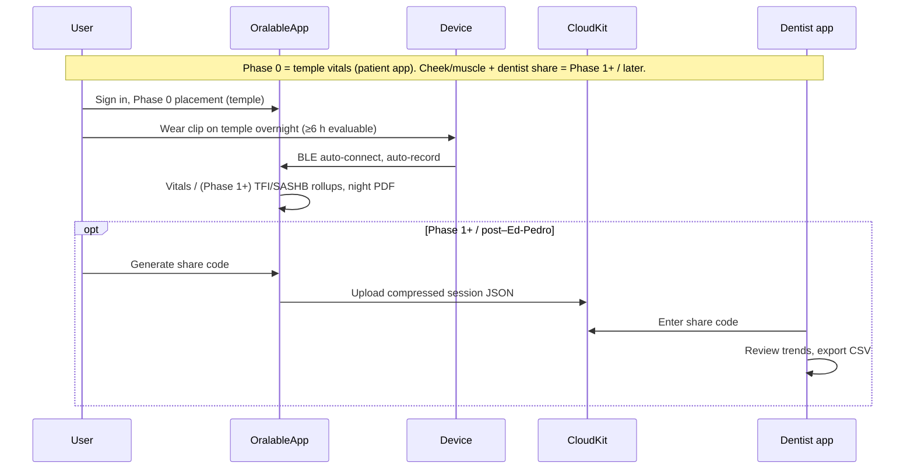

# Oralable — Functional & Technical Specification (36-month horizon)

**Document type:** Investor / diligence FTS (draft)  
**Version:** 1.1.0 · **Date:** July 2026  
**Manufacturer:** JAC Dental Ltd · **Product:** Oralable Oral Activity Monitor (MAM)

**Related:** [PRODUCT_ROADMAP.md](../PRODUCT_ROADMAP.md) · [data_room/README.md](./README.md) · [ED_PEDRO_QUICK_START.md](../clinical/ED_PEDRO_QUICK_START.md) · [REGULATORY_TIMELINE.md](./REGULATORY_TIMELINE.md) · [ORALABLE_SYSTEM_ARCHITECTURE.md](../ORALABLE_SYSTEM_ARCHITECTURE.md) · [COST_AND_TIMELINE.md](./COST_AND_TIMELINE.md) · **App working diagrams:** [MOBILE_APP_FLOWS.md §2](../../../oralable_swift/docs/MOBILE_APP_FLOWS.md#2-how-the-patient-app-works--phase-0)

---

**Strategy stack:** Stage A wellness wearable → Stage B medical (later) · new US patent embodiment · Ed/Pedro = patient app only.  
**Cost & timeline (planning):** [COST_AND_TIMELINE.md](./COST_AND_TIMELINE.md) — Phase 0 now–Sep 2026; Phase 1+ Q4’26–Q1’27; Gen2 parallel; Stage B H2’27–2028. Mid Stage A ~€200–250k; Stage A+Gen2 ~€350–450k; through Stage B ~€0.8–1.0M (ranges — not a budget).

## 1. Purpose and scope

This spec describes the **Oralable MAM platform** for investors and technical diligence:

- **Hardware** — PCB00003 clip + Oralable magnetic case; **Gen1** (BOM REV8 / REV10 / ES2832AA2) **ship-ready / Research Kits gated** (5 → Pedro by 31 Aug 2026); **Gen2** (BOM REV9 / REV11 / ES4L15BA1) upcoming
- **Firmware** — nRF Connect SDK, TGM GATT, BLE-gated streaming; Gen1 target **1.0.84**
- **Mobile** — iOS consumer + professional apps; Android roadmap — working diagrams [MOBILE_APP_FLOWS.md §2](../../../oralable_swift/docs/MOBILE_APP_FLOWS.md#2-how-the-patient-app-works--phase-0)
- **Algorithms** — Phase 0 temple vitals (HR/SpO₂); Phase 1+ IR-DC occlusion, TFI/SASHB, jaw actigraphy
- **Data** — local recording, export, optional CloudKit share to dentists
- **Clinical path** — wellness Phase 0 → Phase 1+ muscle evidence → 510(k) monitoring indication

**Out of scope:** Company financials, legal IP assignments, manufacturing contracts (referenced, not copied here).



---

## 2. Intended use (product tiers)

| Tier | Timeframe | Intended use (draft) |
|------|-----------|----------------------|
| **Phase 0 Vitals (stack ready / Research Kits gated)** | Now – Sep 2026 | Temple HR & SpO₂ on Gen1; Research Kit Dual A optional for Paper A; honest device state. **Not** a diagnosis. |
| **Phase 1+ Muscle (Gen1 software)** | Q4 2026 – Q1 2027 | Personal awareness of jaw load / bruxism phenotypes (IR-DC, TFI); ≥6 h overnight eval; optional share with dental care provider. |
| **Clinical investigation** | 6–18 mo | Structured Protocol B under Ed/Pedro after Phase 0 gates; EMG cross-validation (ANR M40). |
| **Cleared device (target)** | 18–36 mo | Monitor and record nocturnal jaw muscle activity consistent with sleep bruxism (510(k) / CE Class IIa path). |

Full regulatory language: [REGULATORY_TIMELINE.md](./REGULATORY_TIMELINE.md).

---

## 3. System architecture

```
┌─────────────────────────────────────────────────────────────────┐
│  Oralable REV10 clip (pcb00003)                                 │
│  MAXM86161 (R/G/IR PPG) + LIS2DTW12 ACC + temp + battery        │
│  nRF52832 → BLE TGM service 3A0FF000                            │
└────────────────────────────┬────────────────────────────────────┘
                             │ BLE 50 Hz (worn-gated)
┌────────────────────────────▼────────────────────────────────────┐
│  OralableCore (Swift) — parse, resample, algorithms, export     │
└────────────────────────────┬────────────────────────────────────┘
                             │
        ┌────────────────────┼────────────────────┐
        ▼                    ▼                    ▼
  OralableApp          OralableForProfessionals   cursor_oralable
  (patient iOS)        (dentist iOS)              (Python validation)
        │                    │
        └──────── CloudKit shared DB (optional) ──┘
```

---

## 4. Hardware

### 4.1 Current (pcb00003, ship-ready / Research Kits gated)

| Item | Specification |
|------|----------------|
| Board | **pcb00003** — Gen1: **REV10** assembly / **BOM REV8**; Gen2: **REV11** / **BOM REV9** |
| BLE module (Gen1) | Kaga **ES2832AA2** → nRF52832 |
| BLE module (Gen2) | Kaga **ES4L15BA1** → nRF54L15 |
| Battery (Gen1) | CG-320B ~15 mAh (typical) |
| Battery (Gen2) | LP260820 ~30 mAh |
| PPG | ADI MAXM86161 @ I²C `0x62`, channels R/G/IR |
| Accelerometer | ST LIS2DTW12 @ `0x19` |
| Charging | **Oralable magnetic case** (LTC4124 RX + LTC6990 TX) — **not WPC Qi** |
| BLE | TGM custom GATT `3A0FF000` + SMP OTA |
| Mounting (Phase 0) | **Temple / temporalis** (HR & SpO₂) |
| Mounting (Phase 1+) | Cheek / masseter or temporalis for IR-DC / bruxism phenotypes |
| Firmware (Gen1 target) | **1.0.84** (iOS `FirmwareGate` min **1.0.63** / recommend **1.0.84**) · Gen2 **2.0.x** |

### 4.2 36-month hardware roadmap

| Phase | Target | Notes |
|-------|--------|-------|
| H1 2026 | pcb00003 volume samples (KAGA FEI / EMS path) | Ken pilot: ~20 units |
| H2 2026 – 2027 | **Gen2** pcb00003 REV11 + **ES4L15BA1** (BOM REV9) | Same MAXM86161; LP260820 30 mAh; see `HARDWARE_ROADMAP_nRF54L15.md` |
| 2027+ | Battery life characterization; optional on-device inference | Partial bruxism classifier on 256 KB RAM headroom |

---

## 5. Firmware functional requirements

| ID | Requirement | Status |
|----|-------------|--------|
| FW-01 | Advertise as **Oralable**; TGM + battery + SMP services | ✅ |
| FW-02 | Stream PPG/ACC only when **on-body (worn)** | ✅ 1.0.36+ |
| FW-03 | Status char `3A0FF009`: on_dock, worn, device_state, battery % (+ `charge_active` byte on FW ≥ 1.0.47) | ✅ |
| FW-04 | MCUboot + mcumgr OTA (`dfu_application.zip`) | ✅ |
| FW-05 | 50 Hz effective PPG notify rate to phone | ✅ |
| FW-06 | In-app DFU in consumer app | 🔲 Phase 2 (Nordic Device Manager sufficient for trials) |

**Source:** `oralable_nrf` — `tgm_service.c`, `DEVELOPMENT.md`.

---

## 6. Mobile applications

**Working diagrams (canonical):** [MOBILE_APP_FLOWS.md §2](../../../oralable_swift/docs/MOBILE_APP_FLOWS.md#2-how-the-patient-app-works--phase-0).

### 6.1 Oralable (consumer)

| ID | Requirement | Status |
|----|-------------|--------|
| APP-01 | Sign in with Apple | ✅ |
| APP-02 | Phase 0 first-launch: pair → temple placement → vitals (no calibration). Phase 1+: Temporalis fit → calibration | ✅ Phase 0; Phase 1+ gated |
| APP-03 | Auto-record on BLE connect; pause/resume on disconnect | ✅ |
| APP-04 | Dashboard: real-time IR + optional HR/SpO₂/movement (feature flags) | ✅ |
| APP-05 | Historical charts, session history, TFI/SASHB rollups | ✅ |
| APP-06 | Export: research CSV, clinical PDF, share screen | ✅ |
| APP-07 | 6-digit share code → dentist CloudKit | ✅ code · ⏳ prod CloudKit |
| APP-08 | StoreKit 2 subscriptions (6 products) | ✅ code · ⏳ App Store Connect |
| APP-09 | HealthKit read/write | ✅ |
| APP-10 | Unified overnight report (TFI + SASHB + events) | ✅ Share PDF + event CSV; **hypnogram-first**; provisional BP-style bands ([OVERNIGHT_NIGHT_REPORT.md](../OVERNIGHT_NIGHT_REPORT.md)); Mac night pack; evaluable night **≥ 6 h**; **in-app required:** `StateHypnogramView` Share preview + Dashboard morning card (adapts FIG-CO-025; flag `showOvernightHypnogram`) |

**Navigation:** `oralable_swift/docs/MOBILE_APP_FLOWS.md`

### 6.2 Oralable for Dentists (professional)

| ID | Requirement | Status |
|----|-------------|--------|
| PRO-01 | Participant list from share codes | ✅ |
| PRO-02 | CSV import fallback | ✅ |
| PRO-03 | Patient dashboard + multi-session historical | ✅ |
| PRO-04 | ProfessionalHandshakeExport (hourly TFI/SASHB) | ✅ |
| PRO-05 | Practice subscription tiers | ✅ code · ⏳ IAP live |

---

## 7. Data management

### 7.1 On-device

| Data | Storage | Retention |
|------|---------|-----------|
| Raw 50 Hz streams | `SensorDataProcessor`, auto-flush CSV | Session + hourly tmp |
| State events | `AutomaticRecordingSession` | Per session |
| Hourly rollups | `SessionHistoryStore` | Multi-night |
| Calibration | `sessionHistoryStore.temporalisSleepCalibration` | Persistent |

### 7.2 Export paths

| Export | Format | Consumer | Professional |
|--------|--------|----------|--------------|
| Research raw | 50 Hz CSV | ShareView | — |
| Clinical report | PDF | ClinicalReportGenerator | — |
| Handshake | JSON rollups | CloudKit upload | Import / query |
| nRF debug | nRF Connect CSV | NRFConnectBLELogger | — |

### 7.3 Cloud (optional)

- Container: `iCloud.com.jacdental.oralable.shared`
- Records: `ShareInvitation`, `SharedPatientData`, `HealthDataRecord`
- **Production schema:** pending deployment (`CLOUDKIT_PRODUCTION_SETUP.md`)

---

## 8. Algorithms & signal processing

**Sampling:** All analysis pipelines resample to **50 Hz** (20 ms) via linear interpolation.

| Signal | Processing | Output |
|--------|------------|--------|
| Green PPG | Butterworth bandpass 0.5–8 Hz | HR, HRV |
| IR PPG | Low-pass &lt;1 Hz | IR-DC occlusion / muscle hemodynamic |
| Accelerometer | Median filter, jaw vibration | Phasic grinding, sync taps |
| Red/IR | SpO₂ path | SASHB / desat context |

**Bruxism logic:** IR-DC trough depth checked against ACC; TFI hourly; rescue events vs SpO₂ desaturation.

**Validation:** `cursor_oralable` — `self_validate.py`, `validation_dashboard`, protocol phases (Ed/Pedro).  
**Swift parity:** `OralableCore` algorithms + `UnifiedBiometricProcessor`.

**ML roadmap:** Core ML `BruxismMAM_Temporalis`; training labels from Protocol A; cohort sizes / demographics in [CORE_ML_TRAINING_COHORT.md](../CORE_ML_TRAINING_COHORT.md).

---

## 9. User → software → professional workflow



---

## 10. Wellness metrics (consumer)

Pre-launch dashboard shows **PPG IR waveform** by default; additional cards gated (`FeatureFlags`).

| Metric | Definition | Wellness claim (allowed) | Clinical accuracy phase |
|--------|------------|--------------------------|-------------------------|
| **TFI** | Temporalis / jaw fatigue index rollup | Activity trend indicator | Pilot + EMG concordance |
| **SASHB** | SpO₂ desaturation burden proxy | Overnight oxygen pattern context | Validated vs finger oximeter optional |
| **Event timeline** | Clench/grind state transitions | Pattern awareness | vs EMG gold standard |
| **HR / SpO₂** | From green/red/IR PPG | General wellness vitals | Temple (Phase 0) → cheek coupling (Phase 1+) |

**Ken gap:** Modelled accuracy specs and population benchmarks — **filled by Ed/Pedro pilot** ([PILOT_PROTOCOL_ED_PEDRO.md](../clinical/PILOT_PROTOCOL_ED_PEDRO.md)).

---

## 11. Security & compliance (software)

| Area | Implementation |
|------|----------------|
| Auth | Sign in with Apple |
| Privacy | Privacy manifests (`PrivacyInfo.xcprivacy`), wellness disclaimers |
| Regulatory tooling | `RegulatoryPackageBuilder` — 510(k)/CE package drafts |
| Pilot | `PilotDataManager`, `Anonymizer` — consent-gated export |
| Tests | ComplianceTests, MetadataValidationTests, UI consistency |

---

## 12. Manufacturing & supply chain (summary)

| Partner (documented) | Role |
|----------------------|------|
| KAGA FEI Europe | nRF54L15 module / sample builds |
| HOSIDEN Besson (recommended EMS) | Volume assembly |
| Bittele | RFQ reference |

**Ken gap:** Volume pricing, unit cost at scale, resilience plan — **commercial follow-up** with EMS (not in git).

---

## 13. 36-month delivery phases

Aligns with [COST_AND_TIMELINE.md](./COST_AND_TIMELINE.md) · [PRODUCT_ROADMAP.md](../PRODUCT_ROADMAP.md) · [IP_NORTH_STAR.md](../IP_NORTH_STAR.md).

| Quarter | Deliverable |
|---------|-------------|
| **Q3 2026** | **Stage A Phase 0:** Ed/Pedro temple vitals (patient app only); Gen1 FW **1.0.84**; data room |
| **Q4 2026** | **Stage A Phase 1+ start:** TFI/SASHB/IR-DC in patient app; US patent filing push; Gen2 kickoff |
| **H1 2027** | Phase 1+ embodiment soft-launch; Gen2 EVT / vitals parity; optional consumer Premium |
| **H2 2027** | Gen2 pilot parity; **Stage B** pre-sub / clinical package start (if funded) |
| **2028** | Stage B 510(k) / CE MDR exploration; scale manufacturing; professional app clinical role |

**Deferred vs older FTS draft:** dentist channel / CloudKit share **not** in Ed/Pedro Phase 0; Android MVP not on the critical path for patent embodiment.

**Planning cash (mid, EUR):** Stage A ~€200–250k · Stage A+Gen2 ~€350–450k · through Stage B ~€0.8–1.0M — see COST_AND_TIMELINE (not a budget).

---

## 14. Traceability matrix (repos)

| FTS section | Primary source |
|-------------|----------------|
| Hardware / FW | `oralable_nrf/` |
| Mobile UX | `oralable_swift/docs/MOBILE_APP_FLOWS.md` |
| BLE / algorithms | `OralableCore/`, `cursor_oralable/docs/ALGORITHM_ARCHITECTURE.md` |
| Clinical protocol | `TEMPORALIS_COLLECTION_PROTOCOL.md`, `PILOT_PROTOCOL_ED_PEDRO.md` |
| Market / competitors | `oralable_nrf/docs/ORALABLE_MARKET_LANDSCAPE.md` |
| Upload pack | `docs/archive/upload_2026-06/01–04_*.txt` |

---

## 15. Document control

| Version | Date | Author | Change |
|---------|------|--------|--------|
| 1.0.0 | June 2026 | JAC Dental / engineering | Initial investor FTS draft for Point A gap closure |

*This FTS is a diligence draft, not the IEC 62304 software requirements spec for a cleared device.*
