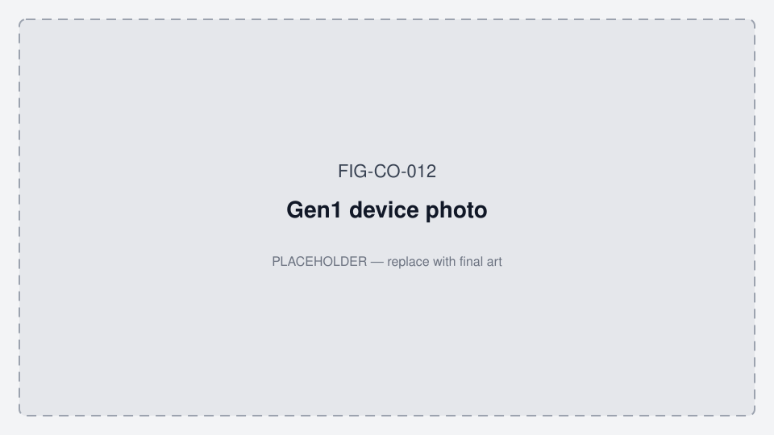

# Message to hardware engineer (Altium) — what to look for

**App working diagrams:** [MOBILE_APP_FLOWS.md §2](../../../../oralable_swift/docs/MOBILE_APP_FLOWS.md#2-how-the-patient-app-works--phase-0)

**From:** Firmware / product (John)  
**To:** PCB / Altium engineer  
**Prior / outgoing HW:** **Wout Geeurickx** · Founder WeeGee BV · wout.geeurickx@weegee.be · VAT BE0803634805 · Leuvensebaan 98, 3220 Holsbeek · +32 456 40 10 97 · [LinkedIn](https://www.linkedin.com/in/wout-geeurickx)  
**Altium custody (31 Jul 2026):** Required Altium packages already shared with **Kaga** and John for manufacture. **Updated / working Altium sources remain with Wout** — John to obtain latest before handoff. Candidate take-over: **Nabavi as personal JAC contractor** (Phase 1 McGill/JAC Altium track — not Dianyx HW ownership) — see [COLLAB_NABAVI_MCGILL.md](../clinical/COLLAB_NABAVI_MCGILL.md). Jun 2026 Kaga thread: Gen2 BOM dual listing ES4L15BA1 + ES2832AA2 — clean single source of truth is part of handoff.  
**Projects:** PCB00003 TGM — **Gen1** (BOM REV8 / PCB REV10 / ES2832AA2) and **Gen2** (BOM REV9 / PCB REV11 / ES4L15BA1)  
**Date:** 2026-07-16 (updated 2026-07-31 — Wout + Nabavi McGill handoff frame)  
**Context:** Stage A wellness wearable (Gen1 pilot) + Gen2 bring-up in parallel. Cost/timeline planning: [COST_AND_TIMELINE.md](../governance/COST_AND_TIMELINE.md).

**Encapsulation note (internal, Mar 2026):** For small skin-contact form factors (~20×7×4 mm class), **silicone tape lamination** suits rapid pilot builds; **silicone potting** is better for a commercial finish once the optical window and dimensions are locked. Keep the MAXM86161 window optically clear. Distill: [LITERATURE_AND_PRIOR_ART.md](../bookmarks/LITERATURE_AND_PRIOR_ART.md) §4.

**Figures:** [../FIGURES.md](../../FIGURES.md)

*Figure FIG-CO-012 — Gen1 device photo (placeholder).*

*Figure FIG-CO-014 — PCB REV10 photo (placeholder).*

*Figure FIG-CO-015 — Altium board overview (placeholder; from Wout / WeeGee).*

*Figure FIG-CO-023 — Tape (pilot) vs silicone potting (commercial) (placeholder).*

Copy or paste the email body below, or attach this whole file.

---

## Status update (2026-07-18) — Gen1 CHRSTS closed on HW side

HW engineer confirmed REV10 **CHRSTS is correct**: LTC4124 STAT **blinks while charging**, goes **steady low** when charge current tapers (“almost full” ≠ cell at 4.2 V). Voltage % on the pad is rough; add a fuel gauge only if we need accurate SoC later.

**Firmware follow-up (1.0.70):** treat STAT blink as `charge_active` / flash red; STAT taper as on-pad hold / solid red; no Altium ECO for CHRSTS. Our earlier “chrsts broken” story was **stable-level debounce** that never latched during blink.

### Suggested reply to the hardware engineer (copy/paste)

> Thanks — that matches LTC4124 STAT. We’ll treat blink as charging and steady assert as charge taper (not 4.2 V full). Agreed REV10 is fine; LED/on_dock is a firmware fix on our side. No Altium ECO needed for CHRSTS. We’ll keep voltage % as a rough gauge; fuel gauge is a later Gen2/product discussion if we need accurate SoC.

---

## Email (copy/paste)

**Subject:** PCB00003 — Altium checks we need (Gen1 CHRSTS + Gen2 REV11 pin/net map)

Hi,

We are shipping Gen1 pilot kits (temple vitals) and bringing up Gen2 in parallel. Firmware needs a few things confirmed from **Altium** (schematic + PCB), not from PDF text extraction. Please check the following and send back the artifacts listed at the end.

### Identity (so we don’t mix revisions)

| | Gen1 (shipping / Ed–Pedro) | Gen2 (upcoming) |
|--|---------------------------|-----------------|
| BOM | `PCB00003-TGM-BOM-REV8` | `PCB00003-TGM-BOM-REV9` |
| PCB / assembly | **REV10** | **REV11** |
| Schematic PDF name | (Gen1 set) | Often labeled **SCHEM-REV10** while PCB is **REV11** |
| U5 | Kaga **ES2832AA2** (nRF52832) | Kaga **ES4L15BA1** (nRF54L15) |
| Battery | CG-320B ~15 mAh | LP260820 ~30 mAh *(EMS sample path May 2026: **LP270829 35 mAh** — Lipol MOQ on LP260820)* |

Clip + case are **one BOM** (LTC4124 RX on clip, LTC6990 TX + USB-C on case). **Not WPC Qi.**

---

### A. Gen1 (REV10 / BOM REV8) — field issues we need HW eyes on

Firmware has been working around these in software. We need Altium or schematic confirmation of whether the layout or net is wrong, flaky, or OK.

1. **CHRSTS** — **resolved (no ECO)**  
   - Net: **CHRSTS** — LTC4124 **STAT** (pin 2) → nRF **P0.05** (Gen1 DTS).  
   - **Finding (HW):** STAT blinks while charging; steady assert = charge taper. REV10 OK.  
   - **Finding (FW):** old stable-GPIO debounce never latched during blink → false “broken.” Fixed in **1.0.70** (`CONFIG_CHRSTS_STAT_ACTIVITY`).  
   - Still useful to confirm in Altium for Gen2 bring-up: continuity + test point labeled. 

2. **BATVOL / SOC on case**  
   - Net: **BATVOL** → SAADC (Gen1 P0.28 / AIN4, ×11 divider).  
   - Symptom: ADC reads **inflated** while on case → false “full” LED.  
   - Please confirm divider values, when sense is relative to case TX field, and whether any change is needed for accurate SOC **on case**.  

3. **INT_OPT (MAXM86161)**  
   - Net: **INT_OPT** — MAXM86161 GPIO (pin 13) → Gen1 **P0.20**.  
   - Firmware expects **active-low open-drain + pull-up**. Please confirm that in the schematic (external pull-up present? polarity?).  

4. **Optional Gen1 wishlist (not blocking pilot)**  
   - Dedicated status LED (not PPG green/red)  
   - Skin thermistor at clip face for worn detect (die temp is laggy / false-positive)  

---

### B. Gen2 (REV11 / BOM REV9) — what we need from Altium before firmware pinmux is locked

REV11 **respins the power island** (U5 / BAT1 / U1 / L1 / X1 move). Do **not** assume Gen1 coordinates or Gen1 `pcb00003.dts` pins.

**Critical nets** (must connect U5 ↔ sensors / charger / power):

| Net | Function |
|-----|----------|
| **SDA** / **SCL** | I²C to MAXM86161 + LIS2DTW12 |
| **INT_ACC** | LIS2DTW12 INT1 |
| **INT_OPT** | MAXM86161 INT (active-low OD + pull-up) |
| **SENS_EN** | MAXM86161 LDO_EN |
| **CHRSTS** | LTC4124 STAT → nRF (must work for auto on-dock) |
| **BATEN** | Boost / rail latch (must stay HIGH at boot) |
| **BATVOL** | Battery sense ADC |
| **nRESET** | Module reset |

**Production test points we expect:** `SDA`, `SCL`, `SENS_EN`, `CHRSTS`, `3V3`, `VCC`  
**Debug:** Tag-Connect **J1** (SWDIO, SWCLK, nRESET, GND)

#### Please verify in Altium (Gen2 checklist)

**1. Pin ↔ net table (blocking for firmware)**  
Export from Altium (not PDF):

- For **U5 ES4L15BA1**: each module pin → net name → SoC port (e.g. P0.03, P1.04/AIN0, …) for the nets above.  
- Hypothesis only (must verify): SDA≈P0.03, SCL≈P2.02, INT_ACC≈P2.01, INT_OPT≈P2.04, BATVOL≈P1.04/AIN0 — see `PCB00003_GEN2_REV11_HARDWARE.md` §5.

**2. Kaga ES4L15BA1 design rules**  
- Antenna: pin **11 (OUT_ANT)** shorted to pin **12 (OUT_MOD)** for internal antenna  
- 32 kHz: **X1** on **P1.00 / P1.01** (ABS06)  
- **L2 = 4.7 µH** (not Gen1’s 10 µH)  
- Bulk cap ~**100 µF** on battery net (Kaga guidance) — present on REV11?  
- Keep-out / RF clearance for on-module antenna vs Gen1 layout  

**3. Charge path for 30 mAh cell**  
- Same LTC4124 / LTC6990 architecture  
- Recheck **ISET strap** / charge current for **LP260820 30 mAh** (Gen1 was sized for ~15 mAh)  
- Confirm **CHRSTS** routing is intentional and testable (Gen1 STAT behavior is understood; Gen2 should keep the same blink/taper semantics)

**4. BOM / designator sanity (REV8 → REV9)**  
- U5 ES2832 → ES4L15  
- BAT1 CG-320B → LP260820  
- XTL1 → X1 (top vs bottom)  
- L2 10 µH → 4.7 µH; L3 RF inductor removed if module-integrated  
- R12 0 Ω strap — confirm purpose  

**5. NTC / skin temp**  
- If NTCG104 (or face thermistor) is on BOM REV9, confirm it routes to a usable nRF ADC pin and is not floating.

---

### C. Deliverables (please send)

1. **Altium netlist export** (or CSV: designator, pin, net) for Gen2 schematic.  
2. **One-page pin map:** `Net | Module pin | SoC GPIO | Direction | Notes` for SDA/SCL/INT_*/SENS_EN/CHRSTS/BATEN/BATVOL.  
3. **Gen1 CHRSTS finding:** OK / assembly issue / schematic fix proposed (with ECO if needed).  
4. Optional: screenshot or PDF of Gen2 power island + CHRSTS sheet from Altium.

Once we have (2), firmware locks `pcb00003_gen2.dts`. Without it we cannot finish Gen2 bring-up safely.

Thanks — happy to jump on a short call with the schematic open in Altium if that is easier.

John  

**Refs (internal):**  
- `cursor_oralable/docs/PCB00003_GEN2_REV11_HARDWARE.md`  
- `cursor_oralable/docs/GEN1_GEN2_MIGRATION.md`  
- `cursor_oralable/docs/PRODUCT_ROADMAP.md`  
- Bundle: `PCB00003-TGM-PROD_DATA-REV11_260620/`

---

## Altium how-to (for the engineer — optional attach)

| Need | Altium action |
|------|----------------|
| Netlist | Design → Netlist For Project → (Protel / or Reports → Bill of Materials / Netlist) |
| Pin ↔ net | Right-click U5 → Find Similar / or Reports → Component Cross Reference; or ActiveBOM + Schematic pin list |
| Continuity of CHRSTS | Schematic: click net CHRSTS → highlight; PCB: net highlight LTC4124.2 → U5 pin |
| Diff Gen1 vs Gen2 | Project comparison / ECO, or compare pickplace REV10 vs REV11 CSV |
| Export for firmware | CSV columns: `NetName, CompDesignator, CompPin, NetClass` filtered to U5 + U1 + U2 + U3 |

### First REV11 board probe order (after fab)

1. J-Link on J1 — read nRF54 ID  
2. Scope SDA/SCL  
3. WHO_AM_I MAXM86161 / LIS2DTW12  
4. Toggle SENS_EN  
5. On case — CHRSTS toggles  
6. BATVOL vs DMM  
7. BATEN high at boot  

---

*Saved for reuse: send this file or the email section only.*
